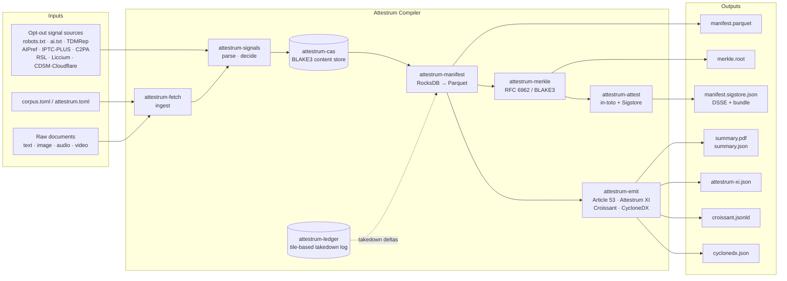
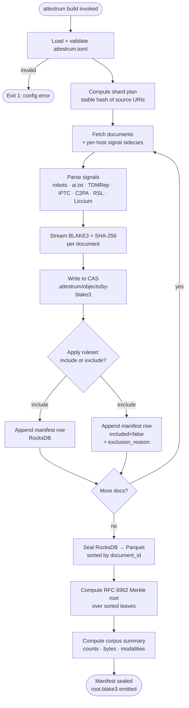
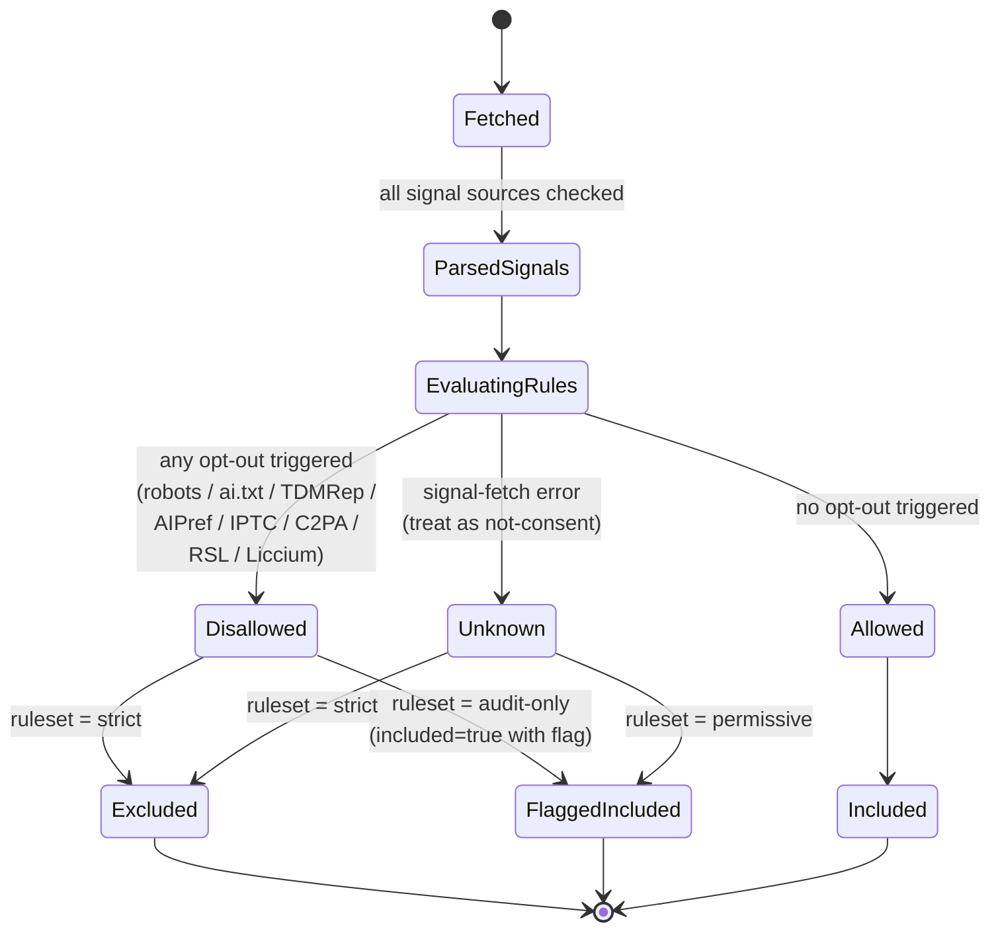
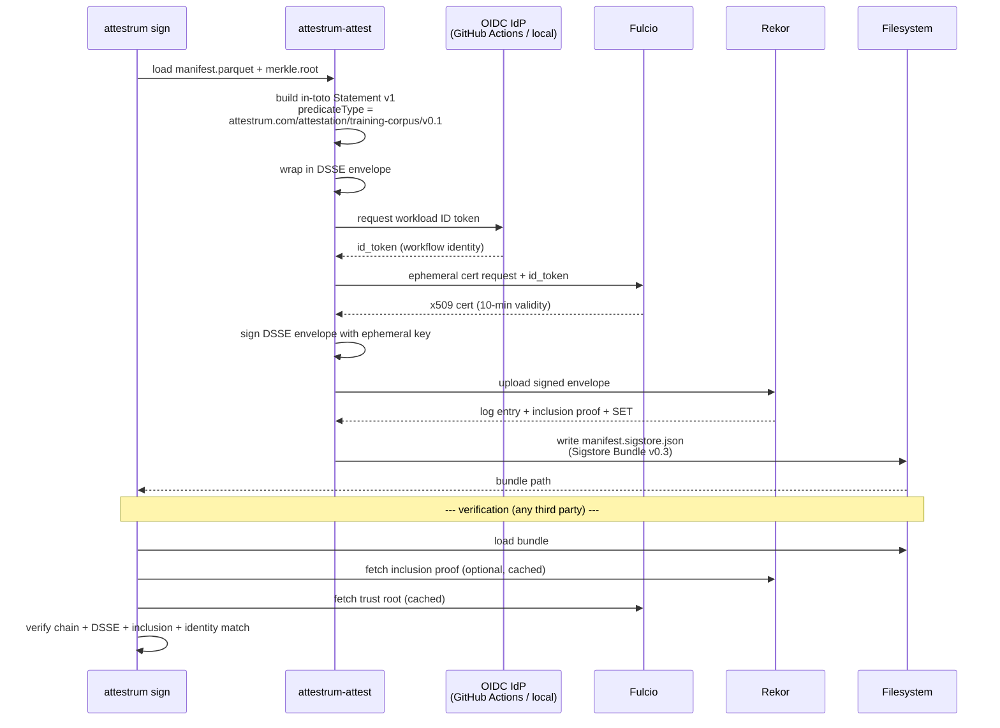
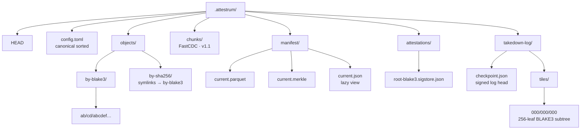

# Attestrum — Deterministic Compiler For AI Training-Data Compliance

A 90-day MVP build plan for a CLI + Rust library that ingests a training-corpus manifest and opt-out signals, then emits (a) a content-addressed Merkle-rooted manifest, (b) a Sigstore-signed attestation, (c) the EU Commission's Article 53(1)(d) training-data summary template, auto-populated, and (d) Attestrum XI fields where derivable. Apache 2.0, no SaaS.

---

## Part 0 — Working Agreement (Read First, Apply To Every Task)

### 0.1 Mermaid Diagrams Before Code — Non-Negotiable

**For any new complicated procedure, ALWAYS make a diagram first.** This applies to: data flow, state machines, dependency graphs, pipelines, decision trees, user flows, error paths, and the overall architecture of any new crate or module.

Rules:

1. The diagram MUST match EXACTLY how the process actually works.
2. If testing reveals the diagram doesn't match observed behaviour, update the diagram (or the process — whichever is the source of truth) until they agree.
3. Diagram-vs-text and diagram-vs-behaviour mismatches are bugs to resolve, not differences of opinion.
4. Diagrams live in `docs/diagrams/<sprint>/<topic>.md` as Markdown files containing a single ```mermaid block plus a short caption explaining what the diagram models, its source of truth, and its date.
5. Every new module gets a diagram before its first commit. Every new CLI subcommand gets a diagram of its state transitions before its first commit. Every new bug fix that changes control flow updates an existing diagram in the same commit.
6. When the agent encounters an existing diagram that no longer matches the code, the fix is in the SAME commit as the code change. A diagram drift is a build break.

### 0.2 Diagram Inventory (Source-Of-Truth)

The diagrams in §0.5 are the canonical descriptions of Attestrum's top-level flows. They are the source of truth; code must conform to them. Sub-flows live in `docs/diagrams/` and refer back to the top-level diagrams by name.

### 0.3 Logging And Session Records

Every commit appends a session entry to `CHANGELOG.md` AND `SESSION-LOG.md` (creating either if missing). Entry format:

```markdown
## [YYYY-MM-DD] — [Task]
- **Files changed**: <paths>
- **Summary**: <one paragraph>
- **Findings**: <surprises, decisions, deferred work>
- **Diagrams touched**: <paths or "none">
- **Tokens used**: <if known>
```

### 0.4 Protected Systems (DO NOT TOUCH Without Explicit Founder Approval)

Once these subsystems are stable (≥ v0.0.4), they require explicit go-ahead in a commit message footer to modify:

- `attestrum-merkle` (RFC 6962 binary Merkle over BLAKE3). Determinism foundation.
- `attestrum-attest` predicate type `https://attestrum.com/attestation/training-corpus/v0.1`. Schema changes require a version bump and a migration doc.
- `attestrum-cas` directory layout under `.attestrum/objects/`. Layout change is a corpus-incompatible event.
- `attestrum-ledger` tile layout. Append-only by definition; never rewrite.
- The Article 53 emitter's golden-file fixtures under `tests/golden/article53/`. Regenerating these without verifying against the Commission template visually is a release-blocking error.

### 0.5 Top-Level Architecture Diagrams (Initial Set)

#### 0.5.1 System Overview — Inputs To Outputs



**Source of truth:** this diagram. Caption owner: founder. Update whenever a new subsystem is introduced or removed.

#### 0.5.2 The `attestrum build` Pipeline (Happy Path)



**Source of truth:** this diagram. Sub-flows for Fetch, SigParse, Hash, Seal live under `docs/diagrams/sprint-1/`, `sprint-2/`, `sprint-3/` respectively.

#### 0.5.3 Signal-Decision State Machine (Per Document)



**Source of truth:** this diagram. Ruleset semantics MUST match `crates/attestrum-core/src/ruleset.rs`.

#### 0.5.4 Sign + Verify Flow (Sigstore Bundle v0.3)



**Source of truth:** this diagram. Mirrors `cosign verify-blob-attestation --new-bundle-format` semantics.

#### 0.5.5 Takedown + Delta Corpus

```mermaid
flowchart LR
    Req[Rightsholder request<br/>removal of doc d] --> Lookup{d ∈ manifest@vN?}
    Lookup -->|no| Reject([Reject: not in corpus])
    Lookup -->|yes| Mark[Build TakedownEntry:<br/>blake3 · reason · requester · ts]
    Mark --> AppendLog[Append leaf to ledger tiles<br/>BLAKE3-Merkle subtree]
    AppendLog --> Checkpoint[Sign new ledger checkpoint]
    Checkpoint --> RebuildMan[Rebuild manifest excluding d<br/>→ manifest@vN+1]
    RebuildMan --> NewRoot[Compute new Merkle root]
    NewRoot --> NewAttest[Sign new in-toto Statement<br/>predicate.removedItems.ledgerRef =<br/>checkpoint hash]
    NewAttest --> Out([manifest@vN+1 + ledger checkpoint])
    Out -.continuity proof.-> Prev[manifest@vN root<br/>retained for audit]
```

**Source of truth:** this diagram. The ledger is append-only: a takedown never deletes a prior ledger leaf.

#### 0.5.6 CAS Layout (Filesystem)



**Source of truth:** this diagram. Layout changes are corpus-incompatible and require a major version bump.

### 0.6 Diagram Conventions (For New Diagrams The Agent Creates)

- **File location:** `docs/diagrams/<sprint>/<short-topic-name>.md`. One diagram per file.
- **File header:** YAML frontmatter with `title`, `models` (what the diagram describes), `source_of_truth` (which artefact is canonical — code, diagram, or spec), and `last_verified` (commit SHA + date).
- **Mermaid only.** No PlantUML, no draw.io, no SVG. Mermaid renders in GitHub, in Obsidian, in VS Code preview, and in our future docs site.
- **Diagram types and when to use them:**
  - `flowchart` — data pipelines, dependency graphs, file/folder structure.
  - `stateDiagram-v2` — anything with discrete states and transitions (decision rulesets, lifecycle of a document, lifecycle of an attestation).
  - `sequenceDiagram` — multi-actor flows that involve network or IPC (signing, verification, registry lookups).
  - `classDiagram` — only for stable public APIs across crate boundaries; never for internal types.
  - `erDiagram` — only for the Parquet schema and any future SQL schemas.
- **Naming:** node IDs in `CamelCase`; node labels in plain English, line-broken with `<br/>` where helpful.
- **No colour theming.** Default Mermaid styling only; GitHub light/dark must both be readable.
- **Always include the legend in the caption** if the diagram uses non-obvious symbols (e.g. dashed arrow = "secondary" or "audit-only").

---

## Part 1 — Regulatory Artifact Specifications

### 1.1 Article 53(1)(d) Training Data Summary Template

- **Source of truth:** European Commission, AI Office. "Explanatory Notice and Template for the Public Summary of Training Content for general-purpose AI models," adopted 24 July 2025. Official landing page: `https://digital-strategy.ec.europa.eu/en/faqs/template-general-purpose-ai-model-providers-summarise-their-training-content`. The Template took effect for new GPAI models placed on the Union market on 2 August 2025; existing models have until 2 August 2027.
- **Authoritative format:** PDF (Explanatory Notice + Template, narrative + tabular). The EU AI Office has **not** published a machine-readable schema (JSON Schema / JSON-LD / XML / Croissant). Attestrum will emit (1) a rendered PDF matching the Commission's published layout exactly, plus (2) a structured JSON sidecar (`article53.json`) using a schema Attestrum defines, so the same data can be re-rendered or audited.

The Template has **three mandatory sections**. Each field below is captured with type and source.

#### Section 1 — General Information

| Field | Type | Source in Attestrum |
|---|---|---|
| `provider.name` | string | `attestrum.toml` `[provider]` |
| `provider.legal_entity` | string | `attestrum.toml` |
| `provider.authorised_representative` | string (optional, conditional on non-EU provider) | `attestrum.toml` |
| `provider.contact_point` | string (email/URL) | `attestrum.toml` |
| `model.name` | string | `attestrum.toml` `[model]` |
| `model.versions[]` | string[] | `attestrum.toml` |
| `model.dependencies[]` | string[] (parent models for fine-tunes) | `attestrum.toml` |
| `model.eu_market_date` | ISO-8601 date | `attestrum.toml` |
| `training.modalities[]` | enum {text, image, audio, video, other} | derived from corpus extension/MIME |
| `training.size_by_modality[]` | enum bucket {<1B tokens, 1B–10T, >10T} per modality; image/audio/video as item-count buckets | derived from manifest counts |
| `training.general_characteristics` | narrative string | `attestrum.toml` `[summary]` |

#### Section 2 — List Of Data Sources

Disclosure granularity required by the Commission varies by source category. Attestrum emits one block per source:

| Field | Granularity required by Commission | Attestrum source |
|---|---|---|
| `sources.public_datasets[]` | **Name and link** required for all "large" public datasets | corpus manifest `source_type: public_dataset` |
| `sources.private_datasets[]` | **Narrative description** only (name optional; protects trade secrets) | corpus manifest `source_type: private_licensed` |
| `sources.scraped_web[]` | **Summary list of domain names**; not exact URLs | manifest `source_type: crawl` aggregated by registered domain |
| `sources.user_data` | Boolean + narrative description of modality | `attestrum.toml` |
| `sources.synthetic_data` | Boolean + narrative + generator identity | `attestrum.toml` |
| `sources.other[]` | Catch-all narrative | `attestrum.toml` |

#### Section 3 — Processing And Governance (TDM / Copyright / Illegal Content)

| Field | Type | Source |
|---|---|---|
| `tdm.respected_opt_out_protocols[]` | enum list {robots.txt, ai.txt, TDMRep, IPTC-PLUS-DMI, C2PA, AIPref, CDSM Art.4(3), RSL, Liccium-TDMAI, Cloudflare-Content-Signals} | derived from Attestrum signal-parser invocations in build log |
| `tdm.measures_before_collection` | narrative | `attestrum.toml` |
| `tdm.measures_during_collection` | narrative | `attestrum.toml` |
| `tdm.contact_for_complaints` | email/URL | `attestrum.toml` |
| `illegal_content.removal_measures` | narrative | `attestrum.toml` |
| `personal_data.measures` | narrative | `attestrum.toml` |
| `summary.version` | semver | auto |
| `summary.last_updated` | ISO-8601 date | auto |

Recommended update cadence per Commission: at least every six months for active models, and upon any material change.

### 1.2 Attestrum XI Technical Documentation (Article 53(1)(a))

Attestrum XI has a **two-section** structure. Section 1 applies to all GPAI providers; Section 2 applies only to systemic-risk models (>10²⁵ FLOPs cumulative training compute).

| Attestrum XI § | Field | Auto-derivable by Attestrum? |
|---|---|---|
| 1(1)(a) | General description: tasks, integration types | **No** (human-authored, from `attestrum.toml`) |
| 1(1)(b) | Acceptable use policies | No |
| 1(1)(c) | Date of release / distribution methods | Partial — release date from git tag; distribution from manifest |
| 1(1)(d) | Architecture and number of parameters | No (from model card) |
| 1(1)(e) | Modality and format of inputs/outputs | Partial — modalities derivable from corpus, formats from `attestrum.toml` |
| 1(1)(f) | Licence | No |
| 1(2)(a) | Detailed description of training process, methodologies and techniques | No |
| 1(2)(b) | Training, testing, validation data: type and provenance, curation methodologies (e.g. cleaning, filtering), number of data points, scope/main characteristics, how data obtained and selected, opt-out measures | **YES — this is exactly Attestrum's output** |
| 1(2)(c) | Computational resources to train (number of FLOPs, training time, etc.) | No (Attestrum emits placeholder slot) |
| 1(2)(d) | Known or estimated energy consumption | No |
| Section 2 (systemic risk only) | Evaluation results, adversarial testing | No |

Attestrum XI Section 1(2)(b) is the primary auto-fill target. Section 1(1)(c) and (e) are partially auto-filled. All other fields render as TODO blocks with structured hints.

### 1.3 GPAI Code Of Practice — Transparency Chapter

Final version published 10 July 2025; formally approved 1 August 2025. Source: `https://digital-strategy.ec.europa.eu/en/policies/contents-code-gpai`. Signing the Code commits a provider beyond the bare Article 53 text to:

1. **Measure 1.1 — Model Documentation Form:** Complete the Code's single-page Model Documentation Form covering Attestrum XI + Attestrum XII fields. The Form is normative within the Code.
2. **Measure 1.2 — Information to downstream providers and AI Office on request,** with quality, security, integrity guarantees on documentation.
3. **Measure 1.3 — Retention / update obligations:** keep documentation current; update at material changes.
4. **Copyright chapter cross-link:** signatories also commit to a published copyright policy identifying state-of-the-art opt-out technologies they honour (Article 4 CDSM); only crawl lawfully accessible content; appoint a copyright complaints contact. Adherence to the Code grants a presumption of conformity with Article 53 until harmonised standards exist.

Attestrum's `emit code-of-practice` subcommand will render the Model Documentation Form from the same canonical `manifest.json`.

### 1.4 Structured Data Formats — What The EU AI Office Accepts

As of May 2026, the AI Office **accepts** the published Template in any presentation form so long as the content matches; it does **not** prefer any machine-readable schema. Attestrum's strategy:

- **Primary deliverable:** the Commission's Template rendered as PDF and HTML.
- **Sidecar JSON-LD:** Attestrum emits a Croissant-compatible JSON-LD record (`https://docs.mlcommons.org/croissant/`, MLCommons, v1.0, March 2024) for forward compatibility — Croissant builds on `schema.org/Dataset` and is the most likely future EU machine-readable format given its Hugging Face / Kaggle / Google adoption.
- **AI-BOM sidecar:** Attestrum emits a CycloneDX 1.7 ML-BOM (`http://cyclonedx.org/schema/bom-1.7.schema.json`, ECMA-424 2nd Edition, October 2025) for the model + datasets, since enterprise procurement RFPs increasingly require it.

---

## Part 2 — Input Signal Specifications

For each signal, Attestrum ships a parser in `crates/attestrum-signals/src/<signal>.rs`. Parsers are deterministic (no network in the core parser; fetching is a separate `attestrum-fetch` module).

### 2.1 robots.txt With AI User-Agents (RFC 9309)

- **Spec:** RFC 9309 (Koster, Illyes, Zeller, Sassman, Sep 2022). `https://www.rfc-editor.org/rfc/rfc9309`.
- **Canonical AI User-Agents tracked (May 2026):** `GPTBot`, `ChatGPT-User`, `OAI-SearchBot` (OpenAI); `Google-Extended` (Google); `ClaudeBot`, `anthropic-ai`, `Claude-Web` (Anthropic); `CCBot` (Common Crawl); `PerplexityBot`, `Perplexity-User` (Perplexity); `Applebot-Extended` (Apple); `Bytespider` (ByteDance); `FacebookBot`, `Meta-ExternalAgent` (Meta); `Amazonbot` (Amazon); `cohere-ai`, `cohere-training-data-crawler` (Cohere); `Diffbot`; `ImagesiftBot`; `Omgilibot`; `YouBot`.
- **Attestrum behaviour:** Attestrum maintains a curated `crates/attestrum-signals/data/ai_user_agents.yaml` keyed by operator + first-observed date. Each corpus document's `source_url` is matched against the corresponding host's cached `robots.txt`. A `disallowed=true` document is **flagged in the manifest** but not auto-removed; the operator decides policy in `attestrum.toml`.
- **Rust parser:** `robotstxt` crate (Google's port).
- **Conformance tests:** Google publishes a test suite at `https://github.com/google/robotstxt`; fixture files copied to `tests/fixtures/robots/`.
- **Edge case:** RFC 9309 permits the crawler to assume "may access" on HTTP errors fetching robots.txt; Attestrum treats fetch error explicitly as an `unknown` signal, not as consent.

### 2.2 ai.txt (Spawning)

- **Origin:** Spawning AI, 2023. `https://site.spawning.ai/spawning-ai-txt`. No formal RFC; published as best-effort standard.
- **Wire format:** plain text, root-relative. Permits/disallows by modality (`User-Agent: *`, then `Disallow-AI-Training: *`-style directives + media-type filters such as `image/*`, `text/*`).
- **Attestrum parser:** custom (~150 LOC). Tests under `tests/fixtures/ai_txt/`.
- **Differs from robots.txt:** ai.txt is intended to be checked at scrape-time of the linked media URL (not just the HTML page), addressing the "third-party-hosted media" gap robots.txt has. Attestrum applies ai.txt rules to each document's *origin* host.

### 2.3 IETF AI Preferences (AIPref) — `draft-ietf-aipref-attach` and `draft-ietf-aipref-vocab`

- **Status (May 2026):** Working Group drafts; `draft-ietf-aipref-attach-04` (October 2025, expires 1 May 2026) and `draft-ietf-aipref-vocab-06` (April 2026, expires 30 October 2026). Not yet RFC. Charter: `https://datatracker.ietf.org/wg/aipref/about/`; drafts repo: `https://github.com/ietf-wg-aipref/drafts`.
- **Two attachment surfaces:**
  1. **HTTP response header** `Content-Usage: ai=n` (or `ai=y`) — uses RFC 9651 Structured Field Values syntax.
  2. **robots.txt extension** via a new `content-usage` rule. ABNF (verbatim from `draft-ietf-aipref-attach`):
     ```
     rule =/ content-usage
     content-usage = *WS "content-usage" *WS ":" *WS [ path-pattern 1*WS ] usage-pref EOL
     usage-pref    = <usage preference vocabulary from [VOCAB]>
     ```
- **Vocabulary (draft-ietf-aipref-vocab-06):** tokens for `ai-train`, `ai-input` (inference), `search`, plus binary preferences. Attestrum's `aipref` parser maps these onto its internal `usage_preference` enum.
- **Rust:** no published crate as of May 2026; Attestrum hand-rolls (`crates/attestrum-signals/src/aipref.rs`).

### 2.4 W3C TDMRep (Text And Data Mining Reservation Protocol)

- **Spec:** W3C Community Final Report, 10 May 2024. `https://www.w3.org/community/reports/tdmrep/CG-FINAL-tdmrep-20240510/`. Editor's draft: `https://w3c.github.io/tdm-reservation-protocol/spec/`.
- **Five surfaces:**
  1. **`/.well-known/tdmrep.json`** — JSON array of rules. Each rule: `location` (path-pattern, robots.txt-like), `tdm-reservation` (0|1, mandatory), `tdm-policy` (URL, optional).
  2. **HTTP response header** `tdm-reservation: 1` and `tdm-policy: <URL>` per resource.
  3. **HTML `<meta>`** with `name="tdm-reservation"` and `name="tdm-policy"`.
  4. **EPUB 3 package metadata** (`property="tdm:reservation"`).
  5. **PDF XMP metadata** under namespace `http://www.w3.org/ns/tdmrep/`.
- **Processing rule:** TDM Agents MUST check `/.well-known/tdmrep.json` before scraping; HTTP header overrides per resource. Other values besides `0` and `1` are protocol errors → treat as unset.
- **Rust parser:** Attestrum implements (`crates/attestrum-signals/src/tdmrep.rs`); for ODRL-formatted `tdm-policy` documents, integrate `oxigraph` (RDF parser) optionally.

### 2.5 IPTC PLUS Data Mining (DMI) Metadata Fields

- **XMP namespace:** `http://ns.useplus.org/ldf/xmp/1.0/` (prefix `plus`).
- **Primary field:** `Xmp.plus.DataMining` (XmpText) with one of the controlled-vocabulary URIs.
- **Companion field:** `Xmp.plus.OtherConstraints` (LangAlt).
- **Verbatim controlled vocabulary** (IPTC, October 2023, `https://iptc.org/news/exclude-images-from-generative-ai-iptc-photo-metadata-standard-2023-1/`):
  - `http://ns.useplus.org/ldf/vocab/DMI-UNSPECIFIED`
  - `http://ns.useplus.org/ldf/vocab/DMI-ALLOWED`
  - `http://ns.useplus.org/ldf/vocab/DMI-PROHIBITED-AIMLTRAINING`
  - `http://ns.useplus.org/ldf/vocab/DMI-PROHIBITED-GENAIMLTRAINING`
  - `http://ns.useplus.org/ldf/vocab/DMI-PROHIBITED-EXCEPTSEARCHENGINEINDEXING`
  - `http://ns.useplus.org/ldf/vocab/DMI-PROHIBITED`
  - `http://ns.useplus.org/ldf/vocab/DMI-PROHIBITED-SEECONSTRAINT`
  - `http://ns.useplus.org/ldf/vocab/DMI-PROHIBITED-SEEEMBEDDEDRIGHTSEXPR`
  - `http://ns.useplus.org/ldf/vocab/DMI-PROHIBITED-SEELINKEDRIGHTSEXPR`
- **NewsML-G2 form:** `<rightsInfo><dataMining uri="http://ns.useplus.org/ldf/vocab/DMI-PROHIBITED-AIMLTRAINING"/></rightsInfo>`.
- **Rust parser:** `xmp-toolkit-rs` for XMP reading; `quick-xml` for NewsML-G2.

### 2.6 C2PA Training And Data Mining Assertion

- **Spec:** CAWG Training and Data Mining Assertion, plus C2PA 2.x core spec `https://spec.c2pa.org/specifications/specifications/2.4/specs/C2PA_Specification.html`.
- **Assertion label:** `c2pa.training-mining` (and CAWG-defined enhanced variants).
- **Field shape:** `{ entries: { "c2pa.ai_training": { use: "allowed"|"notAllowed"|"constrained" }, "c2pa.ai_inference": {...}, "c2pa.data_mining": {...}, "c2pa.ai_generative_training": {...} } }`.
- **Important caveat (December 2024 C2PA clarification):** the C2PA standard formally clarifies that Content Credentials are **provenance**, not TDM rights expression. Attestrum treats `c2pa.training-mining` as a *signal* (good-faith assertion from the embedder) but defers to TDMRep / AIPref / IPTC-PLUS for the legally binding opt-out determination under CDSM Article 4(3).
- **Rust parser:** `c2pa-rs` (Adobe, Apache 2.0). `https://github.com/contentauth/c2pa-rs`.

### 2.7 CDSM Article 4(3) Machine-Readable Opt-Out — "Appropriate Manner"

- **Legal text:** Directive (EU) 2019/790, Article 4(3): the TDM exception applies *unless* rightsholders have *expressly reserved* it in an *appropriate manner, such as machine-readable means for content made publicly available online*. Recital 18 elaborates.
- **Civil Chamber 10 of the Hamburg Regional Court (Landgericht Hamburg) ruled in Robert Kneschke v. LAION e.V., Case No. 310 O 227/23, on 27 September 2024**, dismissing the copyright claim and holding — in obiter dictum — that a natural-language opt-out clause was likely machine-readable. The decision is the first EU court ruling that meaningfully interprets Article 4(3)'s "machine-readable" requirement in an AI-training context; format choice was decisive in the analysis.
- **Attestrum's pragmatic interpretation:** an opt-out is "appropriate" in Attestrum's view if it appears in ANY of: `robots.txt` AI-bot Disallow, ai.txt, TDMRep (any surface), AIPref `Content-Usage`, IPTC-PLUS-DMI prohibition, C2PA `training-mining: notAllowed`, Liccium TDMAI declaration, RSL `permits ai-train` set to deny, or Cloudflare Content Signals `ai-train=no`. Attestrum records *which* signal triggered the opt-out per document.

### 2.8 Cloudflare AI Crawl Control / Content Signals

- **Source:** Cloudflare developer docs `https://developers.cloudflare.com/ai-crawl-control/`.
- **Wire format:** Cloudflare injects a `Content-Signals Policy` block into the `robots.txt` of zones that opt in. Signals: `search=yes|no`, `ai-input=yes|no`, `ai-train=yes|no`.
- **Attestrum parser:** parsing is folded into the robots.txt parser; the Content-Signals comment block is recognised as a distinct signal layer.

### 2.9 Really Simple Licensing (RSL)

- **Spec:** RSL 1.0 Recommendation, RSL Technical Steering Committee, 10 December 2025. `https://rslstandard.org/rsl`.
- **Wire format:** XML in the namespace `https://rslstandard.org/rsl`. Discovery: robots.txt extension, HTTP headers, HTML `<link>`, RSS feeds, dedicated `/license.xml`.
- **Key elements:**
  - `<content url="/...">` scoping
  - `<license>` containing `<permits type="usage">` (values include `ai-train`, `ai-input`, `ai-index`, `ai-all`, `all`)
  - `<payment type="…">` (`free`, `attribution`, `subscription`, `per-crawl`, `per-inference`, `contribution`)
  - `<standard>` for referencing CC license URLs
- **Companion protocols:** Open License Protocol (OLP, OAuth 2.0 extension), Crawler Authorization Protocol (CAP), Encrypted Media Standard (EMS).
- **Attestrum parser:** XML via `quick-xml`. Validate against the RSL XSD published by the RSL TSC.

### 2.10 Liccium TDM·AI (ISCC-Based)

- **Spec:** Liccium TDM·AI; `https://docs.tdmai.org/` and `https://docs.liccium.com/`.
- **Binding mechanism:** "Soft-binding" via ISCC (ISO 24138:2024) content fingerprints rather than embedded metadata. Declarations survive metadata stripping and watermark removal. Verifiable via W3C Verifiable Credentials 2.0 ("Creator Credentials").
- **Registry:** federated content registries / Opt-Out Registry maintained by Liccium.
- **Wire format:**
  ```json
  {
    "iscc": "ISCC:KEC7VSV5QH7FTV7N5YVD5UMF4TUKFFGDGCOI4UDFKE4FNPW6C3L7J2Y",
    "TDMAI": false,
    "TDMAI_summary": "Content must not be used for training generative AI.",
    "TDMAI_policy": "https://example.com/policy"
  }
  ```
- **Attestrum integration:** Attestrum computes the ISCC of every corpus document (via `iscc-rs` if mature, else by FFI to the reference `iscc-sdk` Python implementation), then queries the Liccium registry through `attestrum-fetch` (separately, behind a `--check-liccium` flag) and joins the result onto the manifest.

---

## Part 3 — Cryptographic Substrate

### 3.1 Hash Function — Recommendation: BLAKE3

**Decision: BLAKE3 as the document hash; SHA-256 retained as a parallel hash for Sigstore/in-toto interop.** BLAKE3 achieves ~92 GB/s on 16 threads (8.4 GB/s single-threaded with AVX2) versus SHA-256's fixed 3.0 GB/s with no parallel scaling. BLAKE3's tree structure scales linearly while SHA-256's Merkle–Damgård construction is inherently sequential. BLAKE3 also supports streaming verified prefixes — essential for documents larger than RAM. Attestrum stores both `blake3:<hex>` and `sha256:<hex>` per document; SHA-256 ensures Sigstore/in-toto envelopes (which expect SHA-256 digests in subject sets) are interoperable.

- **Rust crate:** `blake3 = "1"` (BLAKE3 Team, Apache-2.0/CC0).
- **Go crate:** `github.com/zeebo/blake3`.

### 3.2 Merkle Tree — Recommendation: Binary RFC 6962-Style

**Decision: binary Merkle tree with RFC 6962 leaf/node hash domain separation, hashed under BLAKE3.** RFC 6962's `0x00 || leaf` and `0x01 || left || right` domain separation is battle-tested in Certificate Transparency and Trillian. Verkle and Sparse Merkle Trees solve problems Attestrum does not have (small inclusion proofs in a sparse keyspace). For 100M-document corpora we need a dense, ordered tree.

- **Rust:** `ct-merkle` crate (CT-style binary, audited). Fallback: `rs-merkle`.
- **Go:** Trillian's `merkle` package (`github.com/transparency-dev/merkle`).
- **TypeScript:** `@transparency-dev/merkle` (port) or hand-rolled.

### 3.3 Content-Addressed Storage — Recommendation: Raw Multihash + IPFS CID v1

**Decision:** Attestrum uses **CID v1** encoding (`multibase` + `multicodec` + `multihash`) for every content-addressed reference, with the multihash code `0x1e` (BLAKE3). Rationale: CID v1 is a compact, future-proof, ecosystem-broad way to express "this hash, of this codec." Sigstore Bundles use `subject[].digest.<alg>` maps and accept either SHA-256 or any IANA-registered algorithm; Attestrum emits both fields (`sha256`, `blake3`) so Sigstore tooling consumes the SHA-256 field while Attestrum-native tools use BLAKE3.

### 3.4 Signing — Sigstore (Cosign, Rekor, Fulcio)

**Pipeline:**

1. Attestrum computes the corpus Merkle root: `root = blake3-merkle(sort(documents))`.
2. Attestrum builds an in-toto Statement (v1) whose `subject[]` is a one-entry array: `{ name: "attestrum-manifest", digest: { sha256: <root-sha256>, blake3: <root-blake3> } }` and whose `predicateType` is `https://attestrum.com/attestation/training-corpus/v0.1` (Attestrum-defined; see §3.5).
3. The statement is wrapped in a DSSE envelope (`application/vnd.in-toto+json`).
4. Attestrum calls Fulcio via the OIDC ambient flow (`sigstore-rs::fulcio::Client`) to obtain an ephemeral x509 cert bound to a workload identity (GitHub Actions, GitLab, Buildkite, or local OIDC).
5. The DSSE envelope is signed with the ephemeral key; the entry is uploaded to Rekor (v1 by default, with `--rekor-v2` flag for migration), producing a transparency log entry.
6. Attestrum packages everything in a **Sigstore Bundle** (`application/vnd.dev.sigstore.bundle.v0.3+json`) including the certificate chain, signed timestamp, Rekor inclusion proof, and the DSSE envelope. The bundle is the user-facing signed artifact (`manifest.sigstore.json`).
- **Rust client:** `sigstore = "0.x"` (`https://github.com/sigstore/sigstore-rs`). Currently focused on verification; Attestrum contributes a signing helper or uses `sigstore-rust` (`https://github.com/prefix-dev/sigstore-rust`) which supports v0.3 bundles end-to-end.
- **Verification fallback:** `cosign verify-blob-attestation --bundle manifest.sigstore.json --new-bundle-format ...` works against Attestrum output.

### 3.5 In-Toto Attestation Framework — Attestrum-Defined Predicate

**No registered predicate in the in-toto vetted catalog covers training-corpus attestation.** The vetted list (`https://github.com/in-toto/attestation/tree/main/spec/predicates`) contains: SLSA Provenance, Link, SCAI Report, Runtime Traces, SLSA VSA, SPDX, CycloneDX, Vulnerability, Test Result, Release. Per the in-toto v1 predicate spec: *"Users are expected to choose an existing predicate type that fits their needs, or develop a new one if no existing one satisfies. New predicate types MAY be vetted by the in-toto attestation maintainers."*

**Attestrum defines a new predicate type:** `https://attestrum.com/attestation/training-corpus/v0.1`. Schema (minimal):

```jsonc
{
  "_type": "https://in-toto.io/Statement/v1",
  "subject": [{
    "name": "corpus-manifest",
    "digest": { "sha256": "<hex>", "blake3": "<hex>" }
  }],
  "predicateType": "https://attestrum.com/attestation/training-corpus/v0.1",
  "predicate": {
    "attestrumVersion": "0.1.0",
    "merkleAlgorithm": "blake3-rfc6962",
    "merkleRoot": "<hex>",
    "documentCount": 12345678,
    "totalBytes": 12300000000000,
    "modalities": ["text", "image"],
    "signals": {
      "robotsTxt":    { "checked": 12345, "honoured": 12000 },
      "tdmrep":       { "checked":  1234, "honoured":  1200 },
      "iptcPlusDmi":  { "checked":   500, "honoured":   500 },
      "aipref":       { "checked":   100, "honoured":   100 },
      "c2pa":         { "checked":    50, "honoured":    50 },
      "rsl":          { "checked":    20, "honoured":    20 },
      "liccium":      { "checked":    10, "honoured":    10 }
    },
    "removedItems": {
      "totalCount": 345,
      "ledgerRef": "attestrum-takedown-log/<sha256>"
    },
    "buildEnvironment": {
      "attestrumCommit": "<git-sha>",
      "platform": "x86_64-unknown-linux-gnu",
      "buildStartedAt": "2026-05-23T10:00:00Z",
      "buildEndedAt":   "2026-05-23T18:42:00Z"
    },
    "ruleset": {
      "rulesetCommit": "<git-sha-of-attestrum.toml>",
      "rulesetDigest": "<blake3-of-canonical-toml>"
    }
  }
}
```

Attestrum also publishes a SLSA Provenance v1 (`https://slsa.dev/provenance/v1`) attestation alongside, describing the Attestrum *binary* build, plus a SPDX or CycloneDX SBOM attestation for the Attestrum tool's dependencies.

### 3.6 SLSA Provenance Level — L3 Achievable

| Level | Attestrum applicability |
|---|---|
| **L1** | Provenance generated automatically and made available. Attestrum emits this from sprint 4 onward. |
| **L2** | Hosted build platform with authenticated provenance. Achievable when Attestrum's release pipeline runs on GitHub Actions / Buildkite Cloud with `slsa-github-generator`. |
| **L3** | Hardened builder, non-falsifiable provenance, isolated build. Achievable using the SLSA generic generator GitHub Action with workflow_dispatch isolation. |
| **L4** | Hermetic, reproducible, two-party review. Aspirational — Attestrum's determinism work in §6.5 lays groundwork. |

For the **corpus itself**, Attestrum describes provenance via the Attestrum-defined predicate above (since SLSA is about *build* provenance for software, not training data). Attestrum documents this distinction explicitly in the README.

### 3.7 Append-Only Takedown Ledger — Recommendation: Tile-Based, Sunlight-Style

**Decision: a single-tenant, tile-based verifiable log stored as a directory of immutable tile files.** Full Trillian + MySQL is too heavyweight for a solo-founder MVP. Tile-based logs give the same cryptographic guarantees with a flat file layout — every tile is a 256-leaf BLAKE3-Merkle subtree, append-only, with a signed checkpoint per update. We mirror Filippo Valsorda's Sunlight CT log (`https://github.com/FiloSottile/sunlight`, ~700 LOC in Go) ported to Rust.

Each takedown is a leaf: `{ removed_blake3, original_manifest_root, reason, requester, signature, timestamp }`. The signed checkpoint root advances on each takedown, and the new corpus manifest's predicate carries `removedItems.ledgerRef` pointing at the latest checkpoint.

---

## Part 4 — Storage And Pipeline Architecture

### 4.1 CAS Layout (Filesystem)

Mirror Git's object DB and Bazel's CAS, indexed by BLAKE3. See diagram §0.5.6 for the canonical layout.

CAS files are written atomically (`O_TMPFILE` + `linkat`) and fsynced. The two-character sharding (`ab/cd/`) caps directory fan-out at ~65k entries.

### 4.2 Per-Document Manifest Entry Schema — Recommendation: Apache Arrow / Parquet

**Decision: Parquet for at-rest storage, Apache Arrow in-memory.** Plain JSON-LD is too slow at 100M rows; Cap'n Proto and Protobuf are great for RPC but neither has Attestrum's required columnar slice-and-filter ergonomics. Parquet + DuckDB lets auditors run ad-hoc SQL (`SELECT registered_domain, COUNT(*) FROM manifest WHERE robots_disallow GROUP BY 1`) and lets Attestrum stream rows.

Schema (Arrow logical types):

```
document_id            FIXED_SIZE_BINARY(32)  # BLAKE3
sha256                 FIXED_SIZE_BINARY(32)
size_bytes             UINT64
modality               DICTIONARY<STRING>     # text|image|audio|video
mime_type              STRING
source_url             STRING                 # nullable
source_type            DICTIONARY<STRING>     # crawl|public_dataset|private_licensed|user|synthetic|other
source_dataset_id      STRING                 # nullable, references manifest.sources[]
registered_domain      STRING                 # nullable; derived via publicsuffix2
license_spdx           STRING                 # nullable
language               DICTIONARY<STRING>     # nullable
fetched_at             TIMESTAMP[ms]          # nullable
signals                STRUCT<
  robots_disallow      BOOL,
  robots_user_agent    STRING,
  ai_txt_disallow      BOOL,
  tdmrep_reservation   INT8,                  # -1 unset, 0 allow, 1 reserve
  tdmrep_policy_url    STRING,
  aipref_usage_pref    STRING,
  iptc_plus_dmi        STRING,                # full vocab URI
  c2pa_training_mining STRING,
  rsl_permits          STRING,
  liccium_tdmai_iscc   STRING,
  liccium_tdmai_allow  BOOL,
  cloudflare_ai_train  STRING                 # yes|no|null
>
included               BOOL                   # final decision after rules
exclusion_reason       STRING                 # nullable
chunk_refs             LIST<FIXED_SIZE_BINARY(32)>  # nullable; FastCDC chunk hashes
```

The Parquet file is sorted by `document_id` so Merkle leaves are deterministic.

### 4.3 Streaming Hash Computation

For documents > 64 MiB, Attestrum streams via BLAKE3's chunked hasher (`blake3::Hasher::update_rayon` for multi-threaded large-file hashing). The CAS write path tees bytes into both the BLAKE3 hasher and a SHA-256 hasher simultaneously, never holding the full document in RAM.

### 4.4 Parallelisation Model

- **Single machine:** Rayon work-stealing pool. The pipeline is three stages: `fetch → hash+store → emit-manifest-row`. Hashing is CPU-bound; stage runs `num_cpus * 2` workers. Manifest rows are buffered in 64k-row Arrow record batches and flushed to Parquet.
- **Small cluster:** Attestrum emits a deterministic shard plan (`attestrum plan --shards 32 corpus.toml`) producing one shard manifest per worker; shards are merged via `attestrum merge`. Shard boundaries are computed from a stable hash of the source URI so re-runs yield identical shards.
- **AWS Batch / Kubernetes:** Attestrum packages itself as a static musl binary + a job-runner image (`ghcr.io/attestrum/attestrum:VERSION`). Each AWS Batch job consumes one shard; the merge job runs on a coordinator. Object storage is S3; CAS is stored in a bucket with a key layout matching §0.5.6.

### 4.5 Deduplication — Recommendation: Whole-Document Hashing For v1, FastCDC As Opt-In

**Decision: ship v1 with whole-document hashing only.** FastCDC content-defined chunking (`https://crates.io/crates/fastcdc`, Nathan Fiedler, MIT) is great for backup-style storage and cross-corpus reuse, but it adds significant complexity (chunk store, reassembly, chunk-level Merkle proofs) that distracts from the regulatory deliverable. v1.1 adds `--enable-chunking` for users with overlapping corpora; the chunk store sits alongside the document store.

### 4.6 Manifest Storage — Recommendation: Parquet + DuckDB (Auditor Path), RocksDB (Hot-Write Path)

- **Hot path (build time):** `rocksdb = "0.x"` for `(document_id → entry)` writes during build; RocksDB tolerates millions of small writes well.
- **Cold path (post-build):** one canonical Parquet file written from RocksDB at sealing time. `duckdb` CLI provided as an opt-in companion for auditor queries.

### 4.7 Cross-Corpus Reuse

Two training runs sharing Common Crawl share storage because CAS is content-addressed by BLAKE3. `attestrum import --from-corpus other/.attestrum` symlinks (or hardlinks, on the same FS) shared objects. When `--enable-chunking` is on, the FastCDC chunk store amplifies sharing further — overlapping near-duplicate documents share most chunks.

---

## Part 5 — Reference Implementations To Study

| Project | URL | License | What To Learn | What To Avoid |
|---|---|---|---|---|
| **Sigstore Cosign** | `https://github.com/sigstore/cosign` | Apache-2.0 | Bundle format, DSSE envelope construction, attestation flows, OIDC flow | Cosign is not a library; do not embed its internals — use `sigstore-rs` or `sigstore-go` |
| **sigstore-rs** | `https://github.com/sigstore/sigstore-rs` | Apache-2.0 | Verification API, TrustRoot loader | Signing path is incomplete; use `prefix-dev/sigstore-rust` for v0.3 bundle signing |
| **sigstore-go** | `https://github.com/sigstore/sigstore-go` | Apache-2.0 | Idiomatic Protobuf bundle API; separation between sign/verify | n/a |
| **in-toto reference** | `https://github.com/in-toto/in-toto` | Apache-2.0 | Statement/predicate envelope, layout language (not needed for Attestrum MVP) | Skip the layout/inspection layer; Attestrum only needs Statement |
| **in-toto attestation spec** | `https://github.com/in-toto/attestation` | Apache-2.0 | Predicate registry, schema authoring conventions for `https://attestrum.com/attestation/training-corpus/v0.1` | n/a |
| **SLSA generator** | `https://github.com/slsa-framework/slsa-github-generator` | Apache-2.0 | How to wire Attestrum releases to GitHub Actions for SLSA L3 provenance on the *binary* | Conflating build provenance with corpus provenance |
| **Bazel remote execution / CAS** | `https://github.com/bazelbuild/remote-apis` | Apache-2.0 | CAS protocol semantics, content-addressed layouts | gRPC service surface is overkill — adopt the layout, not the RPC |
| **Buck2** | `https://github.com/facebook/buck2` | Apache-2.0/MIT | Action graph determinism patterns; remote CAS client | Don't import; lessons only |
| **Nix store** | `https://github.com/NixOS/nix` | LGPL-2.1 | Determinism through hash-addressed store paths; reproducibility ethos | Heavy DSL; ignore |
| **Git object DB / packfiles** | `https://git-scm.com/docs/gitformat-pack` | GPL-2.0 | Two-char object-dir sharding, packfile delta encoding | Packfile encoding is out of scope for v1 |
| **Trillian** | `https://github.com/google/trillian` | Apache-2.0 | Verifiable-log internals, signed tree heads, inclusion proofs | Don't import — use `transparency-dev/serverless-log` style instead |
| **Sunlight CT log** | `https://github.com/FiloSottile/sunlight` | BSD-3-Clause | Tile-based log layout in Go (~700 LOC) — direct model for Attestrum's takedown ledger | n/a |
| **Certificate Transparency** | RFC 6962 | n/a | RFC 6962 leaf/node hash domain separation Attestrum copies | n/a |
| **npm Sigstore integration** | `https://github.com/sigstore/sigstore-js` | Apache-2.0 | End-user signing UX; npm provenance bundle shape | Node-specific TUF caching |
| **PyPI Sigstore integration** | `https://github.com/sigstore/sigstore-python` | Apache-2.0 | TrustRoot management, GH Actions OIDC flow patterns | Python-specific |
| **TUF** | `https://theupdateframework.io/` | Apache-2.0 | Threshold key management for the takedown ledger's root keys (post-MVP) | Don't ship in v1 |
| **Croissant ML** | `https://github.com/mlcommons/croissant` | Apache-2.0 | JSON-LD schema for ML dataset metadata — Attestrum emits a Croissant sidecar | `mlcroissant` Python library is not on the Attestrum critical path |
| **MLflow Model Registry** | `https://github.com/mlflow/mlflow` | Apache-2.0 | Lineage data model; reasons we don't depend on a registry | Don't take on MLflow's storage abstractions |
| **HF Hub dataset cards** | `https://huggingface.co/docs/hub/datasets-cards` | Apache-2.0 | YAML front-matter conventions for dataset metadata | Free-form Markdown is too loose for compliance |
| **OpenLineage** | `https://github.com/OpenLineage/OpenLineage` | Apache-2.0 | JSON-LD lineage event model | OpenLineage's transport is irrelevant; just the event schema |
| **CycloneDX 1.7 ML-BOM** | `https://github.com/CycloneDX/specification` | Apache-2.0 / ECMA-424 | `machine-learning-model` component type, `data` component, model-card external reference | XML form is verbose; emit JSON only |
| **SPDX 3.0 AI Profile** | `https://spdx.org/specifications` | CC-BY-3.0 | AI Profile JSON shape (post-MVP, optional second emitter) | Ignore SPDX 2.x lite — only 3.0 has the AI profile |
| **fastcdc-rs** | `https://github.com/nlfiedler/fastcdc-rs` | MIT | v2020 streaming chunker for v1.1 dedup | Pre-3.0 API is gone; use `v2020::FastCDC` |
| **`xmp-toolkit-rs`** | `https://github.com/adobe/xmp-toolkit-rs` | Apache-2.0 | Reading XMP from JPEG/PNG/PDF/TIFF for IPTC-PLUS-DMI parsing | n/a |
| **`c2pa-rs`** | `https://github.com/contentauth/c2pa-rs` | Apache-2.0/MIT | C2PA manifest reading; `training-mining` assertion extraction | Don't ship a C2PA signer in v1 |

---

## Part 6 — Language And Dependency Decisions

### 6.1 Primary Language — Recommendation: Rust

**Decision: Rust.** Sigstore has a mature Rust client (`sigstore-rs`, `prefix-dev/sigstore-rust`). BLAKE3's reference implementation is Rust. Apache Arrow / Parquet have first-class Rust bindings. The CLI compiles to a static musl binary trivially via `cargo zigbuild`. EU enterprise comfort with Rust is well-evidenced (the 2025 State of Rust Survey reports ~49% of organisations making non-trivial use of Rust, up from ~39% in 2023). Python (PyO3) and Node (napi-rs) bindings can be added cleanly. Go is the only real alternative — but Go's Sigstore story is split between `cosign` (CLI) and `sigstore-go` (library), and Go's lack of a strong type system for the manifest schema would cost more correctness than its compile-time wins.

### 6.2 Specific Crate Choices

| Subsystem | Crate | Version (May 2026) |
|---|---|---|
| Hashing (BLAKE3) | `blake3` | `1.5` |
| Hashing (SHA-256) | `sha2` | `0.10` |
| Merkle | `ct-merkle` (fallback `rs-merkle`) | latest |
| Sigstore | `sigstore` (RustCrypto org) **and** `sigstore-rust` (prefix-dev) for v0.3 bundle signing | latest |
| in-toto Statement | hand-rolled via `serde`; no canonical Rust crate | — |
| Parquet | `arrow` + `parquet` (Apache) | `52.x` |
| Embedded KV | `rocksdb` | `0.22` |
| In-process SQL | `duckdb` (opt-in) | `1.x` |
| CLI framework | `clap` with `derive` | `4.5` |
| Async runtime | `tokio` (multi-thread) | `1.40+` |
| HTTP client | `reqwest` with `rustls` | `0.12` |
| TOML config | `toml` (read), `toml_edit` (write canonical) | latest |
| JSON / JSON-LD | `serde_json` + `sophia` (RDF) | latest |
| XML | `quick-xml` | `0.31` |
| robots.txt | `robotstxt` (Google port) | latest |
| XMP (IPTC-PLUS) | `xmp-toolkit` | latest |
| C2PA | `c2pa` | latest |
| Public suffix list | `publicsuffix` | latest |
| Error handling | `thiserror` + `anyhow` (binary edges only) | latest |
| Logging | `tracing` + `tracing-subscriber` | latest |
| FastCDC (v1.1) | `fastcdc::v2020` | `3.x` |
| ISCC (Liccium) | `iscc` Rust port; fallback FFI to `iscc-sdk` Python | — |

### 6.3 Package Layout (Cargo Workspace)

A single Cargo workspace, multiple library crates + one binary crate:

```
attestrum/
  Cargo.toml                # workspace
  CLAUDE.md                 # standing rules for the Claude Code agent
  BUILD-PLAN.md             # this document
  CHANGELOG.md
  SESSION-LOG.md
  crates/
    attestrum-core/             # types, error, config (no I/O)
    attestrum-signals/          # parsers: robots.txt, ai.txt, tdmrep, aipref, iptc-plus, c2pa, rsl, liccium
    attestrum-fetch/            # network: fetch robots.txt, tdmrep, registry lookups
    attestrum-cas/              # content-addressed store (filesystem + S3)
    attestrum-manifest/         # Arrow/Parquet schema + read/write
    attestrum-merkle/           # RFC 6962 binary Merkle over BLAKE3
    attestrum-attest/           # in-toto Statement, Sigstore bundle, predicate types
    attestrum-emit/             # Article 53 + Attestrum XI + Croissant + CycloneDX emitters
    attestrum-ledger/           # tile-based takedown log
    attestrum-cli/              # the `attestrum` binary (clap)
  bindings/
    python/                 # PyO3 (post-MVP)
    node/                   # napi-rs (post-MVP)
  examples/
    common-pile-mini/       # 1GB Common Pile subset reference corpus
    fineweb-edu-mini/       # 1GB FineWeb-Edu reference corpus
  docs/
    architecture.md
    cli.md
    article-53-fields.md
    attestrum-xi-fields.md
    diagrams/
      overview/             # diagrams from §0.5
      sprint-1/
      sprint-2/
      sprint-3/
      sprint-4/
      sprint-5/
      sprint-6/
  tests/
    fixtures/
      robots/               # RFC 9309 + AI-bot fixtures
      ai_txt/
      tdmrep/
      iptc_plus/
      c2pa/
      rsl/
    golden/                 # golden files: rendered Article 53 PDF + sidecar JSON
    determinism/            # cross-platform identical-root tests
```

### 6.4 Test Frameworks

- **Unit + integration:** built-in `cargo test`.
- **Property-based:** `proptest = "1"` for signal parsers and Merkle construction (idempotence, commutativity violations).
- **Golden-file:** `insta = "1"` for Article 53 JSON sidecar; pixel-diff for PDF via `pdftotext` + line-diff.
- **End-to-end:** shell-based via `bats-core` against the compiled binary in `target/release/attestrum`.

### 6.5 Determinism Testing Harness

A subdirectory `tests/determinism/` ships a 1GB reference corpus tarball + a script `repro.sh`. CI matrix runs `repro.sh` on:

1. `ubuntu-latest` (x86_64 glibc)
2. `ubuntu-latest` with QEMU `aarch64`
3. `macos-latest` (Apple Silicon)
4. `ubuntu-latest` with musl (`cargo zigbuild --target x86_64-unknown-linux-musl`)

Each run produces `manifest.merkle.root.txt`; CI asserts all four files are byte-identical. Sources of non-determinism we eliminate:

- All map iteration goes through `BTreeMap` or explicitly sorted `Vec`.
- All timestamps written into the manifest come from a single `--source-date-epoch` parameter (Reproducible Builds convention).
- All floating-point absent (no FP arithmetic in the hash path).
- `serde_json` configured with sorted-keys feature.
- Parquet writer pinned to a single compression codec (`zstd`, level 3), no dictionary fallback heuristics.
- BLAKE3 thread count parameter is captured but does not affect output (BLAKE3 tree hashing is associative).

---

## Part 7 — Directory Structure And Module Boundaries

(Workspace tree above in §6.3.) Module public APIs:

```rust
// attestrum-core
pub struct Config { /* parsed attestrum.toml */ }
pub enum Modality { Text, Image, Audio, Video, Other }
pub enum SourceType { Crawl, PublicDataset, PrivateLicensed, User, Synthetic, Other }
pub struct DocumentDigest { pub blake3: [u8; 32], pub sha256: [u8; 32] }
pub struct DocumentEntry { /* the canonical row */ }
pub enum AttestrumError { /* thiserror */ }

// attestrum-signals
pub trait SignalParser {
    type Output;
    fn parse(&self, bytes: &[u8], ctx: &SignalContext) -> Result<Self::Output, ParseError>;
}
pub mod robots; pub mod ai_txt; pub mod tdmrep; pub mod aipref;
pub mod iptc_plus; pub mod c2pa; pub mod rsl; pub mod liccium;
pub fn resolve_for_document(doc: &Document, signals: &SignalIndex) -> SignalDecision;

// attestrum-cas
pub struct CasStore { /* fs path or S3 */ }
impl CasStore {
    pub fn put_streaming<R: Read>(&self, r: R) -> Result<DocumentDigest, AttestrumError>;
    pub fn get(&self, d: &DocumentDigest) -> Result<impl Read, AttestrumError>;
    pub fn has(&self, d: &DocumentDigest) -> bool;
}

// attestrum-manifest
pub struct ManifestWriter { /* RocksDB + later Parquet sealer */ }
pub struct ManifestReader { /* Parquet via Arrow */ }
impl ManifestWriter {
    pub fn append(&mut self, entry: DocumentEntry) -> Result<(), AttestrumError>;
    pub fn seal(self) -> Result<ManifestRoot, AttestrumError>;  // writes Parquet, computes Merkle root
}

// attestrum-merkle
pub fn root(leaves: &[DocumentDigest]) -> MerkleRoot;
pub fn proof(leaves: &[DocumentDigest], i: usize) -> InclusionProof;
pub fn verify(proof: &InclusionProof, leaf: &DocumentDigest, root: &MerkleRoot) -> bool;

// attestrum-attest
pub struct InTotoStatement<'a> { /* subject + predicateType + predicate */ }
pub fn build_corpus_attestation(root: &MerkleRoot, summary: &CorpusSummary) -> InTotoStatement;
pub async fn sign(stmt: &InTotoStatement<'_>, signer: SigstoreSigner) -> SigstoreBundle;
pub async fn verify_bundle(bundle: &SigstoreBundle, expected_identity: &Identity) -> Result<()>;

// attestrum-emit
pub fn article_53(manifest: &ManifestReader, cfg: &Config) -> (PdfBytes, Article53Json);
pub fn attestrum_xi(manifest: &ManifestReader, cfg: &Config) -> AttestrumXiJson;
pub fn croissant(manifest: &ManifestReader, cfg: &Config) -> CroissantJsonLd;
pub fn cyclonedx(manifest: &ManifestReader, cfg: &Config) -> CycloneDxJson;
pub fn code_of_practice(manifest: &ManifestReader, cfg: &Config) -> ModelDocFormJson;

// attestrum-ledger
pub struct TakedownLog { /* tile-based, BLAKE3 */ }
impl TakedownLog {
    pub fn append(&mut self, t: TakedownEntry) -> Result<Checkpoint, AttestrumError>;
    pub fn verify_inclusion(&self, e: &TakedownEntry, cp: &Checkpoint) -> bool;
}

// attestrum-cli
fn main() { /* clap subcommands; thin wrapper over crates */ }
```

Test fixtures live under `tests/fixtures/<signal>/`. Golden files for the Article 53 emitter live under `tests/golden/article53/<scenario>/{expected.pdf,expected.json}` — each scenario is keyed by a `scenario.toml` (input) and snapshot-tested with `insta`.

---

## Part 8 — CLI Ergonomics

### 8.1 Top-Level UX

```bash
attestrum init                     # scaffolds attestrum.toml + .attestrum/ in cwd
attestrum build                    # runs the compiler end-to-end
attestrum verify <manifest>        # verifies the signed bundle against a Sigstore identity
attestrum takedown --doc <blake3>  # produces a signed delta corpus removing items
attestrum emit article-53          # regenerates the Article 53 PDF + JSON from the manifest
attestrum emit attestrum-xi            # regenerates the Attestrum XI sidecar
attestrum emit croissant           # regenerates the Croissant JSON-LD sidecar
attestrum emit cyclonedx           # regenerates the CycloneDX ML-BOM sidecar
attestrum emit code-of-practice    # regenerates the Code of Practice Model Doc Form
attestrum sign <manifest>          # signs an existing manifest (separate from build)
attestrum attest <manifest>        # builds the in-toto Statement only (no signing)
attestrum inspect <manifest>       # human-readable summary of a manifest
attestrum diff <manifest-a> <manifest-b>  # deterministic diff (rows added/removed)
attestrum plan --shards N corpus.toml     # deterministic shard plan
attestrum merge shard-*.attestrum             # merge shard manifests
```

### 8.2 Flags (Common)

```
--corpus <path>          # path to corpus.toml (default: ./attestrum.toml)
--cas <path|s3://...>    # CAS location (default: ./.attestrum/objects)
--output <path>          # output directory (default: ./.attestrum/out)
--threads <N>            # CPU parallelism (default: num_cpus)
--source-date-epoch <ts> # determinism: timestamp baked into outputs
--ruleset <path>         # override ruleset file
--check-liccium          # query Liccium TDM·AI registry (default: off)
--rekor-v2               # use Rekor v2 (default: v1 until 2026 H2)
--bundle-format v0.3     # Sigstore bundle format (default: v0.3)
--allow-network          # permit network in CI runs (default: off in `--reproducible`)
--reproducible           # equivalent to: --threads-cap, --source-date-epoch=$SOURCE_DATE_EPOCH, --allow-network=false
-v / -vv / -vvv          # verbosity (maps to tracing levels INFO/DEBUG/TRACE)
--format text|json       # output format (default: text)
```

### 8.3 Config File Format — Recommendation: TOML

**Decision: TOML.** Attestrum's config is hand-edited by humans, has nested sections, and benefits from comments — TOML is Cargo's choice and the EU enterprise default. We do not pick YAML (whitespace fragility, multiple-document complexity) or JSON (no comments).

`attestrum.toml` example:

```toml
[provider]
name = "ACME GPAI Labs SAS"
legal_entity = "ACME GPAI Labs SAS, RCS Paris 999 999 999"
contact_point = "ai-transparency@acme.example"
country = "FR"

[model]
name = "acme-llm-7b"
version = "1.0.0"
eu_market_date = "2026-09-01"
modalities = ["text"]

[summary]
general_characteristics = """
A text-only foundation model trained on a curated corpus of openly-licensed
and licensed web text, totalling between 1 and 10 trillion tokens.
"""

[tdm]
contact_for_complaints = "copyright@acme.example"
respected = ["robots-txt", "ai-txt", "tdmrep", "iptc-plus-dmi", "aipref", "c2pa", "cdsm-art-4-3", "rsl"]

[[sources]]
id = "common-pile-v0_1"
type = "public_dataset"
name = "Common Pile v0.1"
url = "https://huggingface.co/datasets/common-pile/common_pile_v0_1"
license = "mixed-open"

[[sources]]
id = "crawl-2026-Q1"
type = "crawl"
seed_list = "seeds-2026-Q1.txt"
crawl_started = "2026-01-15"
crawl_ended = "2026-03-31"

[build]
threads = 32
cas = ".attestrum/objects"
source_date_epoch = 1733000000
```

### 8.4 Environment Variables, Exit Codes, Logging

- `ATTESTRUM_CONFIG`, `ATTESTRUM_CAS`, `ATTESTRUM_OUTPUT` mirror flags.
- `ATTESTRUM_LOG=info|debug|trace` mirrors `-v`.
- OIDC: `ATTESTRUM_OIDC_ISSUER`, `ATTESTRUM_OIDC_CLIENT_ID`, plus ambient `SIGSTORE_ID_TOKEN`.
- Exit codes: `0` success; `1` user error (bad config); `2` parse error in a signal; `3` cryptographic verification failure; `4` determinism check failure; `64` internal error.
- Logging: `tracing` JSON output when `--format json`; otherwise human-readable; `RUST_LOG` honoured.

---

## Part 9 — 90-Day Sprint Plan

Six two-week sprints. Each sprint ends Friday with a tagged release `v0.0.<sprint>` and a short demo recording. **Each sprint begins with `docs/diagrams/sprint-N/` populated before any code is written.**

### Sprint 1 (Weeks 1–2): Scaffolding + Signal Parsers

- **Diagrams required before code (in `docs/diagrams/sprint-1/`):**
  - `ingest-pipeline.md` — flowchart: source URL list → fetch → signal sidecar fetch → parser dispatch → SignalDecision aggregation.
  - `signal-parser-trait.md` — class/sequence diagram: `SignalParser` trait, its implementors, the dispatch order.
  - `robots-txt-state.md` — state diagram for robots.txt parsing edge cases (HTTP error → unknown; 404 → permissive; 200 with empty body → permissive).
  - `tdmrep-resolution.md` — sequence diagram: well-known JSON fetch → HTTP header override → meta-tag override → final reservation value.
- **Goal:** Stand up the workspace, ship the three highest-value signal parsers (robots.txt, ai.txt, TDMRep), and ingest a trivial 100-document corpus end-to-end.
- **Deliverables:**
  - `cargo new` workspace with all crates from §6.3 stubbed.
  - `attestrum-signals` with `robots.txt`, `ai.txt`, `tdmrep` parsers + 50+ fixtures from RFC 9309 conformance, Spawning docs, and the W3C TDMRep techniques directory.
  - `attestrum init` and `attestrum build` (degraded: no hashing yet, just signal aggregation).
  - CI: GitHub Actions matrix on Linux x86, Linux ARM, macOS.
- **Done criteria:** `attestrum build` on the example corpus emits a JSON file listing 100 documents with their signal decisions; `cargo test` green across all platforms; all four sprint-1 diagrams exist and CI lints them via `mermaid-cli` for parse validity.
- **Risk + contingency:** AIPref draft churn — defer AIPref parser to Sprint 4 if `draft-ietf-aipref-attach-04` is replaced mid-sprint.

### Sprint 2 (Weeks 3–4): Content Hashing + Merkle + Manifest Schema

- **Diagrams required before code (in `docs/diagrams/sprint-2/`):**
  - `hash-pipeline.md` — flowchart: streaming reader → tee → BLAKE3 hasher + SHA-256 hasher → CAS write → digest emission.
  - `merkle-construction.md` — flowchart: sorted leaves → pairwise hash with RFC 6962 domain separation (`0x00` leaf, `0x01` node) → root.
  - `parquet-schema.md` — ER diagram of the manifest row including the signals struct.
- **Goal:** Compute BLAKE3 + SHA-256 per document, build the RFC 6962 binary Merkle tree, freeze the Parquet manifest schema.
- **Deliverables:**
  - `attestrum-cas` writing to `.attestrum/objects/by-blake3/`.
  - `attestrum-merkle` with golden-file tests against Trillian's RFC 6962 vectors.
  - `attestrum-manifest` Parquet writer + reader; the schema from §4.2.
  - `attestrum inspect` showing root, count, total bytes.
- **Done criteria:** Deterministic Merkle root across three OS/arch in the CI matrix; manifest.parquet roundtrips byte-identical; diagrams in `sprint-2/` match the implemented control flow.
- **Risk + contingency:** Parquet non-determinism with `arrow-rs` default options — fix by pinning writer properties; if blocked, fall back to plain JSON-Lines for v0.0.2 and revisit Parquet in Sprint 3.

### Sprint 3 (Weeks 5–6): CAS Store + Streaming Hash + Parallelism

- **Diagrams required before code (in `docs/diagrams/sprint-3/`):**
  - `rayon-pipeline.md` — flowchart of the three-stage Rayon pipeline (fetch → hash+store → manifest row) with channel boundaries.
  - `shard-merge.md` — sequence diagram for `attestrum plan` → N workers → `attestrum merge` with deterministic shard hashing.
  - `cas-write-atomicity.md` — sequence diagram of `O_TMPFILE` + `linkat` + `fsync` flow under concurrent writers.
- **Goal:** Scale from 100 docs to 10M docs on a workstation; introduce streaming hashing; finalise the CAS layout.
- **Deliverables:**
  - Rayon-based pipeline; throughput baseline of >500 MB/s end-to-end on a 16-core machine.
  - S3 backend for `attestrum-cas` behind a feature flag.
  - `attestrum plan` + `attestrum merge` for sharded runs.
  - Whole-document hashing only (no FastCDC yet).
- **Done criteria:** A 100GB corpus builds to a manifest + Merkle root in under 4 hours on a 16-core / 64GB machine; shards merge deterministically; diagrams reflect channel arities and the actual stage worker counts.
- **Risk + contingency:** Memory pressure from RocksDB bloat; mitigated by bounded write buffers and explicit `compact_range` calls; if persistent, switch to a sorted-string-table sealer.

### Sprint 4 (Weeks 7–8): Sigstore Integration + In-Toto Attestation

- **Diagrams required before code (in `docs/diagrams/sprint-4/`):**
  - `sigstore-sign.md` — refine §0.5.4 with explicit Rust crate calls (`sigstore_rs::fulcio::Client::new`, etc.).
  - `sigstore-verify.md` — sequence diagram of the verifier-side flow including TrustRoot cache.
  - `predicate-schema.md` — class diagram of the `attestrum.com/attestation/training-corpus/v0.1` predicate Rust types.
- **Goal:** Sign the Merkle root with Sigstore Bundle v0.3, emit an in-toto Statement using the Attestrum-defined predicate type, verify end-to-end with `cosign`.
- **Deliverables:**
  - `attestrum-attest` produces a complete `manifest.sigstore.json` against the public-good Sigstore instance.
  - `attestrum verify` independently validates a bundle.
  - `cosign verify-blob-attestation --bundle ... --new-bundle-format` works against Attestrum output (interop test).
  - Attestrum's predicate schema published at `https://attestrum.com/attestation/training-corpus/v0.1.schema.json`.
- **Done criteria:** A third party can `cosign verify-blob-attestation` an Attestrum bundle using only their `cosign` binary; sprint-4 diagrams pass a manual code-vs-diagram review.
- **Risk + contingency:** `sigstore-rs` signing API incomplete — fall back to the `prefix-dev/sigstore-rust` workspace for the signing path or shell out to a vendored `cosign` binary as a temporary bridge.

### Sprint 5 (Weeks 9–10): Article 53 Emitter + Attestrum XI Fields

- **Diagrams required before code (in `docs/diagrams/sprint-5/`):**
  - `emit-pipeline.md` — flowchart: ManifestReader → derivation pass (modalities, size buckets, domain aggregation) → template binding → Typst render → PDF + JSON sidecar.
  - `field-derivation.md` — decision tree mapping every Article 53 field to its derivation source (manifest, config, or TODO).
  - `attestrum-xi-coverage.md` — state diagram of each Attestrum XI field (auto-filled / partial / TODO).
- **Goal:** Produce a publication-quality Article 53 PDF + JSON sidecar from the manifest; emit the Attestrum XI Section 1(2)(b) auto-derivable fields; emit Croissant + CycloneDX sidecars.
- **Deliverables:**
  - `attestrum emit article-53` produces `summary.pdf` + `summary.json` matching the Commission template byte-faithfully (golden-file tested).
  - `attestrum emit attestrum-xi` produces `attestrum-xi.json` with auto-filled and TODO-tagged fields.
  - `attestrum emit croissant` and `attestrum emit cyclonedx` sidecars validate against their respective JSON Schemas.
  - PDF rendering via `typst-cli` invoked from Attestrum (templates in `crates/attestrum-emit/templates/`).
- **Done criteria:** Sample emit on the Common Pile mini corpus is readable by a non-technical reader and validates against schemas in CI; diagrams reflect the implemented derivation order.
- **Risk + contingency:** PDF determinism across libc versions — pin Typst version and font set; if Typst output drifts, switch to `wkhtmltopdf` with a frozen Chromium-like rendering.

### Sprint 6 (Weeks 11–12): Takedown Ledger + Delta Corpora + Public Demo

- **Diagrams required before code (in `docs/diagrams/sprint-6/`):**
  - `ledger-tiles.md` — flowchart of the tile layout (`tiles/000/000/000`) and how appends roll up.
  - `takedown-flow.md` — refine §0.5.5 with explicit CLI argument flow.
  - `verify-script.md` — sequence diagram for `verify.sh` invoking `cosign` + `verify_merkle.py`.
- **Goal:** Ship the tile-based append-only takedown log, support `attestrum takedown`, run the full end-to-end demo on a 1GB Common Pile subset.
- **Deliverables:**
  - `attestrum-ledger` with tile layout under `.attestrum/takedown-log/`.
  - `attestrum takedown --doc <blake3> --reason "rightsholder request 2026-05-15"` produces a new signed manifest + delta provenance pointing back at the prior root.
  - The verification script (`verify.sh`) third parties can run.
  - Public demo: `attestrum build` → `attestrum sign` → `attestrum emit article-53` → `attestrum takedown` → `attestrum verify`, all on a downloadable 1GB Common Pile subset.
  - Tagged `v0.1.0` release with static musl, macOS, and Linux ARM binaries via SLSA L3 GitHub Actions.
- **Done criteria:** Reproducible identical Merkle root across all three CI platforms; an external reviewer (design partner) can run `verify.sh` against released artifacts and get green; all diagrams in `docs/diagrams/` are within one commit of `main` and match observed behaviour.
- **Risk + contingency:** Ledger key management — for v0.1 the ledger is signed with the same Sigstore identity as the manifest; v0.2 introduces a TUF-style threshold root.

> **NOTE on Sprint 6 (v0.1.1 → v0.2.0 supersession):** `PATH-A-BRIEF.md` replaces this Sprint 6 entirely with the Hugging Face publish + end-to-end public demo. If `PATH-A-BRIEF.md` is present in the repo, follow its Sprint 6, not this one.

---

## Part 10 — Validation And Design-Partner On-Ramp

### 10.1 Reference Corpus

**Recommendation: a 1GB subset of Common Pile v0.1** (arXiv:2506.05209; `https://huggingface.co/datasets/common-pile/common_pile_v0_1`) — an openly-licensed 8TB collection assembled by University of Toronto, EleutherAI, Hugging Face, AI2, MIT, CMU, and 14 other institutions. Openly licensed, clear per-document provenance, and small enough to download in <10 minutes on a typical EU connection. We pin a subset by file list (`common-pile-mini/files.txt`) in the Attestrum repo to guarantee identical inputs across reviewers.

Secondary: a 1GB subset of **FineWeb-Edu** (`https://huggingface.co/datasets/HuggingFaceFW/fineweb-edu`) to exercise crawl-source signals, since FineWeb-Edu retains source URLs.

### 10.2 Demo Commands

```bash
# 1. Set up
git clone https://github.com/attestrum/attestrum
cd attestrum/examples/common-pile-mini
./fetch.sh                          # downloads pinned 1GB subset

# 2. Build
attestrum init
attestrum build --reproducible          # builds CAS + manifest

# 3. Inspect
attestrum inspect .attestrum/manifest/current.parquet

# 4. Sign
export SIGSTORE_ID_TOKEN=$(./oidc.sh)   # or via GitHub Actions ambient
attestrum sign .attestrum/manifest/current.parquet

# 5. Emit regulatory artefacts
attestrum emit article-53
attestrum emit attestrum-xi
attestrum emit croissant
attestrum emit cyclonedx

# 6. Takedown demo
attestrum takedown --doc <blake3-of-known-doc> --reason "demo"

# 7. Verify (what an auditor runs)
attestrum verify .attestrum/out/manifest.sigstore.json \
  --identity 'https://github.com/attestrum/attestrum/.github/workflows/build.yml@refs/tags/v0.1.0' \
  --issuer 'https://token.actions.githubusercontent.com'
```

### 10.3 Third-Party Verification Script

`verify.sh` (shipped to design partners):

```bash
#!/usr/bin/env bash
set -euo pipefail
MANIFEST=${1:-.attestrum/manifest/current.parquet}
BUNDLE=${2:-.attestrum/out/manifest.sigstore.json}

# 1. Cosign verifies the bundle independently of Attestrum.
cosign verify-blob-attestation \
  --bundle "$BUNDLE" \
  --new-bundle-format \
  --certificate-identity-regexp '^https://github\.com/attestrum/attestrum/' \
  --certificate-oidc-issuer 'https://token.actions.githubusercontent.com' \
  "$MANIFEST"

# 2. Re-derive the Merkle root with a minimal Python script (no Attestrum dependency).
python3 verify_merkle.py "$MANIFEST" > derived_root.hex
jq -r '.predicate.merkleRoot' < "$BUNDLE" > attested_root.hex
diff derived_root.hex attested_root.hex

echo "OK: bundle valid, Merkle root reproducible, manifest matches attestation."
```

Attestrum ships `verify_merkle.py` (<200 LOC, BLAKE3 via `pip install blake3`, no other deps) so verifiers do not need the full Attestrum tool.

### 10.4 Test Matrix — Same Corpus, Three Machines, Identical Root

| Machine | OS / libc | Arch | Notes |
|---|---|---|---|
| A | Ubuntu 24.04 / glibc | x86_64 | GitHub Actions `ubuntu-latest` |
| B | Ubuntu 24.04 / glibc | aarch64 | GitHub Actions `ubuntu-24.04-arm` |
| C | macOS 14 | aarch64 (Apple Silicon) | GitHub Actions `macos-14` |
| D (optional) | Alpine / musl | x86_64 | Verifies static-musl build |

CI gate: all four `manifest.merkle.root.txt` files MUST be byte-identical or the build fails.

### 10.5 Design-Partner Intake Package

What to send Black Forest Labs, Mistral, and Pleias (NOTE: per Path A pivot in `PATH-A-BRIEF.md`, replace Mistral with AI2 / Allen Institute and add Mozilla Data Collective + Hugging Face Datasets team):

1. **One-pager** (1 page): the Attestrum value proposition (signed Merkle-rooted manifest + auto-populated Article 53 template) — non-marketing, technical readers only.
2. **Tarball** (~20MB): the v0.1.0 Attestrum binary (linux-musl + macos-arm64), the 1GB Common Pile reference corpus URL + checksum, the demo script, the `verify.sh` script, and a sample rendered Article 53 PDF + JSON sidecar.
3. **Predicate schema URL:** `https://attestrum.com/attestation/training-corpus/v0.1.schema.json`.
4. **Sigstore identity to trust:** the GitHub Actions workflow identity used to sign Attestrum releases (printed in the tarball).
5. **Office-hours invite:** a calendar link for a 45-minute walkthrough; promise iteration on the Attestrum-defined predicate type within 2 weeks of feedback.
6. **Explicit scoping note:** Attestrum covers Article 53(1)(d) + auto-derivable subset of Attestrum XI (1)(2)(b); does **not** cover Article 55 systemic-risk obligations, energy reporting (1)(2)(d), or copyright policy authoring.

---

## Next Actions

The first five commands the Claude Code agent should run in the empty repo, **after producing the Sprint 1 diagrams under `docs/diagrams/sprint-1/` and getting founder approval**:

```bash
# 1. Initialise the workspace.
mkdir attestrum && cd attestrum && git init
cat > Cargo.toml <<'EOF'
[workspace]
resolver = "2"
members = [
  "crates/attestrum-core", "crates/attestrum-signals", "crates/attestrum-fetch",
  "crates/attestrum-cas",  "crates/attestrum-manifest","crates/attestrum-merkle",
  "crates/attestrum-attest","crates/attestrum-emit",   "crates/attestrum-ledger",
  "crates/attestrum-cli",
]
EOF

# 2. Bootstrap the ten member crates listed in §6.3.
for c in core signals fetch cas manifest merkle attest emit ledger; do
  cargo new --lib "crates/attestrum-$c" --name "attestrum_$c"
done
cargo new --bin crates/attestrum-cli --name attestrum

# 3. Pin baseline dependencies for Sprint 1.
( cd crates/attestrum-core    && cargo add serde --features derive serde_json thiserror )
( cd crates/attestrum-signals && cargo add robotstxt quick-xml serde --features derive )
( cd crates/attestrum-cli     && cargo add clap --features derive tokio --features full tracing tracing-subscriber )

# 4. Download fixtures + reference corpus stub.
mkdir -p tests/fixtures/{robots,ai_txt,tdmrep,iptc_plus,c2pa,rsl} examples/common-pile-mini docs/diagrams/{overview,sprint-1,sprint-2,sprint-3,sprint-4,sprint-5,sprint-6}
curl -fsSL -o tests/fixtures/robots/google-conformance.zip \
  https://github.com/google/robotstxt/archive/refs/heads/master.zip

# 5. Lock in the BLAKE3-Merkle root format, then start Sprint 1 by writing tests/fixtures/robots/ai_user_agents.yaml.
cargo check --workspace
```
