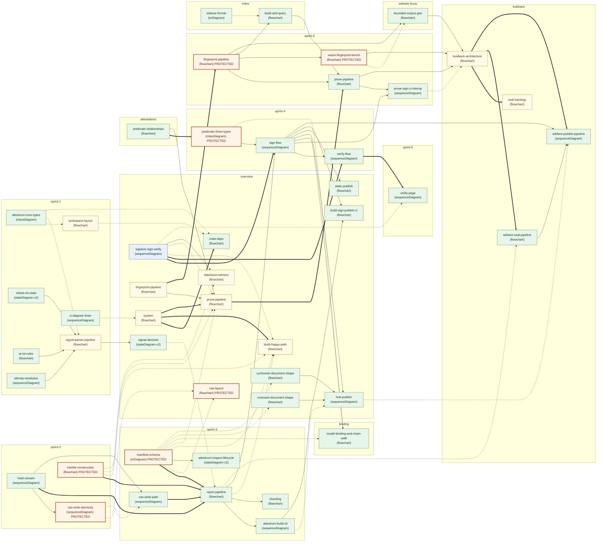

# Attestrum — all 47 diagrams in one map

A single mega-flowchart showing every Mermaid diagram in the Attestrum project as a node, with cross-area links showing how they reference each other. Useful for orientation, for spotting "where does this fit?" gaps, and for figuring out the order to read diagrams when you're new.

This file is **meta** (it describes diagrams, not code), so it lives at the repo root rather than under `docs/diagrams/` — that keeps the diagram-linter from trying to enforce frontmatter / source-of-truth / forward-reference rules on it. Because it is not linter-checked, **it is maintained by hand**: when you add a diagram under `docs/diagrams/`, add a node here too (and bump the count in the title).

---

## Legend

**Arrows:**

| Arrow | Meaning |
|---|---|
| `A --> B` (solid) | Data or control flows from A into B. The output of A is the input of B. |
| `A -.-> B` (dotted) | A *references* a contract that B defines. B is the spec; A is a consumer. |
| `A ==> B` (thick) | A is a higher-level overview that B decomposes into (zoom-in relationship). |

**Node colors** (track each diagram's `source_of_truth` + PROTECTED status):

| Color | Meaning |
|---|---|
| Orange border, peach fill | **PROTECTED** (CLAUDE.md §4). Changing it invalidates every prior corpus; requires the `Protected-system-change:` commit footer. |
| Green border, mint fill | `source_of_truth: code`. Live, shipped contract. Code is authoritative; the diagram is a derived view. |
| Amber border, cream fill | `source_of_truth: diagram`. Spec the code must implement. Flips to `code` when the matching implementation lands. |
| Blue border, ice fill | `source_of_truth: spec`. An external spec (RFC 6962, in-toto v1, Sigstore Bundle v0.3) is authoritative; drift means our implementation is wrong, not the diagram. |

**Subgraphs** group diagrams by area: `overview`, `sprint-1`…`sprint-6`, `attestations`, `binding`, `index`, `lookback`, `website-fuzzy`.

---

## The map

---

## Notes — what's going on in each cluster

### overview/ — orientation layer (14 diagrams)

The mental model for the project. The originals: **`system`** (the 30-second elevator pitch, points outward to everything), **`crate-deps`** (the workspace dep graph, derived from the `Cargo.toml`s), **`build-happy-path`** + **`prove-pipeline`** (the two HEADLINE flows — `build` seals a corpus, `prove` answers "is doc X in corpus Y?"; **`prove-pipeline` is THE wedge** auditors care about), **`signal-decision`** (collapses per-parser verdicts into `Included | Excluded | NeedsReview`), **`sigstore-sign-verify`** (the Sigstore Bundle v0.3 + in-toto v1 wire format — `source_of_truth: spec`, the blue node — verifiable by any cosign v3+ with no Attestrum install), **`takedown-witness`** + **`hub-publish`** (witness ledger + HF Hub publish), **`fingerprint-pipeline`** (the planning-era overview; its shipped form is `sprint-5/fingerprint-pipeline`), and **`cas-layout`** (PROTECTED `.attestrum/cas/` directory layout).

Added since the originals: **`build-sign-publish-ci`** (the build→sign→publish CI dry-run), **`croissant-document-shape`** + **`cyclonedx-document-shape`** (the Croissant 1.0 + CycloneDX 1.6 ML-BOM documents `attestrum-emit` emits from the manifest), and **`static-publish`** (the `--target static` self-hosting publish path alongside `hub-publish`).

### sprint-1/ — scaffolding + top-3 signal parsers (7 diagrams)

`workspace-layout` and `attestrum-core-types` are the substrate every later crate consumes. The three parser state machines (`robots-txt-state`, `ai-txt-rules`, `tdmrep-resolution`) feed the cross-parser `signal-parser-pipeline`, which aggregates into the overview's `signal-decision`. `ci-diagram-linter` is the meta diagram for the custom Rust linter at `tools/diagram-linter/` that enforces the diagrams-first rule — hence `LINTER -.-> SYSTEM` (it governs every diagram). NB: the signal parsers are implemented + tested but **not yet wired into the `build` pipeline** (the pipeline records caller-supplied signals).

### sprint-2/ — hash + atomic CAS + Merkle (3 diagrams)

Tiny but consequential — the **determinism foundation**. `hash-stream` is the BLAKE3+SHA-256 streaming hasher (tee, no buffering). `cas-write-atomicity` is the PROTECTED single-put atomicity contract (tmp + rename + fsync). `merkle-construction` is the PROTECTED RFC 6962 binary Merkle over BLAKE3. Byte-identical output across the 4-target CI matrix (linux-x86_64-glibc, linux-aarch64-glibc, macos-aarch64-darwin, linux-x86_64-musl) depends on every byte these three commit to.

### sprint-3/ — manifest + pipeline + CLI (6 diagrams)

The **composition layer**. `manifest-schema` is the PROTECTED 18-column Parquet schema. `cas-write-path` is how the pipeline calls `CasStore::put` from N parallel Rayon workers. `rayon-pipeline` is the three-stage fold-reduce build that wires signals + hash/CAS/Merkle + manifest into a single deterministic build. `attestrum-build-cli` is the user entry; `attestrum-inspect-lifecycle` is the read-only reader CLI; `sharding` wraps the pipeline with `attestrum plan` + `attestrum merge`.

### sprint-4/ — predicate types + sign/verify (3 diagrams)

`predicate-three-types` is the PROTECTED classDiagram of the three in-toto predicate types (training-corpus / inclusion-proof / non-inclusion-proof at `v0.3`; §4 — a schema change requires a version bump + migration). `sign-flow` is the DSSE-wrapped Sigstore Bundle v0.3 emission half; `verify-flow` is the verify half with TrustRoot cache. Together they are the shipped implementation of the overview's `sigstore-sign-verify` spec.

### sprint-5/ — fingerprint + prove + wasm (4 diagrams)

The shipped fingerprinting + proving layer. `fingerprint-pipeline` is the PROTECTED text/image/ISCC pipeline (NFC + MinHash/SimHash + ISCC composition — its text-normalization is §4-locked). `prove-pipeline` is exact + fuzzy match + non-inclusion + alternate manifest sources. `prove-sign-ci-interop` mints the signed inclusion-proof showcase and proves third-party cosign verifies it. `wasm-fingerprint-kernel` is the PROTECTED text-MinHash kernel compiled to `wasm32` (byte-identity-gated in CI) for the attestrum.com near-match demo.

### sprint-6/ — visitor verification (1 diagram)

`verify-page` is the `verify.html` visitor-verification handoff — the static page that hands a visitor a ready-to-paste stock-`cosign` command, the implementation surface of `verify-flow` for non-engineers.

### attestations/ — predicate URIs (1 diagram)

`predicate-relationships` shows how the three Attestrum predicate URIs reference each other (the overview that `sprint-4/predicate-three-types` decomposes into). Feeds both `sigstore-sign-verify` (the in-toto payload) and `prove-pipeline` (proofs USE these predicate types).

### binding/ — corpus-to-model binding (1 diagram)

`model-binding-and-chain-walk` is the `model-binding/v0.1` in-toto Statement that binds a sealed corpus to a model (`attestation_digest_of_bundle`, `bind`, and the signed chain walk) — built on `sign-flow` and the predicate types.

### index/ — fuzzy-lookup sidecars (2 diagrams)

`sidecar-format` is the v1 on-disk `.idx` layout (minhash / perceptual / iscc sub-indexes; raw little-endian, BLAKE3-sealed, NOT a §4 change — a derived artifact). `build-and-query` is the standalone `attestrum index build` plus the `attestrum prove` fuzzy fast-path with exhaustive fallback. The index accelerates `prove` without touching the signed-proof bytes.

### lookback/ — the public fuzzy-search demo (4 diagrams)

`lookback-architecture` is the end-to-end demo overview; `seal-topology` is the seal-local / sign-in-cloud / publish-to-HF topology; `wikitext-seal-pipeline` is the WikiText-103 seal generator; `wikitext-publish-pipeline` is the gated build→sign→publish. This is Phase A made real (the published `Attestrum/wikitext-103-sealed` corpus the live attestrum.com demo checks against). `lookback-architecture` + `seal-topology` are still `source_of_truth: diagram` (the demo's evolving contract); the two pipeline diagrams are `code`.

### website-fuzzy/ — bounded near-match demo corpus (1 diagram)

`bounded-corpus-gen` is the tracked generator (`tools/fuzzy-web-gen`) that turns the showcase passages into `fuzzy-index.json` using the same kernel the wasm compiles from. With `sprint-5/wasm-fingerprint-kernel`, it powers the LIVE in-browser paste-your-own near-match on attestrum.com (both feed `lookback-architecture`).

---

## How to read this map for different purposes

**"I'm new — where do I start?"**
1. `overview/system` (the 30-second view)
2. `overview/crate-deps` (which crate does what)
3. `overview/build-happy-path` (the canonical successful flow)
4. `sprint-1/workspace-layout` + `sprint-1/attestrum-core-types` (the substrate)
5. Then follow the arrows from `build-happy-path` to learn how a build actually works, then `overview/prove-pipeline` → `sprint-5/prove-pipeline` for the wedge.

**"I'm about to touch a PROTECTED zone"** (the orange nodes)
- Read the PROTECTED diagrams FIRST: `cas-layout`, `cas-write-atomicity`, `merkle-construction`, `manifest-schema`, `predicate-three-types`, `sprint-5/fingerprint-pipeline`, `wasm-fingerprint-kernel`.
- Each documents a corpus-incompatible contract; any change requires the `Protected-system-change:` commit footer per CLAUDE.md §4.
- Pay attention to the dotted arrows INTO these diagrams — those are the consumers you'd break.

**"I'm writing a new diagram"**
- Add the file under `docs/diagrams/<area>/<topic>.md` with the 5-field frontmatter (`title`, `models`, `source_of_truth`, `last_verified`, `diagram_type`).
- Then add a node here (this hand-maintained map) and bump the count in the title — this file is NOT linter-checked, so nothing else will catch the omission.

**"I'm planning new work"**
- The amber (`draft`) nodes are diagrams whose implementation hasn't fully landed or that remain the contract the code tracks: `system`, `build-happy-path`, `prove-pipeline` (overview), `fingerprint-pipeline` (overview), `takedown-witness`, `workspace-layout`, `signal-parser-pipeline`, `lookback-architecture`, `seal-topology`. Most Sprint 4–5 work has flipped to green (`code`); `takedown-witness` is the main Sprint 6 flow still ahead.

**"I'm debugging a determinism failure"**
- Walk the build arrows backwards from the output (`manifest-schema` + `merkle-construction`) toward the input (`hash-stream` + the signal parsers). Every diagram on that path is determinism-critical — check each one's `source_of_truth: code` claim is still accurate.

---

## Cross-area links called out (the most important inter-subgraph arrows)

- `sprint-1::SP_PIPE → overview::SIGNAL_DEC` — the parsers feed the aggregator.
- `sprint-2::CAS_WRITE -.-> overview::CAS_LAYOUT` — single-put atomicity realizes the documented directory layout.
- `sprint-2::HASH ==> sprint-3::RAYON`, `MERKLE ==> RAYON`, `sprint-3::MANIFEST ==> RAYON` — hash + Merkle + manifest are the per-worker / seal steps of the build pipeline.
- `sprint-3::RAYON -.-> overview::BUILD_HAPPY` — the rayon-pipeline IS what `build-happy-path` describes at a higher level.
- `overview::SIGSTORE_SV ==> sprint-4::SIGN_FLOW / VERIFY_FLOW` — the spec decomposes into the shipped sign + verify halves.
- `attestations::PREDICATES ==> sprint-4::PRED3` — the predicate-URI overview decomposes into the PROTECTED three-type classDiagram.
- `overview::OV_FP ==> sprint-5::S5_FP ==> sprint-5::WASM_FP` — the fingerprint pipeline's planning view → shipped impl → wasm-compiled kernel.
- `sprint-5::S5_FP → index::IDX_BQ → sprint-5::S5_PROVE` — fingerprints build the sidecar index that accelerates prove.
- `sprint-5::S5_FP / WASM_FP → website-fuzzy::FUZZY_GEN → lookback::LB_ARCH` — the same kernel generates the bounded corpus and runs in-browser for the live near-match demo.
- `sprint-4::SIGN_FLOW → lookback::LB_PUB` — the gated build→sign→publish that minted the public WikiText corpus.

---

## File map

| File | Path | Purpose |
|---|---|---|
| This file | `DIAGRAMS-OVERVIEW.md` | Repo-root meta-map of all diagrams (hand-maintained) |
| Source diagrams | `docs/diagrams/{overview,sprint-1..6,attestations,binding,index,lookback,website-fuzzy}/*.md` | The individual diagram files (linter-enforced) |
| PNG mirror | `diagrams-png/` | Gitignored, regenerated by `bash tools/render-diagrams.sh` |
