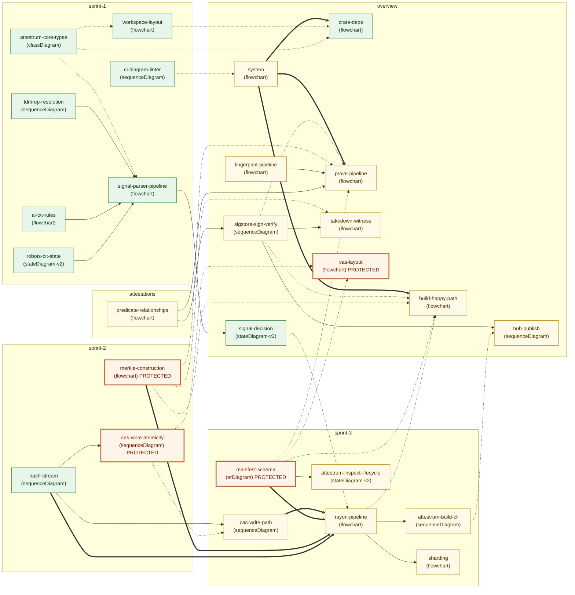

# Attestrum — all 27 diagrams in one map

A single mega-flowchart showing every Mermaid diagram in the Attestrum project as a node, with cross-area links showing how they reference each other. Useful for orientation, for spotting "where does this fit?" gaps, and for figuring out the order to read diagrams when you're new.

This file is **meta** (it describes diagrams, not code), so it lives at the repo root rather than under `docs/diagrams/` — that keeps the diagram-linter from trying to enforce frontmatter / source-of-truth / forward-reference rules on it.

---

## Legend

**Arrows:**

| Arrow | Meaning |
|---|---|
| `A --> B` (solid) | Data or control flows from A into B. The output of A is the input of B. |
| `A -.-> B` (dotted) | A *references* a contract that B defines. B is the spec; A is a consumer. |
| `A ==> B` (thick) | A is a higher-level overview that B decomposes into (zoom-in relationship). |

**Node colors:**

| Color | Meaning |
|---|---|
| Orange border, peach fill | **PROTECTED** (CLAUDE.md §4). Once shipped, changing it invalidates every prior corpus. Requires the `Protected-system-change:` commit footer. |
| Green border, mint fill | `source_of_truth: code`. Live, shipped contract. Code is authoritative; diagram is a derived view. |
| Amber border, cream fill | `source_of_truth: diagram`. Spec the code must implement. Flips to `code` when the matching implementation commit lands. |

**Subgraphs** group diagrams by area: `overview`, `sprint-1`, `sprint-2`, `sprint-3`, `attestations`.

---

## The map

---

## Notes — what's going on in each cluster

### overview/ — orientation layer (10 diagrams)

The 10 `overview/` diagrams are the **mental model** for the project. They're written first (during planning) and then re-verified as code lands. They split into three rough roles:

- **`system`** is the elevator-pitch architecture diagram. It points outward to every other overview diagram. Read this if you have 30 seconds.
- **`crate-deps`** is the workspace dep graph — enforced in code via the `Cargo.toml`s; the diagram is a derived view. Sprint 1 E2 fixed this diagram's arrow direction to match `cargo tree` convention (dependent → dependency).
- **`build-happy-path`** + **`prove-pipeline`** are the two HEADLINE flows. `build` compiles a corpus into a sealed artifact; `prove` answers "is doc X in corpus Y?" with an inclusion or non-inclusion proof. **`prove-pipeline` is THE Path A wedge** — it's why auditors care.
- **`signal-decision`** is the only `stateDiagram-v2` in the overview area. It collapses all the per-parser verdicts into a single `Included | Excluded | NeedsReview` decision per document. It triggered the first per-stateDiagram-v2 proptest obligation (closed Sprint 2 E2).
- **`sigstore-sign-verify`** is the Sigstore Bundle v0.3 + in-toto v1 wire format. This is what makes Attestrum artifacts verifiable by ANY cosign v3+ install without an Attestrum binary.
- **`takedown-witness`** + **`hub-publish`** are Sprint 6 deliverables (the public witness ledger + the HF Hub publish flow).
- **`fingerprint-pipeline`** is Sprint 5 (powers `attestrum prove` for similarity proofs across text/image/audio/video).
- **`cas-layout`** is PROTECTED — the `.attestrum/cas/` directory layout. Every other crate writes through `CasStore`; layout drift breaks every prior corpus.

### sprint-1/ — scaffolding + top-3 signal parsers (7 diagrams)

`workspace-layout` and `attestrum-core-types` are the substrate every later crate consumes. The three parser state machines (`robots-txt-state`, `ai-txt-rules`, `tdmrep-resolution`) feed into the cross-parser `signal-parser-pipeline` flowchart, which then aggregates into the overview's `signal-decision` state machine.

`ci-diagram-linter` is the meta diagram — it describes the custom Rust linter at `tools/diagram-linter/` that enforces the diagrams-first rule on every PR. Hence the dotted `LINTER -.-> SYSTEM` link: the linter governs every diagram, not just one.

### sprint-2/ — hash + atomic CAS + Merkle (3 diagrams)

Tiny but consequential. `hash-stream` is the BLAKE3+SHA-256 streaming hasher (8 KiB tee). `cas-write-atomicity` is the PROTECTED single-put atomicity contract (tmp + rename + fsync). `merkle-construction` is the PROTECTED RFC 6962 binary Merkle over BLAKE3 with the multiset duplicate-leaf policy + audit-path index convention.

These three together are the **determinism foundation**: byte-identical output across the 4-target CI matrix (linux-x86_64-glibc, linux-aarch64-glibc, macos-aarch64-darwin, linux-x86_64-musl) for the same input depends on every byte these three commit to being deterministic.

### sprint-3/ — manifest + pipeline + CLI (6 diagrams)

The **composition layer**. `manifest-schema` is the PROTECTED 18-column Parquet schema (just shipped in E3). `cas-write-path` zooms in on how the pipeline calls `CasStore::put` from N parallel Rayon workers (single-put atomicity from `cas-write-atomicity` is the contract; this is the multi-worker usage pattern). `rayon-pipeline` is the three-stage Rayon fold-reduce pipeline that wires Sprint 1 signals + Sprint 2 hash/CAS/Merkle + Sprint 3 manifest into a single deterministic build.

`attestrum-build-cli` is the user-facing entry. `attestrum-inspect-lifecycle` is the read-only reader CLI — its `stateDiagram-v2` triggers the SECOND proptest obligation (still open, lands in E6). `sharding` wraps the pipeline with `attestrum plan` + `attestrum merge` for deterministic sub-corpus builds.

### attestations/ — predicate URIs (1 diagram)

`predicate-relationships` shows how the three Attestrum predicate URIs (`training-corpus/v0.1`, `inclusion-proof/v0.1`, `non-inclusion-proof/v0.1`) reference each other. Sprint 4-5 deliverable. Feeds both `sigstore-sign-verify` (it's the in-toto Statement payload) and `prove-pipeline` (inclusion/non-inclusion proofs USE these predicate types).

---

## How to read this map for different purposes

**"I'm new — where do I start?"**
1. `overview/system` (the 30-second view)
2. `overview/crate-deps` (which crate does what)
3. `overview/build-happy-path` (the canonical successful flow)
4. `sprint-1/workspace-layout` + `sprint-1/attestrum-core-types` (the substrate)
5. Then follow the arrows from `build-happy-path` to learn how a build actually works.

**"I'm about to touch attestrum-merkle / attestrum-cas / attestrum-manifest" (PROTECTED zones)**
- Read the PROTECTED diagrams FIRST (they're the orange-bordered ones): `cas-layout`, `cas-write-atomicity`, `merkle-construction`, `manifest-schema`.
- Each documents the corpus-incompatible contract. Any change requires the `Protected-system-change:` commit footer per CLAUDE.md §4.
- Pay attention to the dotted arrows INTO these diagrams — those are the consumers you'd break.

**"I'm writing a new diagram"**
- Add the file under `docs/diagrams/<area>/<topic>.md` with the 5-field frontmatter (`title`, `models`, `source_of_truth`, `last_verified`, `diagram_type`).
- Don't add it here (this map) — this is a meta diagram at the repo root, separate from the `docs/diagrams/` tree that the linter checks.
- DO add a one-liner in the dashboard's `WHY_IT_MATTERS` dict at `/tmp/attestrum-dashboard.py` so it shows on the diagrams page.

**"I'm debugging a determinism failure"**
- Walk the build-happy-path arrows backwards from the output (`manifest-schema` + `merkle-construction`) toward the input (`hash-stream` + the signal parsers).
- Every diagram on that path is on the determinism-critical path. Check each one's `source_of_truth: code` claim — is the diagram still accurate?

**"I'm planning Sprint 4+ work"**
- The amber-bordered (`draft`) nodes are diagrams whose implementation hasn't landed yet: `sigstore-sign-verify` (Sprint 4), `predicate-relationships` (Sprint 4-5), `fingerprint-pipeline` (Sprint 5), `prove-pipeline` (Sprint 5), `takedown-witness` (Sprint 6), `hub-publish` (Sprint 6), plus the Sprint 3 commits still pending (`cas-write-path`, `rayon-pipeline`, `attestrum-build-cli`, `attestrum-inspect-lifecycle`, `sharding`).
- Each will flip to green (`source_of_truth: code`) when its implementation commit lands.

---

## Cross-area links called out (the most important inter-subgraph arrows)

- `sprint-1::SP_PIPE → overview::SIGNAL_DEC` — the parsers feed the aggregator.
- `sprint-2::CAS_WRITE -.-> overview::CAS_LAYOUT` — the single-put atomicity contract realizes the documented directory layout.
- `sprint-2::HASH ==> sprint-3::RAYON` — the streaming hasher is the per-worker hashing primitive in the build pipeline.
- `sprint-2::MERKLE ==> sprint-3::RAYON` — the Merkle root computation is the seal step.
- `sprint-3::MANIFEST ==> sprint-3::RAYON` — the manifest writer is the second seal step.
- `sprint-3::RAYON -.-> overview::BUILD_HAPPY` — the rayon-pipeline IS what `build-happy-path` describes at a higher level. The two diagrams should stay in agreement as both evolve.
- `attestations::PREDICATES → overview::SIGSTORE_SV` — the in-toto predicates are the payload Sigstore wraps.
- `overview::FP → overview::PROVE` — fingerprinting is what makes inclusion/similarity proofs work for text/image/audio/video documents.

---

## File map

| File | Path | Purpose |
|---|---|---|
| This file | `/Users/austinmunday/Documents/Claude/attestrum/DIAGRAMS-OVERVIEW.md` | Repo-root meta-map of all 27 diagrams |
| Desktop copy | `/Users/austinmunday/Desktop/attestrum-diagrams-overview.md` | Identical copy for quick local reference |
| Live dashboard | `http://127.0.0.1:8766/diagrams` | All 27 diagrams individually rendered + descriptions |
| Source diagrams | `/Users/austinmunday/Documents/Claude/attestrum/docs/diagrams/{overview,sprint-1,sprint-2,sprint-3,attestations}/*.md` | The 27 individual diagram files (linter-enforced) |
| PNG mirror | `/Users/austinmunday/Documents/Claude/attestrum/diagrams-png/` | Gitignored, regenerated by `bash tools/render-diagrams.sh` |
