# Attestrum v2 — Path A Build Brief

This document is a **delta + addendum** to `BUILD-PLAN.md v0.1.1`. Everything in BUILD-PLAN.md remains canonical unless a Part below explicitly amends it. Read BUILD-PLAN.md first, then this brief.

---

## Part 0 — Working Agreement (Diagram-First, From Day Zero)

**Rule (non-negotiable, restating and expanding BUILD-PLAN.md §0):**

Every new module, every new CLI subcommand, every new public data structure, every error path, and every multi-party flow MUST have a Mermaid diagram in `docs/diagrams/<sprint-or-area>/<topic>.md` **before any production code is written for that unit of work.** A PR that introduces code without its diagram, or that changes behavior without updating the diagram in the same commit, is a build break and must be reverted or fixed in-PR.

### 0.1 Diagram type selection (codified rule)

| Situation | Required type |
|---|---|
| Pipelines, dependency graphs, decision trees with no internal state | `flowchart` |
| State machines, document lifecycles, signing lifecycles | `stateDiagram-v2` |
| Multi-actor or network flows (OIDC, Hub push, takedown notify) | `sequenceDiagram` |
| Stable public Rust APIs (trait surfaces, public structs) | `classDiagram` |
| On-disk schemas, Parquet column families, RocksDB key spaces | `erDiagram` |

ASCII diagrams in Rust doc-comments are permitted for showing local module relationships (e.g., `///   [Fetcher] -> [Hasher] -> [Manifest]`). For any standalone file under `docs/diagrams/`, Mermaid is the only allowed format. No PlantUML, no draw.io, no SVG, no PNG. The reason is deterministic textual diffs and GitHub native rendering — both light and dark themes must render correctly.

### 0.2 Frontmatter (mandatory on every diagram file)

Every `docs/diagrams/**/*.md` file MUST begin with YAML frontmatter:

```yaml
---
title: "attestrum build pipeline — happy path"
models: "crates/attestrum-pipeline/src/lib.rs::run(), crates/attestrum-cas/src/store.rs"
source_of_truth: code      # one of: code | diagram | spec
last_verified: 7f3a91c 2026-05-23
diagram_type: flowchart
---
```

- `source_of_truth: code` → the code is authoritative; the diagram is a derived view and must be re-verified when the code changes.
- `source_of_truth: diagram` → the diagram is authoritative (used for protocols not yet implemented, e.g., predicate flows in Sprint 5 before code exists). When code lands, this field flips to `code` in the same commit.
- `source_of_truth: spec` → an external specification is authoritative (e.g., RFC 6962, in-toto v1, Sigstore Bundle v0.3). Diagram is a local rendering. Drift means we are wrong, not the spec.
- `last_verified` is `<commit SHA short> <YYYY-MM-DD>`. The diagram-linter CI gate rejects any diagram whose `last_verified` SHA is older than the **last 30 commits to the repo OR older than the merge-base of the current PR**, whichever is older.

### 0.3 CI enforcement (specified, not optional)

A custom Rust tool at `tools/diagram-linter/` enforces all of the following on every PR via the `diagrams` GitHub Actions job:

1. **Mermaid parse check.** Every fenced ```mermaid block in every file under `docs/` is piped through `mmdc --input - --output /dev/null` (mermaid-cli, pinned version, fetched in CI from npm registry with SHA-256 verification). Any parse failure fails the job.
2. **Frontmatter check.** Every `docs/diagrams/**/*.md` must have the four required frontmatter keys. Missing key → fail.
3. **Reverse-reference check.** For every `pub mod` and every `pub struct` / `pub trait` / `pub fn` in `crates/**/src/lib.rs` and `crates/**/src/**/mod.rs`, at least one diagram file under `docs/diagrams/` must mention the fully-qualified path in either its `models:` frontmatter field or in a Mermaid node label. Missing reference → fail. (Generated code under `OUT_DIR` and items annotated `#[doc(hidden)]` are exempt.)
4. **Forward-reference check.** For every Rust identifier appearing as a node label in a Mermaid diagram (heuristic: `PascalCase::snake_case` or `crate::path::Item`), the linter verifies the identifier exists in the workspace via `cargo metadata` + `rustdoc --output-format json`. Dangling reference → fail.
5. **Drift check.** The linter walks `git log -- crates/**` for the touched crates in the PR. If any file with `source_of_truth: code` was modified but its referencing diagrams were not touched in the same commit, fail with a list of stale diagrams.

The linter is itself a normal cargo binary. It runs locally with `cargo run -p diagram-linter -- check`. CI invokes the same binary; no separate logic.

---

## Part 1 — Initial Diagram Set

These ten diagrams are the canonical reference for the project. They MUST exist at the listed paths in Sprint 1 before any non-scaffolding code is written. They are reproduced here verbatim; the Claude Code agent's first job is to copy each block into the listed file with the required frontmatter.

### 1.1 System overview — `docs/diagrams/overview/system.md`

Source of truth: **diagram** (this is a contract that downstream code must implement). Will flip to `code` at end of Sprint 6. Verified by the end-to-end demo recording for Sprint 6 — every input and output box in the diagram must appear at least once in the demo.

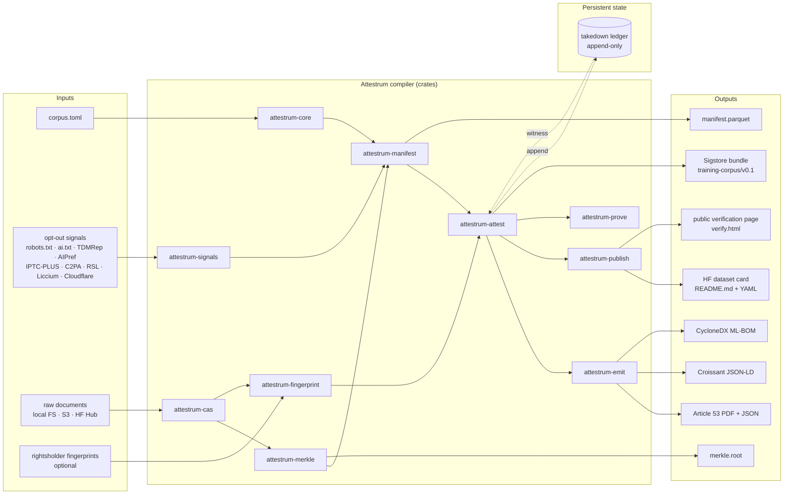

Caption: This is the highest-level system map. The Mermaid is the contract; the code must implement every edge. Verification strategy: the Sprint 6 end-to-end demo recording must visibly traverse each path from at least one Input to at least one Output, and the demo transcript is checked in alongside this file.

### 1.2 `attestrum build` pipeline happy path — `docs/diagrams/overview/build-happy-path.md`

Source of truth: **code** after Sprint 3 completes; **diagram** before then.

```mermaid
flowchart TD
  S[start: attestrum build] --> L[load corpus.toml]
  L --> P[shard plan<br/>attestrum-plan]
  P --> F[parallel fetch<br/>rayon worker pool]
  F --> SP[signal parse<br/>attestrum-signals]
  SP --> H[stream hash<br/>BLAKE3 + SHA-256]
  H --> CW[CAS write<br/>.attestrum/cas/blake3/aa/bb/...]
  CW --> RD{ruleset decision<br/>strict | audit-only | permissive}
  RD -->|include| MR[manifest row append]
  RD -->|exclude with reason| MX[exclusion row append]
  MR --> SE[seal Parquet shard]
  MX --> SE
  SE --> MK[Merkle root<br/>RFC 6962 binary]
  MK --> CS[corpus summary<br/>counts · sizes · signal coverage]
  CS --> E[exit 0]
```

Caption: Code under `crates/attestrum-pipeline/src/lib.rs::run` is canonical. Integration test `tests/pipeline_happy_path.rs` exercises every edge with a 10-MB fixture corpus checked in under `tests/fixtures/mini-pile/`.

### 1.3 `attestrum prove` pipeline — `docs/diagrams/overview/prove-pipeline.md`

Source of truth: **diagram** until Sprint 5; **code** thereafter.

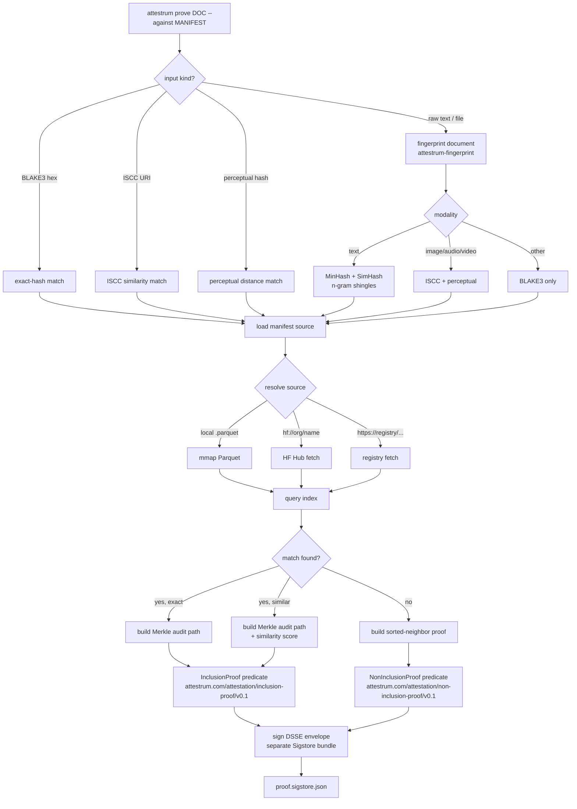

Caption: The proof bundle is **separately signed** and references the corpus manifest by digest in its `subject[]` array. This separation is intentional: a corpus publisher may delegate proof issuance to a different identity (e.g., a hosted Attestrum service operated by Hugging Face) without compromising corpus authorship.

### 1.4 Signal decision state machine — `docs/diagrams/overview/signal-decision.md`

Source of truth: **code** (`crates/attestrum-signals/src/decision.rs`).

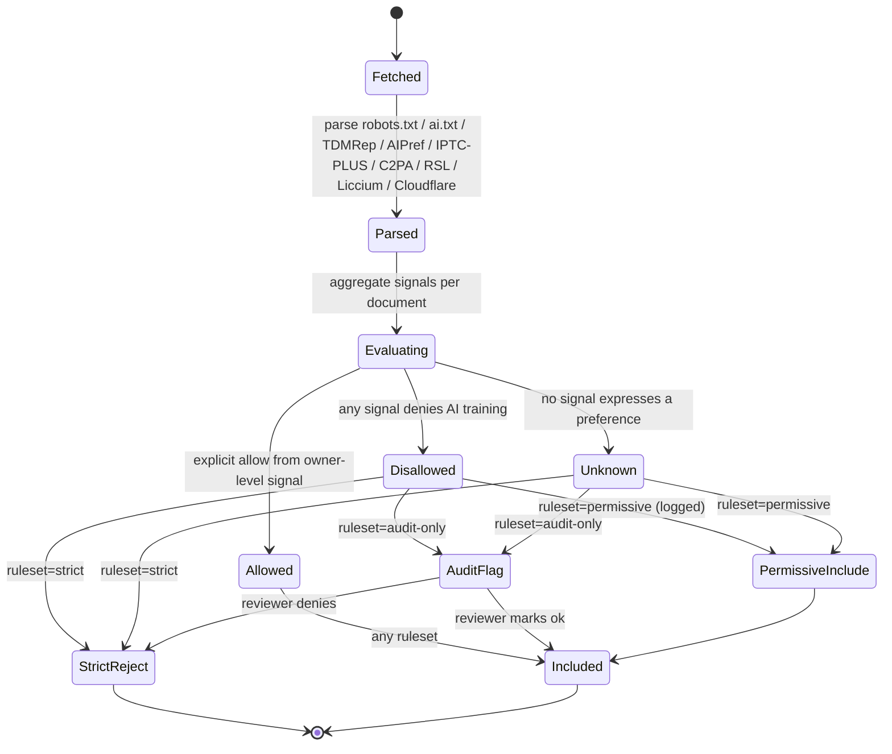

Caption: Property test in `crates/attestrum-signals/tests/decision_proptest.rs` enumerates every (signal-set × ruleset) pair and asserts terminal state matches the diagram.

### 1.5 Sigstore sign-and-verify sequence — `docs/diagrams/overview/sigstore-sign-verify.md`

Source of truth: **spec** (Sigstore Bundle v0.3 / in-toto v1 / Fulcio / Rekor v2). Per the Sigstore documentation, the new bundle format "supports offline verification, and includes additional information (like signed timestamps and attestations) in a single file"; we target `application/vnd.dev.sigstore.bundle.v0.3+json` exclusively.

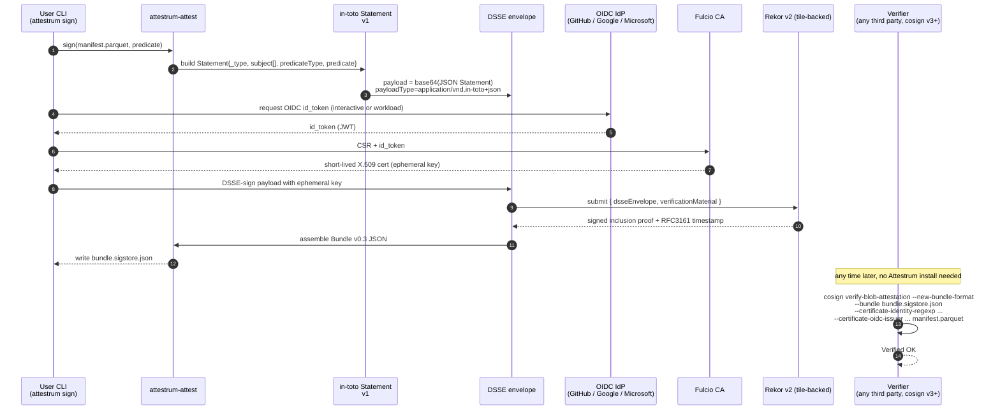

Caption: Cosign v3 made `--new-bundle-format` the default; the v3.0.3 release notes confirm v3 "fixes a number of bugs … along with adding compatibility for the new bundle format and attestation storage in OCI to additional commands." Attestrum emits v0.3 bundles exclusively; v0.1/v0.2 are not supported.

### 1.6 Takedown flow with public witness — `docs/diagrams/overview/takedown-witness.md`

Source of truth: **diagram** until Sprint 6.

```mermaid
flowchart TD
  R[takedown request<br/>rightsholder + doc hash + reason] --> V[verify standing<br/>attestrum-ledger]
  V --> L[append takedown leaf<br/>local append-only log]
  L --> W{witness mode?}
  W -->|local only| NV[new corpus version<br/>v_{n+1}]
  W -->|rekor| RK[submit leaf to Rekor v2<br/>predicate: takedown/v0.1]
  W -->|hub-witness| HB[append leaf to<br/>huggingface.co/datasets/&lt;org&gt;/&lt;dataset&gt;-witness/log.jsonl]
  RK --> NV
  HB --> NV
  NV --> CH[cryptographic chain<br/>v_{n+1}.prev_root = v_n.merkle_root]
  CH --> SIGN[sign new manifest<br/>training-corpus/v0.1 predicate]
  SIGN --> PUB[republish to HF dataset repo<br/>attestrum publish]
  PUB --> NOTIFY[notify downstream consumers<br/>via Hub webhook]
```

Caption: The Rekor v2 path uses the public-good instance whose URL is distributed via TUF (the Sigstore docs warn against hardcoding it: "We strongly advise against hardcoding this URL into any pipelines that cannot be easily updated"). The hub-witness path is a fallback we operate ourselves on the Hub when Rekor v2 is unavailable, contractually equivalent to a tiled append-only log.

### 1.7 Hugging Face Hub publish flow — `docs/diagrams/overview/hub-publish.md`

Source of truth: **diagram** until Sprint 6; **code** after.

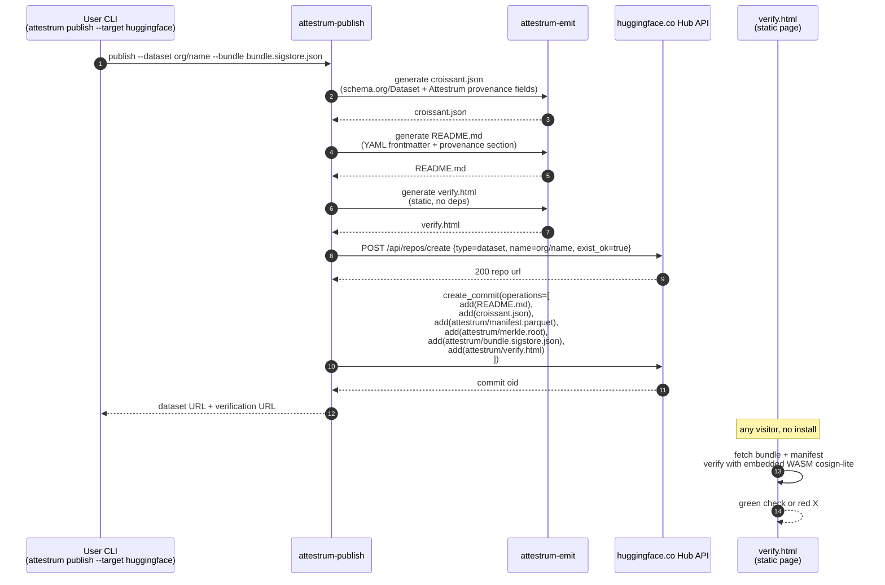

Caption: As confirmed in May 2026, the Hugging Face Hub does **not** expose a native Sigstore-bundle attestation endpoint for datasets; the bundle is committed as a regular repo file via the standard `create_commit` API, exactly as the OpenSSF model-signing project does for models. The HF docs state that the dataset card YAML and the dataset card body are the only Hub-side native surfaces; the Croissant `/croissant` endpoint is read-only and Hub-generated. We therefore make our `croissant.json` an explicit repo-root file (mirroring established practice such as `huggingface.co/datasets/princeton-nlp/CharXiv/blob/main/croissant.json`), independent of the Hub-generated one.

### 1.8 Fingerprint generation pipeline — `docs/diagrams/overview/fingerprint-pipeline.md`

Source of truth: **code** (`crates/attestrum-fingerprint/src/lib.rs`).

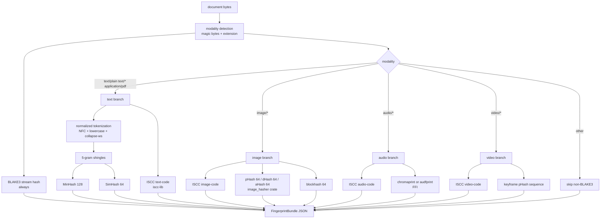

Caption: ISO 24138:2024 ISCC is implemented via the official `iscc-lib` Rust crate (the only ISO 24138:2024 conformance-tested polyglot library, with Rust at its core and Python/Java/Go bindings). Image perceptual hashes use the `image_hasher` crate (the maintained fork of `img_hash`, MSRV 1.70). Text MinHash/SimHash are implemented in-tree because public crates are either toy implementations or unmaintained.

### 1.9 CAS filesystem layout — `docs/diagrams/overview/cas-layout.md`

Source of truth: **code** (`crates/attestrum-cas/src/store.rs`).

```mermaid
flowchart TD
  Root[".attestrum/"] --> Cfg["config.toml<br/>(workspace local overrides)"]
  Root --> CAS["cas/"]
  Root --> Mani["manifests/"]
  Root --> Att["attestations/"]
  Root --> Led["ledger/"]
  Root --> Bun["bundles/"]
  Root --> Tmp["tmp/<br/>(atomic-rename staging)"]
  Root --> Idx["index/<br/>(RocksDB)"]

  CAS --> CASb3["blake3/aa/bb/&lt;full-hash&gt;.bin"]
  CAS --> CASs["sha256/aa/bb/&lt;full-hash&gt;.bin"]
  CAS --> CASm["meta/&lt;blake3-prefix&gt;.json<br/>(content-type, fetched_at, source URI)"]

  Mani --> Mfshard["shard-0000.parquet<br/>shard-0001.parquet<br/>..."]
  Mani --> Mfroot["merkle.root"]
  Mani --> Mfsum["summary.json"]

  Att --> AttC["corpus.intoto.json"]
  Att --> AttI["inclusion-&lt;subject&gt;.intoto.json"]
  Att --> AttN["non-inclusion-&lt;subject&gt;.intoto.json"]

  Bun --> BunC["corpus.sigstore.json"]
  Bun --> BunP["proofs/&lt;id&gt;.sigstore.json"]

  Led --> LedJ["takedowns.jsonl<br/>(append-only)"]
  Led --> LedR["ledger.merkle.root"]

  Idx --> IdxF["fingerprints.db<br/>(RocksDB: hash → manifest row)"]
  Idx --> IdxB["bloom.bin<br/>(membership filter)"]
```

Caption: Two-level hex sharding (`aa/bb/`) matches git's object layout; tested up to 50M objects without ext4 dirent slowdown. Atomic-rename from `tmp/` is the only legal write path into `cas/`.

### 1.10 Crate dependency graph — `docs/diagrams/overview/crate-deps.md`

Source of truth: **code** (`Cargo.toml` workspace + per-crate manifests).

**Arrow convention:** `A --> B` means "A depends on B" — the arrow points from the dependent crate to its dependency, matching `cargo-tree` / `cargo-deps` convention.

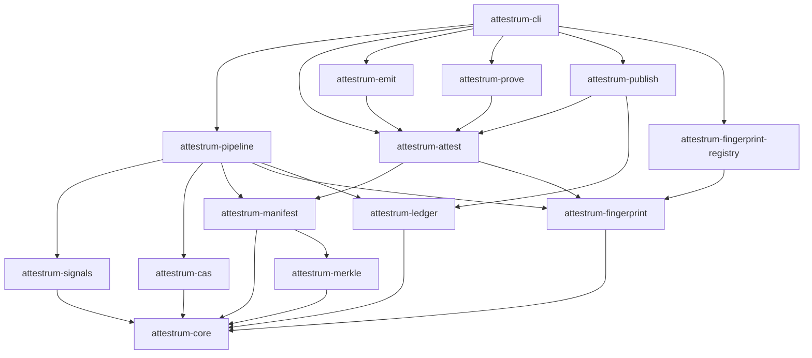

Caption: `attestrum-core` has zero inbound dependencies and only depends on `std` plus `serde`, `thiserror`, `blake3`. Every leaf crate depends transitively on `attestrum-core`; no other cycles or skip-level deps are allowed. The diagram-linter forwards this graph to a `cargo-deny` rule that fails the build on any disallowed edge.

---

## Part 2 — New Module Specifications (Path A Deltas)

### 2.1 `attestrum-fingerprint` (new crate, `crates/attestrum-fingerprint/`)

**Internal flow diagram** — already given as 1.8 above.

**Public API surface (`src/lib.rs`):**

```rust
pub trait Fingerprinter {
    fn modality(&self) -> Modality;
    fn fingerprint(&self, bytes: &[u8], meta: &SourceMeta) -> Result<FingerprintBundle, AttestrumFingerprintError>;
}

#[derive(Debug, Clone, Copy, Serialize, Deserialize, PartialEq, Eq)]
pub enum Modality { Text, Image, Audio, Video, Pdf, Other }

#[derive(Debug, Clone, Serialize, Deserialize)]
pub struct FingerprintBundle {
    pub schema: &'static str,         // always "attestrum.com/fingerprint/v0.1"
    pub blake3: [u8; 32],
    pub sha256: Option<[u8; 32]>,
    pub modality: Modality,
    pub iscc: Option<IsccCode>,
    pub perceptual: Option<PerceptualHashes>, // pHash/dHash/aHash/blockhash for images
    pub audio: Option<AudioFingerprint>,
    pub text: Option<TextFingerprint>,        // MinHash 128 + SimHash 64
    pub byte_len: u64,
    pub generated_at: jiff::Timestamp,
}

pub fn fingerprint_path(path: &Path, opts: &FingerprintOpts) -> Result<FingerprintBundle, AttestrumFingerprintError>;
pub fn fingerprint_bytes(bytes: &[u8], modality_hint: Option<Modality>) -> Result<FingerprintBundle, AttestrumFingerprintError>;

pub fn canonical_json(bundle: &FingerprintBundle) -> String; // RFC 8785 JCS, deterministic
```

**Error variants:**

```rust
#[derive(thiserror::Error, Debug)]
pub enum AttestrumFingerprintError {
    #[error("io: {0}")] Io(#[from] std::io::Error),
    #[error("modality detection failed for {0:?}")] ModalityUnknown(PathBuf),
    #[error("iscc backend failed: {0}")] IsccBackend(String),
    #[error("perceptual hash failed: {0}")] Perceptual(String),
    #[error("text normalization failed: {0}")] TextNorm(String),
    #[error("ffi error: {0}")] Ffi(String),
    #[error("canonicalization failed: {0}")] Canonical(String),
}
```

**Cargo.toml deps added (workspace versions managed centrally):**

```toml
[dependencies]
attestrum-core = { path = "../attestrum-core" }
blake3 = { workspace = true }
sha2 = { workspace = true }
serde = { workspace = true, features = ["derive"] }
serde_json = { workspace = true }
thiserror = { workspace = true }
jiff = { workspace = true }
# fingerprinting
iscc-lib = "0.4"                    # iscc/iscc-lib, ISO 24138:2024
image = "0.25"
image_hasher = "3.0"                # qarmin/img_hash maintained fork
blockhash = "0.5"
unicode-normalization = "0.1"
# text minhash/simhash implemented in-tree under src/text/
# audio behind a feature flag (optional)
chromaprint-sys = { version = "0.1", optional = true }

[features]
default = []
audio-chromaprint = ["chromaprint-sys"]
```

**Test fixtures:** `tests/fixtures/fp/` contains 12 documents (3 text, 3 image, 2 audio, 2 video, 2 pdf), each with a golden `expected.json` capturing every numerical fingerprint output. Golden file regen is gated behind `ATTESTRUM_REGEN_GOLDEN=1`.

**Rationale for ISCC backend choice:** the `iscc/iscc-lib` crate is the only ISO 24138:2024 implementation with a Rust core (the BIO-CODES project's iscc-sum demonstrates the Rust core reaches "1+ GB/s — up to 184× faster than the pure Python reference implementation"). FFI to `iscc-sdk` Python was the original BUILD-PLAN.md fallback; we no longer need it.

---

### 2.2 `attestrum-prove` (new crate, `crates/attestrum-prove/`)

**Internal flow diagram** — given as 1.3 above.

**Public API surface:**

```rust
pub fn prove(
    target: ProofTarget,
    manifest: ManifestSource,
    opts: &ProveOpts,
) -> Result<ProofArtifact, AttestrumProveError>;

pub enum ProofTarget {
    Blake3([u8; 32]),
    Iscc(String),
    Perceptual(PerceptualHashes),
    Document(PathBuf),     // run fingerprinting inline
    Bundle(FingerprintBundle),
}

pub enum ManifestSource {
    Local(PathBuf),                          // .parquet or directory
    HuggingFace { repo: String, revision: Option<String> },
    Url(url::Url),
}

pub struct ProofArtifact {
    pub kind: ProofKind,                     // Inclusion | NonInclusion
    pub statement: InTotoStatement,
    pub bundle: Option<SigstoreBundle>,      // None if --unsigned
    pub confidence: f32,                     // 0.0–1.0
    pub matched_subject: Option<ResourceDescriptor>,
}

pub enum ProofKind { Inclusion, NonInclusion }
```

**Match modes (confidence reporting):**

| Mode | Confidence | Predicate |
|---|---|---|
| Exact BLAKE3 | 1.00 | `inclusion-proof/v0.1` |
| Exact SHA-256 | 1.00 | `inclusion-proof/v0.1` |
| ISCC composite distance ≤ 4 | 0.95 | `inclusion-proof/v0.1` with `match_mode: "iscc"` |
| Perceptual Hamming ≤ 6 (of 64) | 0.85 | `inclusion-proof/v0.1` with `match_mode: "perceptual"` |
| MinHash Jaccard ≥ 0.85 | 0.80 | `inclusion-proof/v0.1` with `match_mode: "minhash"` |
| All match modes fail | 1.00 | `non-inclusion-proof/v0.1` with sorted-neighbor proof |

**Non-inclusion proof structure** uses the sorted-Merkle adjacent-leaves technique (also known as a sorted Merkle tree non-membership proof): leaves are sorted by BLAKE3 hash; for a query `q` we return the two adjacent leaves `(l, r)` with `l < q < r` plus audit paths for both, plus an attestation that the tree is sorted (which the verifier checks by recomputing the root and verifying `l.hash < r.hash` and that `l` and `r` are adjacent in the leaf order encoded by the audit paths). This is the standard primitive used in Certificate Transparency–adjacent literature and in the Cartesian Merkle Tree / Sparse Merkle Tree families; for Attestrum we use the simpler sorted-Merkle variant because our manifests are sealed (no insertions after build).

**Error variants:**

```rust
#[derive(thiserror::Error, Debug)]
pub enum AttestrumProveError {
    #[error("manifest source unreachable: {0}")] SourceUnreachable(String),
    #[error("manifest format invalid: {0}")]    InvalidManifest(String),
    #[error("merkle root mismatch")]            MerkleMismatch,
    #[error("fingerprint failed: {0}")]         Fingerprint(#[from] AttestrumFingerprintError),
    #[error("signing failed: {0}")]             Sign(#[from] AttestrumAttestError),
    #[error("ambiguous match: {0} candidates")] Ambiguous(usize),
}
```

**Predicate type URIs (new, see Part 3 for schemas):**

- `https://attestrum.com/attestation/inclusion-proof/v0.1`
- `https://attestrum.com/attestation/non-inclusion-proof/v0.1`

Both are sister predicates of `https://attestrum.com/attestation/training-corpus/v0.1` and reference the corpus manifest by digest in `subject[]`.

**Cargo.toml deps:** `attestrum-core`, `attestrum-manifest`, `attestrum-fingerprint`, `attestrum-merkle`, `attestrum-attest`, `parquet`, `arrow`, `hf-hub` (cf. 2.3), `url`.

**Test fixtures:** `tests/fixtures/prove/` with three sealed manifests (10 / 1K / 100K leaves), each accompanied by an `included.txt` and `excluded.txt` list of test queries with expected proof types.

---

### 2.3 `attestrum-publish` (new crate, `crates/attestrum-publish/`)

**Internal flow diagram** — given as 1.7 above.

**Public API surface:**

```rust
pub trait PublishTarget {
    fn target_name(&self) -> &'static str;
    fn publish(&self, plan: &PublishPlan) -> Result<PublishReceipt, AttestrumPublishError>;
}

pub struct HuggingFaceTarget { client: HFClient, repo: String, branch: String }
pub struct GitHubReleaseTarget { repo: String, tag: String }   // fallback path
pub struct StaticBundleTarget { out_dir: PathBuf }              // for Zenodo, mirrors

pub struct PublishPlan {
    pub manifest_path: PathBuf,
    pub bundle_path: PathBuf,
    pub croissant: serde_json::Value,
    pub readme: String,
    pub verify_html: String,
    pub extras: Vec<(PathBuf, String)>, // (local path, path-in-repo)
}

pub struct PublishReceipt {
    pub target: String,
    pub dataset_url: String,
    pub verify_url: String,
    pub commit_oid: Option<String>,
}
```

**Hub client choice:** we use the `huggingface/hf-hub` Rust crate (the canonical first-party client, with both async `HFClient` and synchronous `HFClientSync` interfaces, supporting "create commits with multiple file operations" and `repo_type=dataset`). The stable crates.io 0.4.x line is currently download-focused (its docs describe it as "implements a smaller subset of functions"); the upload/commit API exists on the GitHub master branch and is in pre-1.0 churn, so we pin via `git = "https://github.com/huggingface/hf-hub", rev = "<sha pinned in Cargo.lock>"` until a published release exposes the upload API. This is the only acceptable departure from "crates.io only" in the workspace; we add a CI check that the pinned rev is no older than 14 days at any tag release.

**Croissant emitter:** generates `croissant.json` at the repo root (mirroring established practice such as `huggingface.co/datasets/princeton-nlp/CharXiv/blob/main/croissant.json`) containing the standard `@context` block, `@type: sc:Dataset`, plus an Attestrum-extension `cr:attestrumProvenance` field linking to `attestrum/manifest.parquet`, `attestrum/merkle.root`, and `attestrum/bundle.sigstore.json`. The Hub's auto-generated `/croissant` endpoint will continue to serve its own Parquet-derived JSON-LD; ours is the publisher-authored authoritative one and we explicitly note this in the README.

**Dataset card YAML frontmatter (generated):**

```yaml
---
pretty_name: "<dataset display name>"
license: "<single SPDX id or 'mixed'>"
license_details: "see attestrum/license-inventory.json"
language: [en]
task_categories: [text-generation]
size_categories: [1B<n<10B]
tags:
  - attestrum-provenance
  - sigstore-signed
  - croissant
configs:
  - config_name: default
    data_files:
      - split: train
        path: "data/*.parquet"
attestrum:
  predicate: https://attestrum.com/attestation/training-corpus/v0.1
  manifest: attestrum/manifest.parquet
  merkle_root: attestrum/merkle.root
  bundle: attestrum/bundle.sigstore.json
  verify_url: ./attestrum/verify.html
  publication_intent: huggingface-hub
---
```

The `attestrum:` block is a non-Hub-reserved extension key; the Hub silently passes it through and our verify.html reads it.

**Authentication:** the `hf-hub` crate resolves tokens in this order — `HF_TOKEN` env var → `~/.cache/huggingface/token` → `~/.cache/huggingface/stored_tokens`. Fine-grained tokens with `write` scope on the target repo path are sufficient. Organizational vs personal accounts are transparent. Setting `HF_HUB_DISABLE_IMPLICIT_TOKEN=1` forces explicit `--token` on the CLI.

**Public verification page (`verify.html`):** a single self-contained HTML file with embedded WASM `sigstore-js`-equivalent verification logic (we ship our own Rust→WASM build from the `sigstore` Rust crate). The page fetches the bundle and the manifest from the same repo root via relative URLs, verifies offline, and renders a green/red status with the identity certificate's `cert-identity` and `cert-oidc-issuer` displayed. No network call beyond the same-origin fetches; no JS framework; ≤ 250 KB total.

**Sprint 6 contingency (HF native attestation not ready):** confirmed by research that native Sigstore attestation acceptance is not shipping on the Hub for dataset repos as of May 2026 (Sigstore community framing remains aspirational — Red Hat: "Imagine: Seamless integration with model hubs like Hugging Face, providing every model with a verifiable lineage"). The shipped pattern is exactly the OpenSSF model-signing flow used on Hugging Face today, in which Sigstore bundles are committed as ordinary repo files (`model.sig` / `model_signature.json`) via the regular `create_commit` API. Cohere has implemented this pattern at scale: per Cohere's official blog post "Our commitment to AI model signing on Hugging Face," "Cohere has implemented model signing for all Cohere Command models hosted on Hugging Face to improve integrity and authenticity efforts." We therefore ship the Hub commit-API path (treating the bundle as a regular committed file under `attestrum/bundle.sigstore.json`) as primary, with the `GitHubReleaseTarget` and `StaticBundleTarget` as additional published surfaces. There is no functional regression — the bundle remains verifiable by any `cosign v3+ verify-blob-attestation --new-bundle-format` invocation.

**Error variants:** `Network`, `Auth`, `RepoExists`, `RepoMissing`, `Quota`, `BundleMissing`, `ReadmeRender`, `CroissantInvalid`, `VerifyHtmlBuild`.

**Test fixtures:** `tests/fixtures/publish/mock-hub/` is a tiny in-process HTTP server mocking the `create_repo`, `preupload`, `create_commit`, and `repo_files` endpoints. End-to-end publish tests run against it in CI; the real Hub is exercised only in a once-per-release nightly job gated on `HF_TOKEN_ATTESTRUM_BOT`.

---

### 2.4 `attestrum-fingerprint-registry` (new crate, optional in v1)

**Purpose:** local registry of rightsholder fingerprints submitted to Attestrum, plus optional read-only federation with external registries (Spawning, Liccium, Created by Humans). Backs the "was this in any tracked corpus" query.

**Public API:**

```rust
pub struct Registry { rocks: rocksdb::DB, bloom: BloomFilter }

impl Registry {
    pub fn open(path: &Path) -> Result<Self, AttestrumRegistryError>;
    pub fn submit(&self, fp: FingerprintBundle, claimant: ClaimantId) -> Result<RegistryReceipt, _>;
    pub fn lookup(&self, fp: &FingerprintBundle) -> Result<Vec<RegistryHit>, _>;
    pub fn federate(&self, source: FederationSource) -> Result<usize, _>;
}

pub enum FederationSource {
    Spawning, Liccium, CreatedByHumans, Custom(url::Url),
}
```

**Bloom filter:** per-manifest filter (size = `1.44 · n · log2(1/p)` bits, p=0.001) lets us answer "definitely not in this manifest" without loading the Parquet index; loaded on demand from `.attestrum/index/bloom.bin`.

**Federation adapters:** read-only. Each adapter normalizes the upstream registry's records into our `FingerprintBundle` shape; we do not write back. Federation is gated behind a feature flag because some upstream APIs have terms that forbid redistribution; the federation cache is stored under `.attestrum/index/federation/<source>.db` and is never published.

**Optionality:** crate exists but is excluded from the default workspace `default-members` list; opted in via `cargo build -p attestrum-fingerprint-registry`. Not exposed via the CLI in v1.

---

### 2.5 Expanded `attestrum-ledger` (revised)

**New API additions:**

```rust
pub trait Witness {
    fn submit(&self, leaf: &TakedownLeaf) -> Result<WitnessReceipt, AttestrumLedgerError>;
    fn verify(&self, leaf: &TakedownLeaf, receipt: &WitnessReceipt) -> Result<(), AttestrumLedgerError>;
}

pub struct RekorWitness { url: url::Url, trusted_root: SigstoreTrustedRoot }
pub struct HubWitness  { client: HFClient, repo: String }  // org/<dataset>-witness
pub struct NullWitness;                                    // local only

pub fn append_takedown(&mut self, req: TakedownRequest, witness: &dyn Witness) -> Result<TakedownLeaf, _>;
pub fn verify_chain(&self, from_root: [u8; 32], to_root: [u8; 32]) -> Result<ConsistencyProof, _>;
```

**Witness decision rule:**
- If `--witness rekor` and the public Rekor v2 instance is reachable (fetched via TUF, not hardcoded), submit there. The Sigstore docs explicitly note: "Rekor v2 also will provide stronger security guarantees that the log remains append-only by integrating witnessing directly into Rekor."
- Else if `--witness hub` and an `HF_TOKEN` is available, append to `huggingface.co/datasets/<org>/<dataset>-witness/log.jsonl` as an append-only file in a dedicated witness repo.
- Else fall back to `NullWitness` and emit a CI-visible warning.

**Public verification:** any third party verifies a takedown leaf by fetching `log.jsonl` + the Merkle proof from the witness, recomputing the root, and verifying the root signature in the corpus bundle. No Attestrum install required.

---

## Part 3 — Revised Attestation Predicate Schema

The in-toto v1 Statement layer is unchanged from BUILD-PLAN.md. Every Attestrum attestation conforms to the spec exactly as defined at `https://github.com/in-toto/attestation/blob/main/spec/v1/statement.md`:

```json
{
  "_type": "https://in-toto.io/Statement/v1",
  "subject":       [{ "name": "...", "digest": { "blake3": "...", "sha256": "..." }}],
  "predicateType": "<one of the three Attestrum URIs>",
  "predicate":     { ... }
}
```

### 3.1 `https://attestrum.com/attestation/training-corpus/v0.1` (revised)

```json
{
  "$schema": "https://json-schema.org/draft/2020-12/schema",
  "$id":     "https://attestrum.com/attestation/training-corpus/v0.1.schema.json",
  "title":   "Attestrum Training Corpus Attestation v0.1",
  "type":    "object",
  "required": [
    "attestrumVersion","builderVersion","builtAt","determinism","manifest","merkleRoot",
    "rulesetMode","signalCoverage","licensingPosture","licenseInventory",
    "takedownContact","datasetHomepage","publicationIntent"
  ],
  "properties": {
    "attestrumVersion":      { "type": "string", "pattern": "^v[0-9]+\\.[0-9]+\\.[0-9]+" },
    "builderVersion":    { "type": "string" },
    "builtAt":           { "type": "string", "format": "date-time" },
    "determinism": {
      "type": "object",
      "required": ["targetTriple","seed","manifestSchemaVersion"],
      "properties": {
        "targetTriple":          { "type": "string" },
        "seed":                  { "type": "string" },
        "manifestSchemaVersion": { "type": "string" }
      }
    },
    "manifest": {
      "type": "object",
      "required": ["uri","digestAlgo","digest","rowCount","byteCount"],
      "properties": {
        "uri":        { "type": "string" },
        "digestAlgo": { "enum": ["blake3","sha256"] },
        "digest":     { "type": "string", "pattern": "^[0-9a-f]{64}$" },
        "rowCount":   { "type": "integer", "minimum": 0 },
        "byteCount":  { "type": "integer", "minimum": 0 }
      }
    },
    "merkleRoot":  { "type": "string", "pattern": "^[0-9a-f]{64}$" },
    "rulesetMode": { "enum": ["strict","audit-only","permissive"] },
    "signalCoverage": {
      "type": "object",
      "properties": {
        "robotsTxt":     { "type": "number", "minimum": 0, "maximum": 1 },
        "aiTxt":         { "type": "number" },
        "tdmRep":        { "type": "number" },
        "aipref":        { "type": "number" },
        "iptcPlus":      { "type": "number" },
        "c2pa":          { "type": "number" },
        "rsl":           { "type": "number" },
        "liccium":       { "type": "number" },
        "cloudflare":    { "type": "number" }
      }
    },
    "licensingPosture": {
      "enum": ["allOpenLicensed","mixedLicensed","allLicensed","undisclosed"]
    },
    "licenseInventory": {
      "type": "array",
      "items": {
        "type": "object",
        "required": ["spdxId","byteCount"],
        "properties": {
          "spdxId":     { "type": "string" },
          "byteCount":  { "type": "integer", "minimum": 0 },
          "rowCount":   { "type": "integer", "minimum": 0 },
          "notes":      { "type": "string" }
        }
      }
    },
    "takedownContact": { "type": "string", "format": "uri" },
    "datasetHomepage": { "type": "string", "format": "uri" },
    "publicationIntent": {
      "enum": ["huggingface-hub","zenodo","github-release","eu-ai-office","private"]
    },

    "totalCompute": { "type": "string" },
    "trainingCost": { "type": "string" },
    "modelName":    { "type": "string" }
  }
}
```

**Field changes vs BUILD-PLAN.md v0.1.1:**
- Newly required: `licensingPosture`, `licenseInventory`, `takedownContact`, `datasetHomepage`, `publicationIntent`.
- Newly optional (were required for the Article-53-headline flow): `totalCompute`, `trainingCost`, `modelName`. A dataset may exist without a model.

### 3.2 `https://attestrum.com/attestation/inclusion-proof/v0.1` (new)

```json
{
  "$schema": "https://json-schema.org/draft/2020-12/schema",
  "$id":     "https://attestrum.com/attestation/inclusion-proof/v0.1.schema.json",
  "title":   "Attestrum Inclusion Proof v0.1",
  "type":    "object",
  "required": ["proofType","corpus","queryFingerprint","matchMode","confidence","auditPath","leafIndex"],
  "properties": {
    "proofType":  { "const": "inclusion" },
    "corpus": {
      "type": "object",
      "required": ["manifestUri","merkleRoot","attestationDigest"],
      "properties": {
        "manifestUri":       { "type": "string" },
        "merkleRoot":        { "type": "string", "pattern": "^[0-9a-f]{64}$" },
        "attestationDigest": { "type": "string", "pattern": "^[0-9a-f]{64}$" }
      }
    },
    "queryFingerprint": { "$ref": "https://attestrum.com/fingerprint/v0.1.schema.json" },
    "matchMode":  { "enum": ["exact-blake3","exact-sha256","iscc","perceptual","minhash"] },
    "confidence": { "type": "number", "minimum": 0, "maximum": 1 },
    "auditPath":  {
      "type": "array",
      "items": { "type": "string", "pattern": "^[0-9a-f]{64}$" }
    },
    "leafIndex":  { "type": "integer", "minimum": 0 },
    "matchedSubject": {
      "type": "object",
      "properties": {
        "name":   { "type": "string" },
        "digest": { "type": "object" }
      }
    }
  }
}
```

### 3.3 `https://attestrum.com/attestation/non-inclusion-proof/v0.1` (new)

```json
{
  "$schema": "https://json-schema.org/draft/2020-12/schema",
  "$id":     "https://attestrum.com/attestation/non-inclusion-proof/v0.1.schema.json",
  "title":   "Attestrum Non-Inclusion Proof v0.1",
  "type":    "object",
  "required": ["proofType","corpus","queryFingerprint","leftNeighbor","rightNeighbor","sortedAssertion"],
  "properties": {
    "proofType": { "const": "non-inclusion" },
    "corpus": {
      "type": "object",
      "required": ["manifestUri","merkleRoot","attestationDigest"],
      "properties": {
        "manifestUri":       { "type": "string" },
        "merkleRoot":        { "type": "string", "pattern": "^[0-9a-f]{64}$" },
        "attestationDigest": { "type": "string", "pattern": "^[0-9a-f]{64}$" }
      }
    },
    "queryFingerprint": { "$ref": "https://attestrum.com/fingerprint/v0.1.schema.json" },
    "leftNeighbor": {
      "type": "object",
      "required": ["leafHash","leafIndex","auditPath"],
      "properties": {
        "leafHash":  { "type": "string", "pattern": "^[0-9a-f]{64}$" },
        "leafIndex": { "type": "integer", "minimum": 0 },
        "auditPath": { "type": "array", "items": { "type": "string" } }
      }
    },
    "rightNeighbor": { "$ref": "#/properties/leftNeighbor" },
    "sortedAssertion": {
      "type": "object",
      "required": ["leafOrdering","query","comparator"],
      "properties": {
        "leafOrdering": { "const": "blake3-bytewise-ascending" },
        "query":        { "type": "string", "pattern": "^[0-9a-f]{64}$" },
        "comparator":   { "const": "leftNeighbor < query < rightNeighbor AND adjacent(leftNeighbor, rightNeighbor)" }
      }
    }
  }
}
```

### 3.4 Predicate relationship diagram — `docs/diagrams/attestations/predicate-relationships.md`

```mermaid
flowchart LR
  TC[training-corpus/v0.1<br/>signed when attestrum build completes] -- subject digest --> M[(manifest.parquet<br/>+ merkle.root)]
  IP[inclusion-proof/v0.1<br/>signed when attestrum prove finds a hit] -- corpus.attestationDigest --> TC
  NIP[non-inclusion-proof/v0.1<br/>signed when attestrum prove finds none] -- corpus.attestationDigest --> TC
  TD[takedown/v0.1<br/>signed when attestrum takedown runs] -- previousRoot --> TC
  TD -- newRoot --> TC2[training-corpus/v0.1 v_{n+1}]
```

Caption: The three sister predicates form a DAG rooted at `training-corpus`. Each proof attestation embeds the corpus attestation digest as an immutable reference; an attacker would have to break BLAKE3 collision resistance to forge a proof against a different corpus than the one the publisher signed. We submit all three predicate types to the in-toto vetted catalog (see Part 9.2).

---

## Part 4 — Hugging Face Integration Specifics

### 4.1 Current state of HF Hub for our purposes (verified May 2026)

| Capability | State | Implication for Attestrum |
|---|---|---|
| Native server-side Sigstore-bundle acceptance for datasets | **Not available.** The HF Hub does not expose any endpoint that processes `application/vnd.dev.sigstore.bundle.v0.3+json` specially for datasets; Sigstore bundles are stored as ordinary repo files via `create_commit`. | We commit `attestrum/bundle.sigstore.json` as a regular file. This matches established practice: the OpenSSF model-signing project does the same for models, and Cohere uses exactly this pattern for all Cohere Command models on the Hub. |
| GPG-signed git commits → "Verified" badge | Yes (commit-level, not artifact-level). | Useful as a secondary trust signal; we offer it via `attestrum publish --sign-commits`. |
| Croissant `/croissant` endpoint | Auto-generated, read-only. As the HF dataset-viewer docs state, "The dataset viewer automatically generates the metadata in Croissant format (JSON-LD) for every dataset on the Hugging Face Hub." | Our publisher-authored `croissant.json` is at repo root; we mark it `cr:isLiveDataset: false` and reference our manifest. The Hub endpoint will keep serving its Parquet-derived version. |
| Dataset card YAML frontmatter | Standard, documented field set (`pretty_name`, `license`, `language`, `task_categories`, `size_categories`, `tags`, `configs`). | We populate all standard fields plus an `attestrum:` extension key for our provenance pointers. |
| `huggingface_hub` Python library | Stable. | Not used by us. |
| `hf-hub` Rust crate (huggingface/hf-hub) | Master branch ships dataset repo create/upload/commit operations (`HFClient` + `HFClientSync`); crates.io 0.4.3 is still download-focused. | We pin a `git = ".../hf-hub"` rev for upload paths; we revisit at every release. |
| `hf-xet` storage backend | Default for new repos; chunk-based dedup, "written in Rust." | Transparent to us; we use `hf-hub` which handles it. We set `HF_XET_CACHE` to a local SSD path in CI. |
| Webhooks | Available for repo events. | Used in our takedown re-notify flow (Part 1.6). |

### 4.2 Endpoints we use

- `POST /api/repos/create` — create the dataset repo (idempotent with `exist_ok=true`).
- `POST /api/datasets/{org}/{name}/preupload/{revision}` — chunk upload pre-flight.
- `POST /api/datasets/{org}/{name}/commit/{revision}` — atomic multi-file commit.
- `GET  /api/datasets/{org}/{name}/tree/{revision}` — verify our files landed.
- `GET  /api/datasets/{org}/{name}/croissant` — read-only Hub-generated Croissant (we display it alongside ours).

### 4.3 Authentication

Tokens are fine-grained Hub tokens with `write` scope on the target repo. We never use legacy "write-all" tokens in CI. The CI `HF_TOKEN_ATTESTRUM_BOT` secret is scoped to `attestrum/*` orgs only. The CLI never logs tokens.

### 4.4 Publish flow — Hub-side vs Attestrum-side concerns

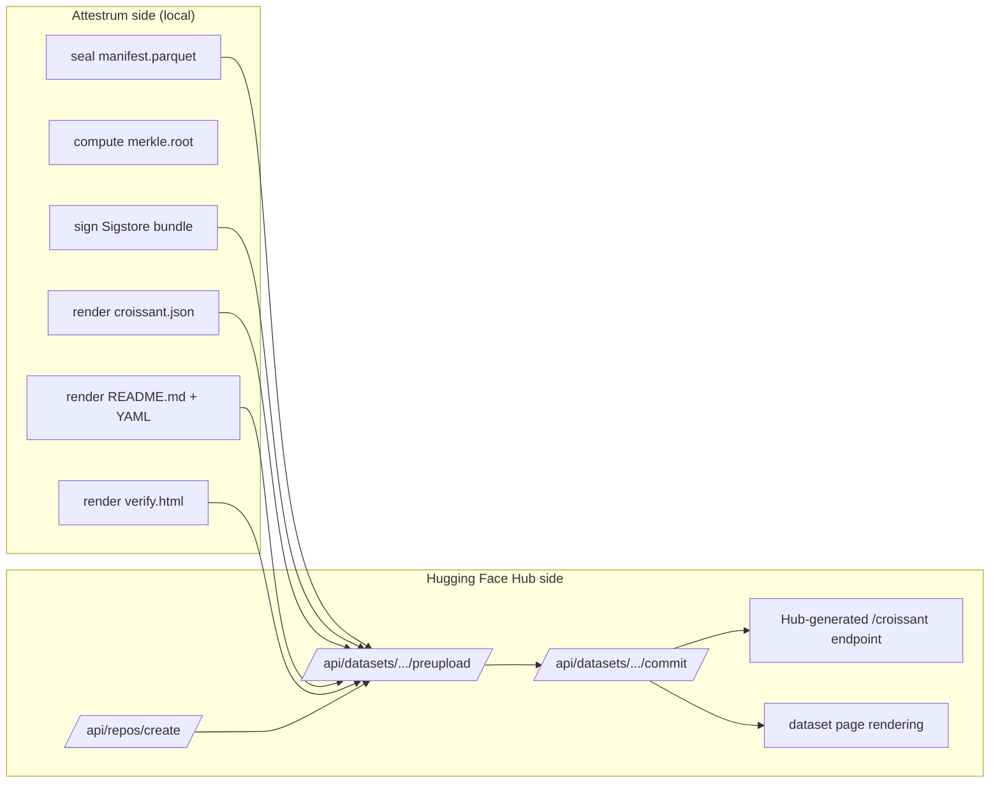

### 4.5 Fallback architecture

If at any point the Hub becomes unsuitable (terms change, attestation acceptance regresses, rate limits hit hard), the same `PublishPlan` is shipped via `GitHubReleaseTarget`: a tag is cut, the assets are uploaded to GitHub Releases, and the static `verify.html` is hosted on GitHub Pages. The `cosign verify-blob-attestation --new-bundle-format --bundle bundle.sigstore.json manifest.parquet` invocation is identical. There is no lock-in to the Hub.

---

## Part 5 — Revised CLI Surface

```
attestrum init                        # scaffolds attestrum.toml, .attestrum/, docs/diagrams/
attestrum build                       # the compiler, unchanged from BUILD-PLAN.md
attestrum sign <manifest>             # signs an existing manifest with training-corpus/v0.1
attestrum verify <bundle>             # local cosign-equivalent verification
attestrum prove <doc> --against <m>   # NEW HEADLINE: inclusion or non-inclusion proof
attestrum publish --target hf --dataset <org>/<name>     # NEW
attestrum publish --target github-release --repo <r>     # NEW (fallback)
attestrum fingerprint <doc>           # NEW: emit FingerprintBundle JSON, no storage
attestrum takedown --doc <hash> --reason "..." [--witness rekor|hub|null]
attestrum emit article-53             # PDF + JSON sidecar (now SECONDARY emitter)
attestrum emit croissant              # JSON-LD (now PRIMARY emitter)
attestrum emit cyclonedx              # ML-BOM 1.6 sidecar
attestrum emit dataset-card           # README.md + YAML
attestrum inspect <manifest>          # human summary
attestrum diff <a> <b>                # deterministic manifest diff
attestrum plan                        # shard planner
attestrum merge                       # shard merger
```

### 5.1 Per-subcommand lifecycle diagrams (one stateDiagram-v2 each)

Each `docs/diagrams/cli/<subcommand>.md` carries a state diagram of this shape:

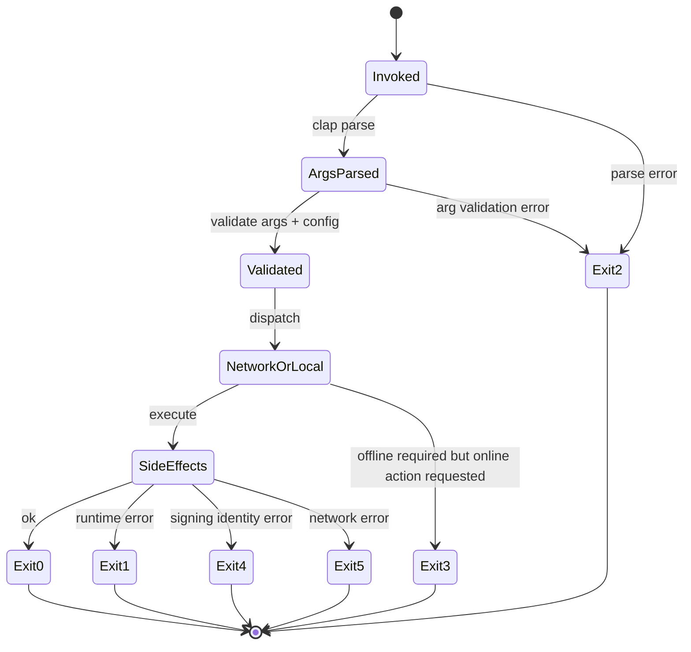

### 5.2 Exit code matrix

| Code | Meaning |
|---|---|
| 0 | Success. |
| 1 | Generic runtime error (I/O, parsing, internal). |
| 2 | Argument validation error (clap exit code preserved). |
| 3 | `--offline` violation: subcommand requires network but `--offline` set. |
| 4 | Signing identity error: OIDC failure, Fulcio rejection, no token, expired cert. |
| 5 | Network error: Rekor unreachable, Hub 5xx, upstream registry timeout. |
| 6 | Verification failure (cryptographic): bundle invalid, root mismatch, audit path bad. |
| 7 | Determinism failure: a re-run produced different output bytes. |
| 8 | Schema validation failure: predicate JSON does not satisfy its schema. |

### 5.3 Network / OIDC / offline matrix

| Subcommand | Network? | OIDC? | `--offline` behavior |
|---|---|---|---|
| `init` | no | no | n/a |
| `build` | yes (fetch docs) | no | uses CAS only; errors on missing |
| `sign` | yes (Fulcio + Rekor) | yes | exits 3 |
| `verify` | optional (TUF refresh) | no | uses cached trusted root; ok if cache fresh |
| `prove` | optional (HF Hub manifest) | only if signing | local sources work offline |
| `publish` | yes | yes (commit signing) | exits 3 |
| `fingerprint` | no | no | n/a |
| `takedown` | only if `--witness` ≠ null | only if signing | exits 3 if witness needs net |
| `emit *` | no | no | n/a (pure local rendering) |
| `inspect` / `diff` / `plan` / `merge` | no | no | n/a |

---

## Part 6 — Revised Sprint Plan (90 Days)

Six two-week sprints. Sprints 1–4 are largely BUILD-PLAN.md v0.1.1 with minor adjustments; Sprint 5 picks up the fingerprint + prove work; Sprint 6 is fully replaced.

For each sprint, the diagrams listed MUST exist under `docs/diagrams/sprint-N/` BEFORE any non-trivial code lands. The diagram-linter blocks merge otherwise.

### Sprint 1 (Weeks 1–2) — Scaffolding & top-3 signals

Diagrams (must exist first):
- `sprint-1/workspace-layout.md` (flowchart, source_of_truth: code)
- `sprint-1/attestrum-core-types.md` (classDiagram)
- `sprint-1/signal-parser-pipeline.md` (flowchart)
- `sprint-1/ci-diagram-linter.md` (sequenceDiagram)

Tasks (execution order):
1. `cargo new --lib --vcs none` workspace; create `crates/` with empty crate stubs for every crate in 1.10.
2. Wire `Cargo.toml` workspace, `rust-toolchain.toml` pinned to a current stable, `.cargo/config.toml`, `rustfmt.toml`, `clippy.toml`.
3. Implement `attestrum-core` (`AttestrumError` enum, `BuildContext`, `Modality`, hex helpers).
4. Implement `attestrum-signals` parsers for robots.txt, ai.txt, TDMRep.
5. Stand up `tools/diagram-linter/` with the five checks from Part 0.3.
6. CI workflow `.github/workflows/ci.yml`: fmt, clippy, test, diagrams, audit.

Acceptance criteria:
- `cargo test --workspace` green.
- `cargo run -p diagram-linter -- check` green on the four Sprint-1 diagrams.
- A demo recording (`docs/demos/sprint-1.cast`) showing parser output for 3 fixtures.
- `last_verified` SHA on all diagrams matches `HEAD`.

Risks/contingencies:
- mermaid-cli requires Node ≥ 18 in CI; we pin via `actions/setup-node@v4` and add SHA-pinned npm install of `@mermaid-js/mermaid-cli`. Risk: a Node version drift; mitigation: the linter binary embeds the expected version and bails if mismatch.

### Sprint 2 (Weeks 3–4) — Hashing, Merkle, Manifest

Diagrams:
- `sprint-2/hash-stream.md` (sequenceDiagram)
- `sprint-2/merkle-construction.md` (flowchart)
- `sprint-2/manifest-schema.md` (erDiagram)
- `sprint-2/attestrum-inspect-lifecycle.md` (stateDiagram-v2)

Tasks:
1. BLAKE3 + SHA-256 streaming hasher with `Read` adapter and back-pressure.
2. RFC 6962 binary Merkle tree (`attestrum-merkle`), including audit-path generation. RFC 6962 specifies the tree structure used by Certificate Transparency and is reused here for compatibility with the broader transparency ecosystem.
3. Parquet manifest schema (Arrow ≥ 50): columns `doc_id, blake3, sha256, source_uri, content_type, byte_len, fetched_at, signal_result, ruleset_decision, license_spdx, leaf_hash`.
4. `attestrum inspect` rendering of a sealed manifest.

Acceptance:
- 10 GB synthetic corpus seals deterministically to the same Merkle root across two runs on the same machine.
- `cargo test` green.
- Demo recording.

### Sprint 3 (Weeks 5–6) — CAS, pipeline, end-to-end build

Diagrams:
- `sprint-3/cas-write-path.md` (sequenceDiagram)
- `sprint-3/rayon-pipeline.md` (flowchart)
- `sprint-3/sharding.md` (flowchart)

Tasks: implement `attestrum-cas`, `attestrum-pipeline` (Rayon-based), sharding via `attestrum plan`/`attestrum merge`, end-to-end `attestrum build` on a 1 GB corpus.

Acceptance:
- 1 GB Common-Pile-mini build completes in under 10 min on a 16-core dev box (target, not hard limit).
- Determinism CI green across Linux x86, Linux ARM, macOS, Linux musl.
- Demo recording showing `attestrum build` and `attestrum inspect` on the mini corpus.

### Sprint 4 (Weeks 7–8) — Sigstore + in-toto

Diagrams:
- `sprint-4/sign-flow.md` (sequenceDiagram, mirroring 1.5)
- `sprint-4/verify-flow.md` (sequenceDiagram)
- `sprint-4/predicate-three-types.md` (classDiagram)

Tasks:
1. Integrate `sigstore` Rust crate; emit Bundle v0.3.
2. in-toto Statement v1 builder for all three predicate types (only `training-corpus` populated this sprint; `inclusion-proof` and `non-inclusion-proof` are scaffolded with empty payloads).
3. `attestrum sign` and `attestrum verify`.
4. cosign interop test: every bundle emitted in CI is verified by an installed `cosign v3.0.3+` with `--new-bundle-format`.

Acceptance: cosign verifies every Attestrum-emitted bundle; determinism preserved (stable bytes after stripping the OIDC timestamp).

### Sprint 5 (Weeks 9–10) — Fingerprint, prove, Croissant promoted; Article 53 demoted

Diagrams:
- `sprint-5/fingerprint-pipeline.md` (flowchart, mirroring 1.8)
- `sprint-5/prove-pipeline.md` (flowchart, mirroring 1.3)
- `sprint-5/croissant-emit.md` (flowchart)
- `sprint-5/article-53-emit.md` (flowchart) — secondary, deferred from prior plan
- `sprint-5/inclusion-vs-non-inclusion.md` (classDiagram)

Tasks:
1. `attestrum-fingerprint` crate per Part 2.1.
2. `attestrum prove` per Part 2.2. Sorted-Merkle non-inclusion proof in `attestrum-merkle`.
3. Two new predicate types (Part 3.2, 3.3) wired into `attestrum-attest`.
4. `attestrum emit croissant` becomes a primary emitter (per HF's central role).
5. `attestrum emit article-53` ships as a SECONDARY emitter producing the European Commission's mandatory training-data-summary template. Under Article 53(1)(d) of the EU AI Act, GPAI provider obligations entered into application on August 2, 2025, and the European Commission's enforcement powers for GPAI models apply from August 2, 2026; under Article 101, violations carry fines up to €15 million or 3% of total worldwide annual turnover, whichever is higher. We ship a working version but it is no longer the headline.

Acceptance: round-trip prove on a 100K-leaf manifest for both inclusion and non-inclusion in <1s.

### Sprint 6 (Weeks 11–12) — Hugging Face publish, public witness, END-TO-END DEMO

Diagrams:
- `sprint-6/hub-publish.md` (sequenceDiagram, mirroring 1.7)
- `sprint-6/verify-html.md` (sequenceDiagram)
- `sprint-6/takedown-witness.md` (flowchart, mirroring 1.6)
- `sprint-6/end-to-end-demo.md` (sequenceDiagram of the demo script)

Tasks:
1. `attestrum-publish` crate (Part 2.3) with both `HuggingFaceTarget` and `GitHubReleaseTarget`.
2. Dataset card emitter with the YAML schema in Part 2.3.
3. Static `verify.html` with embedded sigstore-rs WASM verifier.
4. Expanded `attestrum-ledger` with `RekorWitness` and `HubWitness` (Part 2.5).
5. END-TO-END DEMO: build a 5 GB slice of the Common Pile v0.1 (an 8 TB EleutherAI corpus of public domain and openly licensed text built in collaboration with the University of Toronto and Vector Institute, Hugging Face, the Allen Institute for AI, Teraflop AI, Cornell University, MIT, CMU, Lila Sciences, poolside, University of Maryland College Park, and Lawrence Livermore National Laboratory), sign it, publish to `huggingface.co/datasets/attestrum/common-pile-mini-v0.1` (a real, public dataset repo), and have a fresh machine verify it via the static page.

Contingency: the HF native Sigstore attestation surface for datasets is confirmed absent in May 2026; the primary path remains the `create_commit` upload of `attestrum/bundle.sigstore.json`, which is fully verifiable via `cosign v3+ verify-blob-attestation --new-bundle-format`. The `GitHubReleaseTarget` ships as a tested alternate. There is no demo regression — the same bundle verifies from either location.

Acceptance: end-to-end demo recording shows a fresh laptop, with no Attestrum installed, verifying our published dataset by visiting the verification URL.

---

## Part 7 — Testing Strategy (Diagram-Anchored)

### 7.1 Per-diagram-type test obligations

| Diagram type | Required test class | Location |
|---|---|---|
| `flowchart` | Integration test exercising every documented edge | `tests/<area>_edges.rs` |
| `stateDiagram-v2` | proptest enumerating all transitions | `tests/<area>_proptest.rs` |
| `sequenceDiagram` | Contract test verifying message order, types, error paths | `tests/<area>_contract.rs` |
| `erDiagram` | Schema-roundtrip test (write → read → equal) | `tests/<area>_schema.rs` |
| `classDiagram` | API surface snapshot (cargo-public-api) | `tests/<area>_api.rs` |

### 7.2 Diagram-consistency CI gate

The `diagrams` job in CI runs `cargo run -p diagram-linter -- check --strict --json` and fails on:
- Missing or stale frontmatter (per Part 0.2).
- Mermaid parse failure (mermaid-cli).
- Reverse-reference failure (Part 0.3 #3).
- Forward-reference failure (Part 0.3 #4).
- Drift (Part 0.3 #5).

The linter outputs a JSON report uploaded as an artifact for human inspection on failure.

### 7.3 Determinism CI gate (expanded from BUILD-PLAN.md)

A nightly job runs `tests/determinism/` on the same 1 GB Common Pile slice across:
- `ubuntu-24.04` x86_64-unknown-linux-gnu
- `ubuntu-24.04-arm` aarch64-unknown-linux-gnu
- `macos-14` aarch64-apple-darwin
- `alpine:3.20` x86_64-unknown-linux-musl

Required identical bytes (after stripping OIDC timestamps and Rekor inclusion timestamps from bundles):
- `manifest.parquet` byte-identical
- `merkle.root` byte-identical
- Sigstore bundle DSSE payload byte-identical
- Croissant JSON-LD byte-identical
- Article 53 JSON sidecar byte-identical (the PDF need not be byte-identical because PDF font subset embedding is non-deterministic; we compare the underlying JSON instead and assert the PDF parses and validates).

---

## Part 8 — Design Partner Acceptance Package

### 8.1 Common per-partner template

Each `docs/partners/<partner>/` contains: `touchpoints.md` (flowchart), `input-format.md` (erDiagram of their dataset structure), `output-format.md`, `acceptance.md` (binary checklist), `demo.md` (30-minute script).

### 8.2 AI2 / Allen Institute

Touchpoints: ingest Dolma v1.7 from `huggingface.co/datasets/allenai/dolma` (the OLMo pretraining corpus). Per AI2's blog post "Making a switch — Dolma moves to ODC-BY," "As of today, Dolma is now operating under the ODC-BY license"; the license switched from ImpACT to ODC-BY on April 15, 2024. Use the existing `dolma` toolkit's per-document JSONL output as upstream of `attestrum build`. Expected input: gzipped JSONL with `{id, text, source, version, added}` fields. Output: a signed manifest + Croissant JSON-LD that augments their current dataset card with a `merkle_root` field and a verification URL. Acceptance criteria: (a) we reproduce their token counts to ±0.01%, (b) our license inventory matches theirs, (c) a senior AI2 dataset engineer (e.g. Luca Soldaini, who is named on the Common Pile paper) personally runs `attestrum verify` and gets a green check. 30-min demo: build → sign → publish to `huggingface.co/datasets/attestrum/dolma-v1.7-attested` → AI2 reviewer verifies.

### 8.3 Pleias

Touchpoints: ingest `PleIAs/common_corpus` (over 2 trillion permissibly-licensed multilingual tokens per the AI Alliance announcement: "the largest open and permissibly licenced dataset for training LLMs, at over 2 trillion tokens"). Pleias's own framing is that Common Corpus "exceeds the requirements of even the strictest regulations on AI training data, such as the EU AI Act," so our Article-53 emitter is directly useful to them. Acceptance criteria: (a) round-trip via Attestrum preserves their language tagging exactly, (b) the Croissant JSON-LD validates against `mlcroissant`, (c) the EU-AI-Office sidecar passes their internal compliance review. Demo: live publish to `huggingface.co/datasets/attestrum/common-corpus-attested`.

### 8.4 Mozilla Data Collective

Touchpoints: Mozilla co-hosted the Dataset Convening with EleutherAI on June 11, 2024 in Amsterdam. As Mozilla Foundation describes it, "On June 11, 2024, Mozilla and EleutherAI convened 30 scholars and practitioners from prominent open-source AI startups, nonprofit AI labs, and civil society organizations." Their interest is in best-practices tooling, not a specific corpus. Input: a typical "open dataset" structure (Parquet + dataset card + license file). Output: full Attestrum bundle with Article 53 sidecar. Acceptance: (a) Attestrum's diagram-first methodology is judged adoptable by other contributors to the Convening's published best-practices paper, (b) `attestrum emit dataset-card` produces output that passes Mozilla's internal reviewer checklist.

### 8.5 Black Forest Labs

Touchpoints: image modality. Input: a FLUX-style training set described as a directory of image files plus a JSONL of captions and license metadata. Output: a manifest plus per-image ISCC + pHash + dHash, plus a Croissant JSON-LD with `fileSet` modality `image/*`. Acceptance: (a) perceptual-hash recall on a held-out near-dup set ≥ 0.95 at Hamming ≤ 6, (b) ISCC composite distance correlates ≥ 0.8 with perceptual distance on the same set.

### 8.6 Hugging Face Datasets team (fifth design partner — not a customer, the wedge)

Touchpoints: integration with the Hub commit API and the Hub-generated `/croissant` endpoint. We do not ask them for code changes in v1; we ask for (a) blog co-publication when the Common Pile mini ships, (b) review of our `attestrum publish --target huggingface` flow against the Hub's terms, (c) ideally, eventual native Hub-side acceptance of Sigstore bundles (we are not blocked on this). Acceptance: a HF Datasets team member (Albert Villanova López — named as a Hugging Face representative on the Croissant working group and the dataset library maintainer team — or equivalent) signs off on the publish-flow design and we get a placement on `huggingface.co/blog`.

---

## Part 9 — Acquirer-Relevant Architectural Decisions

(Decisions only — no business case prose per the brief.)

### 9.1 Stable embeddable API surfaces

The `attestrum-core`, `attestrum-manifest`, `attestrum-attest`, `attestrum-publish`, and `attestrum-prove` crates expose stable public APIs from v0.4 forward (semver-tracked via `cargo-public-api`). Their public types use no proc-macro-derived traits that are not in `serde` or `thiserror`. Each crate's `lib.rs` carries a `//! # Stability` doc-block. An acquirer embedding these into a service (e.g., the Hub) only needs to call public functions — no internal access.

### 9.2 Open-standards posture

We submit the three predicate types to the in-toto vetted catalog via the New Predicate Guidelines workflow on the `in-toto/attestation` GitHub repo, and to the SPDX 3.0 AI/Dataset profile working group. Per the published academic study of the SPDX 3.0 process (Building an Open AIBOM Standard in the Wild, arXiv:2510.07070), "Our SPDX 3.0 extension comprises 36 new fields that treat datasets, models, and their provenance as first-class supply-chain elements." Our predicates fit cleanly as a serialization profile on top of those 36 fields. We pre-commit to whatever non-substantive renames the catalog maintainers require.

### 9.3 Acquirer-operable data model

The `.attestrum/` directory layout (Part 1.9) is self-describing: every file references the version it was written with, every Parquet manifest carries the schema version in its metadata, every bundle is verifiable without Attestrum installed. An acquirer can host Attestrum as a service that operates on user-uploaded `.attestrum/` trees with no special back-channel.

### 9.4 Branding neutrality

The Sigstore bundle, the in-toto statement, the Croissant JSON-LD, and the Article 53 sidecar all use the standard public type URIs. The string "Attestrum" appears in: (a) the predicate URI prefix `attestrum.com/`, which is a domain we own and that we will move into a vendor-neutral namespace at first acquirer's request — the in-toto attestation framework spec explicitly notes "New predicate types MAY be vetted by the in-toto attestation maintainers," so a rename has a defined upgrade path; (b) the `builderVersion` field, which is informational. No emitted format embeds Attestrum-specific structure that prevents an acquirer from continuing to serve our existing OSS users with their own builder.

### 9.5 Long-term architectural progression — `docs/diagrams/strategy/progression.md`

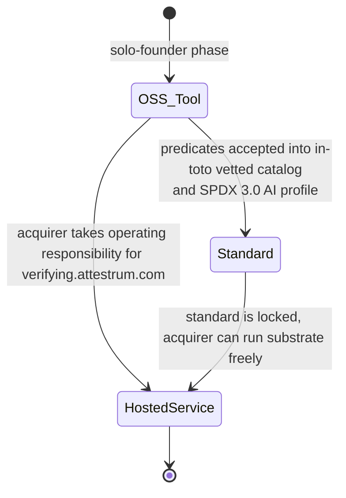

Caption: The OSS tool never deprecates. The hosted service is additive. The standards path is the moat: once the predicate types are in the in-toto catalog and the SPDX 3.0 AI profile, no acquirer needs us to operate the substrate, but every acquirer benefits from the Attestrum builder being the reference implementation.

---

## Part 10 — Kickoff Actions for the Claude Code Agent

### 10.1 First ten commands (run in this exact order in an empty repo)

```bash
# 1. initialize the repo skeleton (no cargo yet)
mkdir -p docs/diagrams/{overview,attestations,cli,strategy,sprint-1,sprint-2,sprint-3,sprint-4,sprint-5,sprint-6} \
         docs/partners/{ai2,pleias,mozilla,bfl,huggingface} \
         docs/demos tools/diagram-linter/src tests/fixtures .github/workflows

# 2. copy this brief and BUILD-PLAN.md into the repo root
cp /tmp/PATH-A-BRIEF.md ./PATH-A-BRIEF.md && cp /tmp/BUILD-PLAN.md ./BUILD-PLAN.md

# 3. seed the ten Part-1 diagrams (one file per subsection 1.1–1.10) with frontmatter
for d in system build-happy-path prove-pipeline signal-decision sigstore-sign-verify \
         takedown-witness hub-publish fingerprint-pipeline cas-layout crate-deps; do
  touch "docs/diagrams/overview/${d}.md"
done

# 4. install mermaid-cli pinned via npm (CI will re-verify SHA)
npm install -g @mermaid-js/mermaid-cli@10.9.1 && mmdc --version

# 5. scaffold the diagram-linter binary
cargo new --bin tools/diagram-linter --name diagram-linter --vcs none

# 6. write the workspace Cargo.toml and rust-toolchain.toml
cat > Cargo.toml <<'EOF'
[workspace]
resolver = "2"
members  = ["crates/*", "tools/diagram-linter"]
EOF
printf '[toolchain]\nchannel = "1.85.0"\n' > rust-toolchain.toml

# 7. scaffold every crate listed in 1.10 with empty lib.rs;
#    attestrum-cli is the user-facing binary and must be a bin crate.
for c in attestrum-core attestrum-signals attestrum-cas attestrum-merkle attestrum-manifest \
         attestrum-fingerprint attestrum-ledger attestrum-pipeline attestrum-attest \
         attestrum-emit attestrum-prove attestrum-publish attestrum-fingerprint-registry; do
  cargo new --lib --vcs none "crates/${c}"
done
cargo new --bin --vcs none crates/attestrum-cli

# 8. seed CHANGELOG.md and SESSION-LOG.md with the kickoff entries
cat > CHANGELOG.md <<'EOF'
# Changelog
## [v0.2.0-kickoff] — 2026-05-23
- Path A pivot accepted; this brief checked in.
EOF
cat > SESSION-LOG.md <<'EOF'
# Session log
## 2026-05-23 — kickoff
- Read BUILD-PLAN.md and PATH-A-BRIEF.md. Confirmed scope.
- Created workspace skeleton, ten Part-1 diagrams seeded, diagram-linter scaffolded.
EOF

# 9. add CI workflow with the diagrams job
cat > .github/workflows/ci.yml <<'EOF'
name: ci
on: [push, pull_request]
jobs:
  diagrams:
    runs-on: ubuntu-24.04
    steps:
      - uses: actions/checkout@v4
      - uses: actions/setup-node@v4
        with: { node-version: 20 }
      - run: npm install -g @mermaid-js/mermaid-cli@10.9.1
      - uses: dtolnay/rust-toolchain@1.85.0
      - run: cargo run -p diagram-linter -- check --strict
  test:
    runs-on: ubuntu-24.04
    steps:
      - uses: actions/checkout@v4
      - uses: dtolnay/rust-toolchain@1.85.0
      - run: cargo fmt --check
      - run: cargo clippy --workspace --all-targets -- -D warnings
      - run: cargo test --workspace
EOF

# 10. initial commit
git init && git add -A && git commit -m "kickoff: PATH-A-BRIEF v0.2.0, workspace skeleton, diagram seeds"
```

### 10.2 Founder prompt to paste into Claude Code

> Read `BUILD-PLAN.md`, `CLAUDE.md`, and `PATH-A-BRIEF.md` end to end. Then:
> (1) Confirm scope back to me in one paragraph — restate Path A, the headline workflow, and what is unchanged from BUILD-PLAN.md.
> (2) Produce the Sprint 1 work plan as numbered commits, each commit small enough to review.
> (3) Draw the four Sprint 1 diagrams in `docs/diagrams/sprint-1/` BEFORE any non-scaffolding code. Each diagram must carry the four-field YAML frontmatter from Part 0.2.
> (4) Wait for my approval on the four diagrams before moving to Sprint 1 code.
> Append a session entry to `CHANGELOG.md` and `SESSION-LOG.md` per `CLAUDE.md` rules at the end of this turn.

---

## Next Actions

The ten Kickoff Actions in Part 10.1 above are the literal next ten commands. The agent runs them in order, then awaits approval per the founder prompt in Part 10.2.

---

## Changelog

- **2026-05-23** — Doc-bug patch from Sprint 1 findings: §1.10 crate-deps Mermaid arrows reversed to cargo-tree convention (`A --> B` = "A depends on B") and Arrow Convention note added; §10.1 step 7 split into a 13-crate `--lib` loop plus a separate `cargo new --bin crates/attestrum-cli` matching actual workspace state. Originally flagged in Sprint 1 commit E1 (`da841c7`); brief now matches on-disk reality.
- **2026-05-23** — Sprint 2 E2: rustc pin bumped 1.84.0 → 1.85.0. Updates §10.1 step 6 (`rust-toolchain.toml`) and steps 9–10 (`dtolnay/rust-toolchain@1.85.0`) in CI workflow. Driven by edition2024 transitive-dep churn surfaced when adding `proptest` for the signal-decision state-machine property test (`proptest` → `rand` → `getrandom 0.4` requires Cargo edition2024, stabilized in rustc 1.85.0). Bump also unblocks `cargo-deny 0.18.x` locally, which restores the full advisory check (E1 had to skip advisories locally because the rustc 1.84.0 pin forced cargo-deny 0.17, which predates CVSS 4.0 entries).