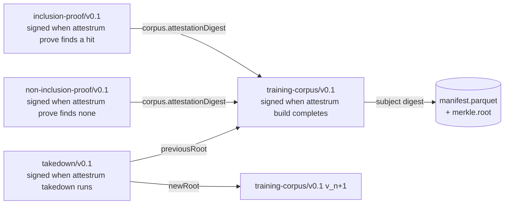

# Predicate relationships

Source of truth flips to `code` when the predicate Rust types land in Sprint 4 (`training-corpus`) and Sprint 5 (`inclusion-proof`, `non-inclusion-proof`). `takedown/v0.1` lands in Sprint 6.

The three sister predicates form a DAG rooted at `training-corpus`. Each proof attestation embeds the corpus attestation digest as an immutable reference; an attacker would have to break BLAKE3 collision resistance to forge a proof against a different corpus than the one the publisher signed. We submit all three predicate types to the in-toto vetted catalog (PATH-A-BRIEF §9.2).

The predicate URIs themselves are a protected system per CLAUDE.md §4 — schema changes require a version bump (`v0.4` since current is v0.3), a migration document, and an in-toto vetted catalog re-submission.

