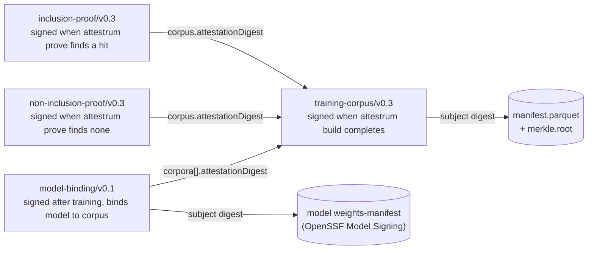

# Predicate relationships

Four in-toto v1 predicate types ship today. The three **v0.3 sister predicates** — `training-corpus`, `inclusion-proof`, `non-inclusion-proof` — form a DAG rooted at `training-corpus` (`crates/attestrum-attest/src/predicate.rs`). Each proof attestation embeds the corpus attestation's digest via `corpus.attestationDigest` (the BLAKE3+SHA-256 digest of the corpus's signed in-toto Statement / DSSE payload); an attacker would have to break BLAKE3 collision resistance to forge a proof against a different corpus than the one the publisher signed.

`model-binding/v0.1` (`crates/attestrum-attest/src/model_binding.rs`) is a **separate predicate generation** — a distinct version line from the frozen v0.3 family. It closes the gap between "corpus C existed with root R" and "C is what trained model M": the **model is the `subject`** and the training-corpus attestation(s) are the **materials**, referenced as a SET via `corpora[].attestationDigest`. It is signed *after* training (the corpus is sealed *before* training, so the corpus attestation cannot itself carry the model digest).

There is no `takedown` predicate type — takedown is a `takedown_contact` *field* inside the `training-corpus` predicate, not a separate attestation.

The predicate URIs are a protected system per CLAUDE.md §4 — a schema change requires a version bump (`v0.4` for the v0.3 family), a migration document, and an in-toto vetted catalog re-submission.

