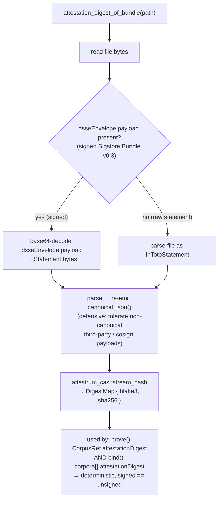
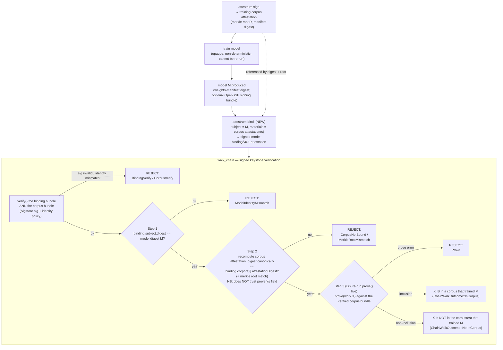
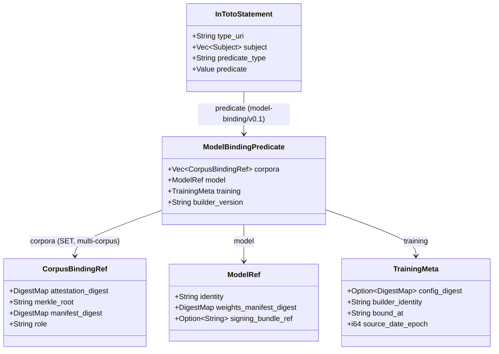

# Corpus-to-model binding + the chain walk

**`source_of_truth: code`** — the binding promotion has landed on `main`; this diagram is now a derived view of the implemented code, and `model-binding/v0.1` is PROTECTED per CLAUDE.md §4. Migration / catalog record: [`docs/migration/model-binding-v0.1-new-predicate.md`](../../migration/model-binding-v0.1-new-predicate.md). Decided via the high-stakes-decision protocol (`Attestrum-internal-notes/2026-05-29/model-binding-v0-1-promotion-*`): **D1 = B+C hybrid** (the `prove()` `attestationDigest` determinism fix landed first, isolated; the binding is built on top with `walk_chain` recomputing canonically so it never depends on `prove()`'s emitted field), **D2/D3/D4/D5 = A**, **D6 = `walk_chain` re-runs `prove()` live for the membership step** (the inclusion proof is recomputed by the verifier, not independently attested — see the honest ceiling).

A signed Attestrum corpus proves "corpus C existed with Merkle root R" — **not** "C is what trained model M." The `model-binding/v0.1` attestation closes that gap: an in-toto v1 Statement, SLSA-shaped — the **model is the `subject`** (the product) and the **corpus attestation(s) are materials** (the inputs) — under `https://attestrum.com/attestation/model-binding/v0.1`.

**Honest ceiling (foundational, restate to every design partner):** this is an *attestation, not a proof-of-training*. The cryptography guarantees integrity + timestamp + identity + verifiable membership against C — NOT the truth of the training claim itself, and (per D6) NOT an independent attestation of X's membership: the inclusion proof is *recomputed live* by the verifier inside the walk, so the membership result is only as strong as the corpus manifest the verifier feeds `prove()`. A dishonest trainer can attest a sanitized corpus. Mitigations: contemporaneousness, identity-binding (Sigstore), transparency-log timestamp, and that lying in a signed, logged attestation is perjury-adjacent. Same ceiling as the EU Article 53 summary.

## `attestation_digest_of_bundle` — the canonical digest definition (Commit 1, PROTECTED determinism bugfix)

`CorpusRef.attestationDigest` is the BLAKE3+SHA-256 digest of the corpus in-toto Statement's `canonical_json()` bytes — i.e. the DSSE payload bytes — in BOTH the signed and unsigned cases. The prior `prove()` behaviour (hashing the whole bundle file) was non-deterministic for signed bundles (the file carries 16 stripped cert/tlog fields) and contradicted the type's own doc-comment. One shared helper fixes it; **both branches re-emit `canonical_json()` before hashing** so a stock-cosign-signed corpus (non-canonical embedded payload) still links (vendor-neutrality, §12).

## `bind()` API surface (Commit 4, `attestrum-bind`)

`bind(opts: &BindOpts) -> Result<BindArtifact, BindError>` emits the
`model-binding/v0.1` Statement. `BindOpts` carries the `ModelRef`, the model-card
URI, a `Vec<BoundCorpus>` (each a corpus bundle path + role), the contemporaneous
training metadata, and an optional-sign block (`sign` + `oidc_id_token` +
`workspace`) mirroring `prove()`. For each `BoundCorpus`, `bind` reads the corpus
via `attestrum_attest::statement_from_bundle`, digests it via
`attestation_digest_of_statement` (the in-memory twin of
`attestation_digest_of_bundle` — both hash `canonical_json()`, so `bind`'s
recorded digest equals what `walk_chain` Step 2 recomputes from the same file),
and lifts `merkleRoot` + `manifest.digestSet` into a `CorpusBindingRef`.
`BindArtifact` carries the canonical Statement and, when signed, the written
Sigstore bundle path. `BindError` is the failure set (corpus read/digest, corpus
predicate parse, timestamp, serialize, canonicalize, io, sign — the last covers
a missing OIDC token when `sign` is true).

## Timeline + the signed chain walk (D3 + D6)

**Step 3 has no `ProofCorpusMismatch` check (implementation finding).** `prove()` runs against the **same** verified corpus bundle Step 2 already matched by canonical digest, so the proof is bound to the verified corpus *by construction*. The signed single-verified-bundle design therefore **prevents** a proof-against-a-different-corpus rather than detecting it after the fact — the spike's separate `ProofCorpusMismatch` check is subsumed by `CorpusNotBound` at Step 2 (a strictly earlier, stronger rejection). Removing it keeps the walk free of an unreachable branch (CLAUDE.md §14). The public API is `walk_chain(model_digest, BindingInput, CorpusInput, ProofTarget) -> Result<ChainWalkOutcome, ChainWalkError>`; `IdentityPolicy` carries the cosign-shaped identity/issuer regexes + offline flag applied to both bundles; `ChainWalkError` is the failure set (`BindingVerify`, `CorpusVerify`, `BindingPredicate`, `NoSubject`, `ModelIdentityMismatch`, `Corpus`, `CorpusNotBound`, `MerkleRootMismatch`, `Prove`). `query` must be an exact `ProofTarget` arm at v0.1 (the fuzzy arms need a CAS root this entry point does not thread through).

## Predicate shape (`model-binding/v0.1`)

**`role` is a `String` at v0.1 (D4-A)** — a recommended vocabulary (`pretraining`, `finetuning`, `rlhf`, ...) lives in the schema `description`, not a closed enum, to avoid trapping an evolving training-method taxonomy in a PROTECTED wire format (§4) and to preserve vendor neutrality (§12).

**Multi-corpus.** `corpora` is a set, so a model trained on (pretraining + finetuning) binds all of them. "Is X in the corpus that trained M?" generalises to "is X in **at least one** corpus that trained M?" — `walk_chain` runs per bound corpus and the CLI ORs the inclusion results.

**`signingBundleRef` is recorded, not verified at v0.1 (D3-A).** It carries a digest reference or URI to the model's own OpenSSF/Sigstore signing bundle, composing the corpus supply chain with the model supply chain. Attestrum does not verify the model's own signature at v0.1; verify-if-present is deferred to v0.2.

**`MODEL_BINDING_PREDICATE_TYPE` is a standalone PROTECTED const (D2-A).** `ALL_PREDICATE_TYPES` stays frozen at the `[3]` v0.3 corpus/proof snapshot; the binding is a separate v0.1 generation.
