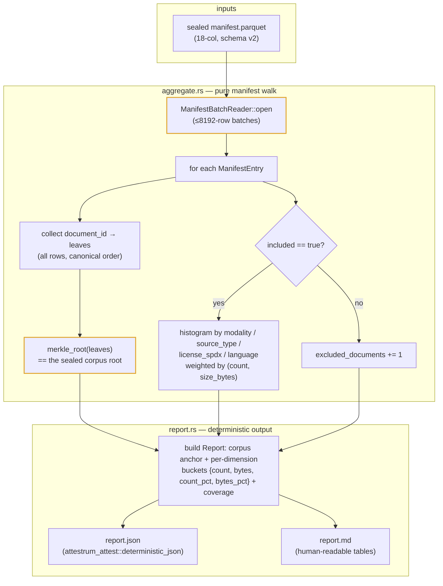

# `attestrum compose` — training-content composition summary

Source of truth: **`code`**. The `attestrum-compose` crate is authoritative; this diagram is the derived
view.

**What it answers.** "What is this corpus *made of*?" — the EU AI Act Article 53(1)(d) training-content
summary surface, expressed as the language / source-type / SPDX-license / modality mix of a sealed corpus.
v1 is a **read-only, unsigned** report: `attestrum compose --manifest <manifest.parquet>` emits
`report.json` + `report.md`. No signed predicate, no manifest mutation — it reads the sealed manifest and
produces a composition summary.

**Pure manifest read — touches no §4 protected system.** `aggregate_manifest` streams the manifest with
`ManifestBatchReader` (constant-memory, ≤8192-row batches — the same reader `attestrum diff` uses) and
walks every `ManifestEntry`. Every field it needs is already persisted in the sealed 18-column manifest:
`modality`, `source_type`, `license_spdx`, `language`, `size_bytes`, `included`. It computes nothing new
about the documents and consumes no fingerprint kernel.

**The Merkle anchor matches the seal.** `aggregate_manifest` collects every row's `document_id` in
on-disk canonical order and recomputes the corpus root via `merkle_root` — byte-identical to the root the
build pipeline sealed (`attestrum-pipeline` feeds the same leaves, all rows, same order). So the summary is
tied to a specific, verifiable corpus state, not a free-floating description.

**Honesty: unspecified is a bucket, never a silent drop.** `modality` is always present; `source_type`,
`license_spdx`, and `language` are optional in the manifest. A `None` value folds into an explicit
`"unspecified"` bucket and is *excluded* from the dimension's coverage count, and the report carries a
**coverage %** per dimension (by document count and by bytes). Dropping unknowns would misrepresent the
corpus to a regulator — the coverage figure makes the gaps legible instead.

**Two weights per bucket.** Each bucket records both a document count and a `size_bytes` sum, with
percentages of the included totals. Byte-weighting answers "how much of the training data" (the
regulator's real question); count-weighting answers "how many documents". Composition is aggregated over
`included == true` rows (the actual training content); recorded-but-excluded rows are reported as a
separate count.

**Deferred (NOT in this leaf).** A signed `composition` predicate and emitting the Commission's official
Article 53 template are §4 / §A4 work — a new predicate URI (and, if a third party validates the template,
a §2.5 CI validator gate) requiring the high-stakes-decision protocol + founder approval. This leaf emits a
plain unsigned report only.

The crate adds **no** new external dependency and modifies **no** §4 protected system: `ManifestBatchReader`
and `merkle_root` (highlighted) are consumed read-only, and the report rides
`attestrum_attest::deterministic_json` — the workspace's single sanctioned sort-then-serialize primitive —
so two runs over the same manifest produce byte-identical `report.json` bytes on any target.
