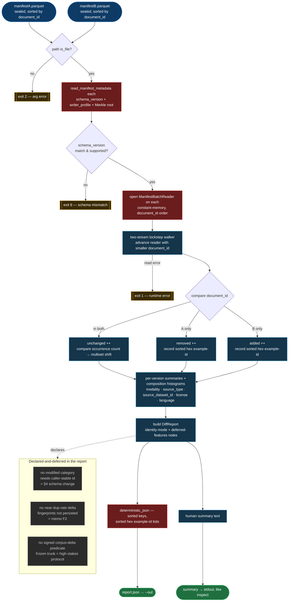

# attestrum diff — corpus-version delta pipeline

Source of truth: `diagram` — this is the contract the code must implement; it
flips to `source_of_truth: code` once `crates/attestrum-diff/` and
`commands/diff.rs` land (§2 drift rule, same commit).

`attestrum diff <manifestA> <manifestB>` answers *"what changed between two
already-sealed corpus states?"* — the read-only, **unsigned** sibling of
`attestrum inspect` (which reasons about one corpus). It reports added /
removed / unchanged documents, multiset (occurrence) shifts, and per-source /
per-modality composition shift, in a byte-reproducible report. Both endpoints
are already cryptographically sealed, so the report names both Merkle roots and
the delta between them.

Nothing here touches a §4 protected system: no Merkle change, no predicate URI,
no manifest schema change, no CAS/ledger layout. It is the reversible *leaf*
(unsigned report), deliberately not the frozen *trunk* (a signed corpus-delta
predicate — deferred behind the high-stakes protocol).

## Identity model, stated plainly (the report declares it)

`document_id` **is** the BLAKE3 content hash, and manifests are written in
canonical `(document_id, occurrence_index)` sort order (`sort_entries`, enforced
across the seal path). So the diff is a **merge-join of two sorted streams**:

- **unchanged** — `document_id` present in both
- **removed** — present in A only
- **added** — present in B only
- **multiset shift** — same `document_id`, different occurrence count (a doc that
  appeared 3× now appears 1×), read from `occurrence_index` run-length

There is **no "modified" category**: in a content-addressed manifest a changed
document is simply a removed old hash plus an added new hash, with nothing
linking them (no caller-stable id exists in the schema). The report states this
mode explicitly — the honesty pattern, never a fuzzy-matched "modified" verdict.

**Legend:** 🟦 dark-blue `input` = the two sealed manifests · 🟥 red `reused` =
existing protected/landed code consumed read-only (`read_manifest_metadata`,
`ManifestBatchReader`, `deterministic_json`) · light-blue `new` = the additive
`attestrum-diff` crate + `commands/diff.rs` · 🟩 green `output` = the two report
surfaces · amber = exit paths · grey = declared-and-deferred (stated in the
report, not computed in v1).

## Public API (`crates/attestrum-diff`)

The crate's surface, as the flowchart's nodes map to it:

- `compare` — the streaming merge-join entry point; consumes two canonically
  sorted `ManifestEntry` streams and returns a `DiffReport`.
- `DiffReport` — the whole report: `REPORT_VERSION` tag, `IDENTITY_MODE` string,
  the `DEFERRED` declared-and-deferred list, optional verbatim timestamp, the two
  `VersionSummary` sides, and the `Delta`.
- `VersionSummary` — per-version Merkle root + counts (documents, distinct,
  exact-duplicate, bytes) + composition histograms.
- `Delta` — added / removed / unchanged counts, example-id lists (capped at
  `MAX_EXAMPLES`), `MultisetShift` records (occurrence-count changes), and the
  per-dimension `ShareShift` composition shift.
- `MultisetShift`, `ShareShift` — the two delta-detail records.
- `render_json` — canonical deterministic JSON (via the shared
  `deterministic_json`); `render_summary` — the human stdout summary.

## Reuse boundary

- **Consumed read-only:** `attestrum_manifest::ManifestBatchReader` /
  `read_manifest_metadata` / `manifest_row_count` (landed in `39fa850`), and
  `attestrum_attest::deterministic_json` (sorts keys recursively — the one shared
  determinism primitive; `attestrum-decontaminate` uses it too).
- **Not reused:** `commands/merge.rs::ShardCursor` is private and k-way (merge
  *combines* rows; diff *classifies* them, 2-way). `attestrum-diff` carries its
  own small 2-stream walker for v1. **Follow-up flag:** unify `ShardCursor` and
  the diff walker into one shared sorted-cursor primitive in `attestrum-manifest`
  once both have landed — a small coordinated refactor, out of scope here.

## Exit codes (mirror inspect)

`0` success · `1` runtime/I-O error · `2` argument error (path missing / not a
file) · `8` schema-version mismatch.

## Determinism contract

Same two manifests → byte-identical `report.json` on any machine. No wall-clock
(timestamp only via an explicit `--timestamp`, embedded verbatim); `BTreeMap`-
keyed accumulation; every example-id list sorted (lowercase hex) before emit;
the merge-join walks in `document_id` order so the output never depends on thread
scheduling. CI gate: a committed golden plus a double-run byte-compare, modelled
on the `croissant` / `api-surface` golden tests.
