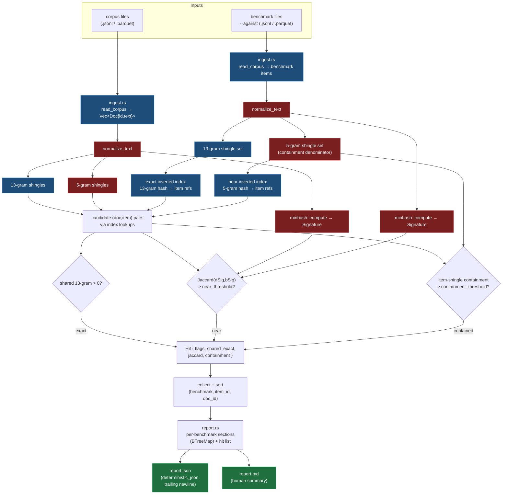

# `attestrum decontaminate` — benchmark-contamination scan

Source of truth: **`code`**. The `attestrum-decontaminate` crate is authoritative; this diagram is the
derived view.

**What it answers.** "Did evaluation-benchmark questions leak into this corpus?" — a corpus-composition
question, the same family as inclusion/non-inclusion. v1 is a **read-only, unsigned** report:
`attestrum decontaminate <corpus...> --against <benchmark...>` emits `report.json` + `report.md`. No
signed predicate, no manifest mutation — it consumes the corpus and benchmark files and produces evidence.

**One determinism ruler — it rides the PROTECTED kernel, it does not fork it.** Normalization and the
near-duplicate signal reuse `attestrum-text-minhash` unchanged: `normalize_text` (NFC → lowercase →
whitespace-collapse) and `minhash::compute` (128-permutation, BLAKE3-keyed, 5-gram word shingles). So the
contamination near-dup basis is **byte-identical** to what `attestrum index` / `attestrum prove` use — the
same ruler everywhere. The decontaminate crate does **not** ship a second MinHash and does **not** modify
any §4 protected system; it only *consumes* the kernel read-only.

**Two additive signals layer on top.** The exact (13-gram collision) and containment signals need raw
shingle *sets*, which the kernel doesn't expose, so the crate adds a small BLAKE3 shingle-set helper
(`shingle.rs`). This is purely additive — workspace is BLAKE3-everywhere, so no `xxhash` dependency, and
nothing protected changes. Three signals decide a hit; **any one** firing flags the (doc, item) pair:

- **exact** — the doc and the benchmark item share at least one `EXACT_N`-gram (13 words) (catches
  verbatim leakage).
- **near** — MinHash Jaccard ≥ `near_threshold` (default `DEFAULT_NEAR_THRESHOLD` = 0.80) (catches
  paraphrase / light edit).
- **contained** — ≥ `DEFAULT_CONTAINMENT_THRESHOLD` (0.90) of the item's `NEAR_N`-gram (5-word) shingles
  appear in the doc (catches an answer buried in filler, where Jaccard is diluted below threshold).

Each hit carries a `SNIPPET_CHARS`-truncated (120-char) normalized snippet of the benchmark item for the
human-readable `report.md`. The crate-level constants `EXACT_N`, `NEAR_N`, `DEFAULT_NEAR_THRESHOLD`,
`DEFAULT_CONTAINMENT_THRESHOLD`, and `SNIPPET_CHARS` live in `attestrum-decontaminate`'s `lib.rs` and are
recorded verbatim in `report.json`'s `parameters` block so a reader can reproduce the scan.

**Determinism is the product (same discipline as the rest of the workspace).** rayon scans documents in
parallel, but every hit is collected and sorted (`benchmark, item_id, doc_id`) before reporting; all keyed
aggregates use `BTreeMap`; the canonical `report.json` is serialized through the workspace's single
sanctioned primitive `attestrum_attest::deterministic_json` (recursive key sort) — not a hand-rolled
serializer — so it shares one tested determinism basis with `attestrum diff` and the attestation emitters;
floats are round-6'd for stable formatting; no wall-clock unless an explicit
`--source-date-epoch`-style timestamp is supplied. Same corpus + same benchmarks in → byte-identical
`report.json` out, enforced by a double-run + committed-golden test (mirrors `attestrum-fingerprint`).

**Scope fence (v1).** Benchmarks are supplied as **local files** via `--against` — no network, no
Hugging Face pinning, no new dependency. The HF-pinned `fetch` (revision + sha256) and any
manifest-integrated / signed `contamination` predicate are deliberate later decisions, the same
"unsigned-read-only first" posture the `diff` fold-in took. The `modified` category and corpus-internal
dedup are out of scope here (dedup is its own roadmapped command).
