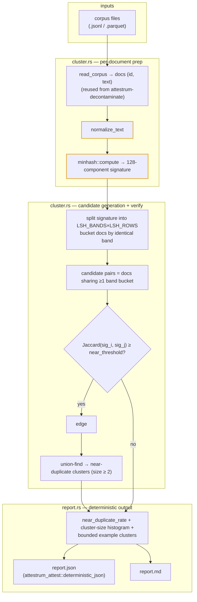

# `attestrum dedup` — intra-corpus near-duplicate rate

Source of truth: **`code`**. The `attestrum-dedup` crate is authoritative; this diagram is the derived
view.

**What it answers.** "How much of this corpus is near-duplicated against itself?" — a composition-quality
signal in the same read-only family as `attestrum decontaminate`. v1 is a **read-only, unsigned** report:
`attestrum dedup --corpus <file...>` emits `report.json` + `report.md` with a near-duplicate rate, a
cluster-size histogram, and bounded example clusters. No signed predicate, no manifest mutation.

**One determinism ruler — rides the PROTECTED kernel, does not fork it.** Normalization and the
near-duplicate basis reuse `attestrum-text-minhash` unchanged: `normalize_text` (NFC → lowercase →
whitespace-collapse) and `minhash::compute` (128-permutation, BLAKE3-keyed, 5-gram word shingles). The
near-dup basis is therefore byte-identical to what `attestrum index` / `attestrum prove` /
`attestrum decontaminate` use — the same ruler everywhere. This crate ships **no** second MinHash and
modifies **no** §4 protected system; it consumes the kernel read-only. Corpus ingestion reuses
`attestrum-decontaminate`'s `read_corpus` (JSONL / Parquet), so a missing text field is a hard error, never
a silent skip.

**MinHash-LSH banding — candidate generation, not naive O(n²).** Each document's 128-component signature is
split into `LSH_BANDS` (16) bands of `LSH_ROWS` (8) rows. Documents that share an identical band land in the
same bucket and become *candidate* pairs; every doc sits in exactly 16 buckets, so the candidate set is
bounded rather than all-pairs. Each candidate pair is then **verified** by the exact MinHash Jaccard
estimate, and only pairs with Jaccard ≥ `near_threshold` (default 0.80) become edges. A union-find over the
surviving edges groups documents into near-duplicate clusters (size ≥ 2).

**Why this is honest.** The reported `near_duplicate_rate` is the fraction of documents that fall in *some*
near-duplicate cluster — a coverage figure, not a pair count that double-counts. Example clusters in the
report are **bounded** (top `MAX_EXAMPLE_CLUSTERS` by size); when more exist the report states how many were
omitted, so the cap never reads as "that's all there is."

**Deferred (NOT in this leaf).** Persisting per-leaf MinHash signatures in the sealed manifest — which would
let `dedup` skip recomputation and enable a cross-version near-dup *delta* — is a §4 manifest-schema change
(protected, needs approval + migration). This leaf recomputes signatures from the raw corpus bytes each run.

The crate adds **no** new external dependency and modifies **no** §4 protected system: `normalize_text` and
`minhash::compute` (highlighted) are consumed read-only, and the report rides
`attestrum_attest::deterministic_json`, so two runs over the same corpus produce byte-identical `report.json`
bytes on any target.
