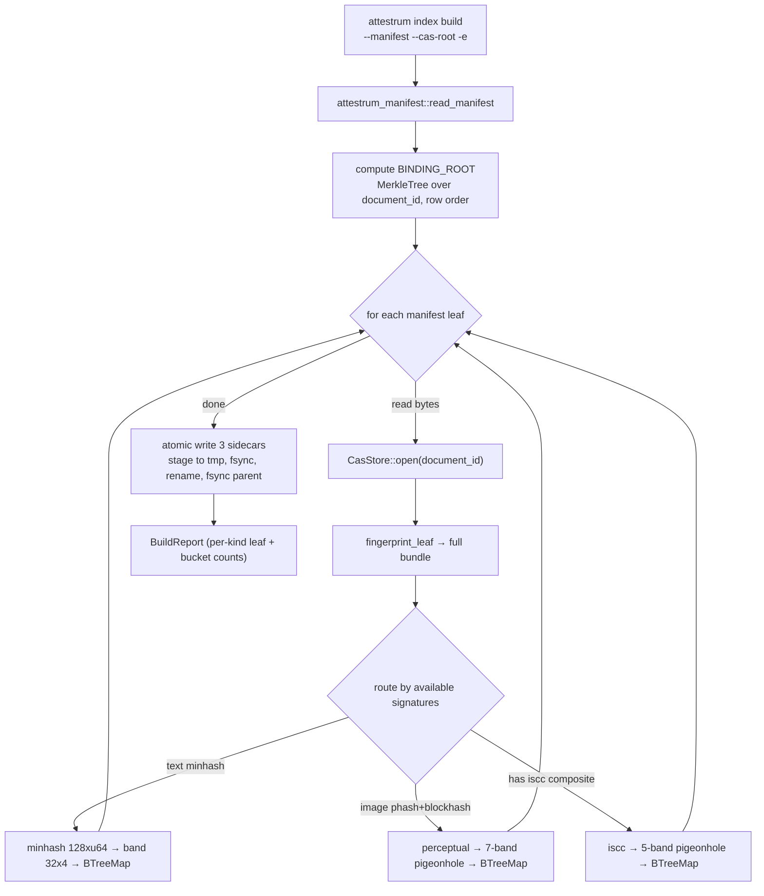
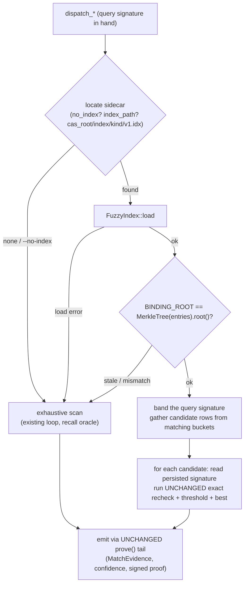

# Index build + query flows

Source of truth: `code` — the build/query modules + the prove dispatch fast-path have landed;
this diagram is the derived view, re-verify when they change. The index is **discovery-grade
acceleration**: it only
changes *which candidates get scored*. The exact recheck (`minhash_jaccard_ppm` ≥ 850000,
`min(phash, blockhash) ≤ 6`, `iscc_composite_distance ≤ 4`) and the signed-proof tail
(`crates/attestrum-prove/src/lib.rs` `prove()` 436-490) are the **existing, unchanged** code, so
the emitted proof is byte-identical whether or not the index was used.

## Build (`attestrum index build` → `build_all`)

Standalone subcommand, NOT wired into `attestrum build` (the pipeline does not depend on
`attestrum-fingerprint`; wiring it in would force a `pipeline → fingerprint` edge for a
discovery-grade artifact). One pass over the manifest, one fingerprint per leaf, routed to each
applicable sub-index.

## Query (inside prove `dispatch_minhash` / `dispatch_perceptual` / `dispatch_iscc`)

**Test obligations** (CLAUDE.md §7/§9):

- `indexed_equals_exhaustive` — for every query the exhaustive path matches, the indexed path
  returns the identical `(leaf_index, jaccard/distance)`. The load-bearing **recall** proof.
- `recall_at_threshold` — a query whose best match is exactly at the locked threshold
  (Jaccard 0.85 / Hamming = k) is still found via the index.
- `stale_binding_falls_back` — corrupt `BINDING_ROOT` → prove silently uses the exhaustive
  path and still emits the correct proof.
- `no_index_flag_forces_exhaustive` — `--no-index` produces a byte-identical proof to the
  indexed run.
- Determinism: `build_all` twice from a fixed manifest → byte-identical sidecars.
