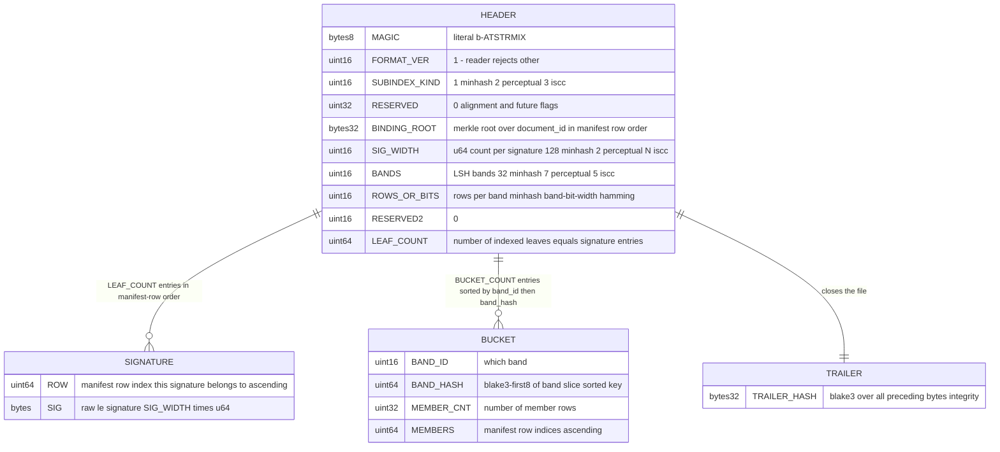

# Fuzzy-lookup sidecar on-disk format

Source of truth: `code` — `crates/attestrum-index/src/format.rs` is authoritative; this diagram
is the derived view, re-verify when the format changes. The sidecar is a **derived,
discovery-grade** acceleration artifact — NOT part of the signed trust chain (CLAUDE.md §11
"is not a registry"). It is rebuildable byte-identically from `manifest.parquet` + `cas/`, so
it carries no signature and no clock field; its only corpus binding is `BINDING_ROOT`.

One file per sub-index kind under `.attestrum/index/<kind>/v1.idx`
(`minhash`, `perceptual`, `iscc`). The per-kind subdir is the format-extension seam: adding a
new modality lands a new dir, never a format break in an existing file.

**Encoding: raw little-endian binary, no codec.** This matches the `to_le_bytes` /
`from_le_bytes` convention already in `crates/attestrum-fingerprint/src/text/minhash.rs` and
is the §7-cleanest choice for fixed-width `u64` arrays — no Parquet page-boundary/dictionary
drift, no float, no map-iteration-order nondeterminism. Buckets are built in a
`BTreeMap<(band_id, band_hash), Vec<row>>` and written in sorted key order with sorted
members, so a rebuild from a fixed manifest is byte-identical (the §7 invariant). The trailing
`TRAILER_HASH` (BLAKE3 over all preceding bytes) makes the golden a one-line digest assertion
and catches partial writes.

**Two signature-block flavors, one header + bucket framework:**

- `minhash` — `SIG` is the locked 128×`u64` MinHash signature; LSH = band the 128 perms into
  `BANDS`=32 × `ROWS_OR_BITS`=4; `BAND_HASH` = first 8 LE bytes of BLAKE3 over the 4-perm
  slice. Recheck at query time = the unchanged exact `minhash_jaccard_ppm` ≥ 850000.
- `perceptual` — `SIG` is pHash(`u64`) + blockhash(`u64`); LSH = Hamming pigeonhole, `BANDS`=7
  (k=6 → k+1) exact-match bands per hash; candidate = union over both hashes. Recheck =
  unchanged `min(phash_dist, blockhash_dist) ≤ 6`. Image leaves only.
- `iscc` — `SIG` is the decoded ISCC composite bits; LSH = Hamming pigeonhole, `BANDS`=5
  (k=4 → k+1). Recheck = unchanged `iscc_composite_distance ≤ 4`.

Pigeonhole banding gives **exact recall** (zero false negatives) for Hamming distance ≤ k.
MinHash banding at 32×4 puts the S-curve knee well below 0.85, so the miss-rate at the locked
threshold is ~1e-5; an exhaustive fallback (`--no-index`, or auto on stale/invalid index)
restores full recall.

**Test obligations** (CLAUDE.md §7 — erDiagram → schema-roundtrip + every Err path):

- `format_roundtrip_returns_equal_index` — write a synthetic index, read it back, assert
  per-field equality including signatures + buckets.
- `format_byte_identical_rebuild` — write the same in-memory index twice, assert byte-identity.
- Reader Err-path tests, one each: bad `MAGIC`, `FORMAT_VER` ≠ 1, `SIG_WIDTH` mismatch for the
  declared kind, `BANDS`×`ROWS` ≠ 128 (minhash), `BANDS` ≠ k+1 (hamming), truncated bucket
  block, `TRAILER_HASH` mismatch.
- `trailer_hash_covers_all_preceding_bytes` — flip one signature byte → trailer check fails.
