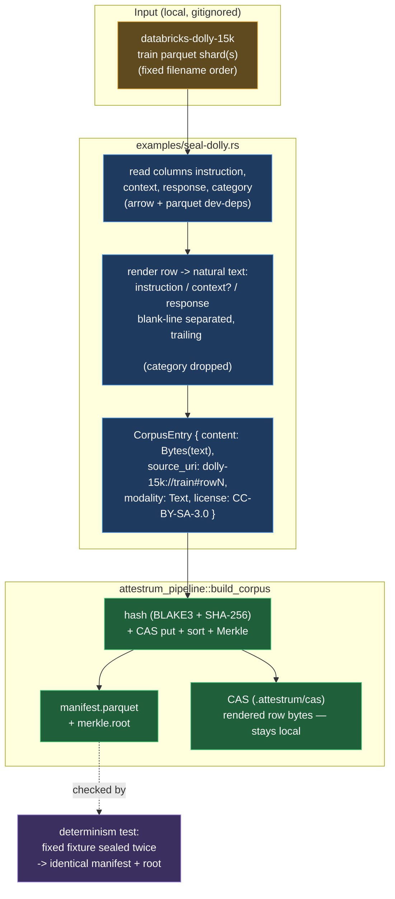

# Lookback Tier-1 — databricks-dolly-15k seal generator

**Source of truth: `code`** — the seal generator
`crates/attestrum-pipeline/examples/seal-dolly.rs` (with its Parquet-reading core
`examples/dolly/seal.rs` and row renderer `examples/dolly/render.rs`) has landed;
this diagram is now a derived view of it. It is the second Tier-1 reference bundle
after WikiText-103 (`wikitext-seal-pipeline.md`) and follows the same deterministic
`build_corpus` pattern — reading the real corpus from the Hugging Face
auto-converted Parquet mirror instead of synthesising bytes in memory.

Three decisions shape the pipeline:

1. **One row = one leaf, sealed as natural text.** Each `databricks-dolly-15k`
   row is a human-written instruction example with four columns —
   `instruction`, `context` (often empty), `response`, `category`. The sealed
   bytes are the row rendered to readable prose: `instruction`, then the
   `context` block **only when non-empty**, then `response`, each separated by a
   single blank line and normalized to a trailing newline. The bare `category`
   label is a metadata tag, not training text, so it is **not** sealed (founder
   decision, 2026-06-06: "natural text per row"). This mirrors how the data
   actually conditions a model and keeps the sealed bytes human-meaningful.
2. **No detokenization.** Unlike WikiText-103-raw (moses-tokenized), dolly is
   already natural English, so the seal path has no detok step — it renders and
   seals the source text directly. The PROTECTED `attestrum-fingerprint`
   normalization (CLAUDE.md §4) is untouched, exactly as in WikiText.
3. **Determinism is preserved.** Shards are read in fixed filename order, rows in
   file order; `build_corpus` stamps `input_ordinal` then sorts canonically, so
   the same input yields a byte-identical `manifest.parquet` + Merkle root (the
   `sprint-3-corpus` determinism contract, extended to this corpus). The
   `source_uri` backref is `dolly-15k://train#row<N>` (0-based, file order).

**Why render-to-text, not lossless JSON:** the bundle is a training-corpus
provenance record, and the meaningful unit of dolly is the instruction example a
model trains on — `instruction` + optional `context` + `response`. Rendering that
to natural prose keeps the sealed bytes faithful to the training content and
human-readable, at the cost of dropping the `category` tag (recoverable from the
public source if ever needed). The published dataset card states the rows were
rendered to natural text before sealing, so the transform is disclosed (matching
the WikiText detok disclosure pattern).
