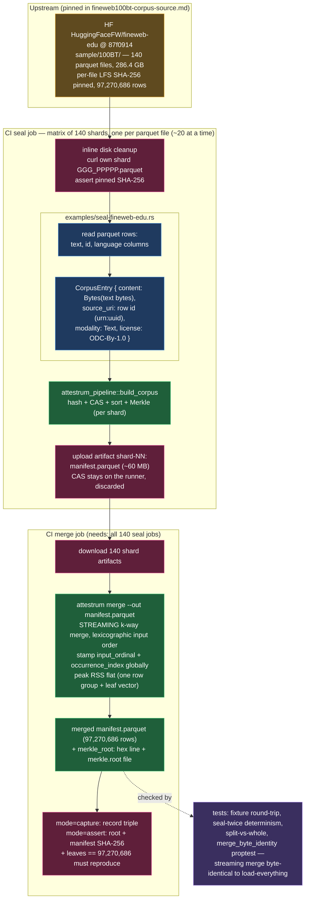

# Lookback — fineweb-edu sample-100BT sharded-matrix seal

**Source of truth: `code`** — reuses the seal generator
`crates/attestrum-pipeline/examples/seal-fineweb-edu.rs` (unchanged from the
10BT rung) and the streaming `attestrum merge`
(`crates/attestrum-cli/src/commands/merge.rs`). Fifth reference bundle and the
ladder's **headline 100 GB+ rung**: 97,270,686 web pages / 286.4 GB compressed
parquet across **140 upstream files** — far past any single runner, so this rung
runs the proven sharded architecture at 10× the 10BT scale. The corpus never
moves between jobs; only manifests (~60 MB/shard) do.

Three decisions shape the pipeline (identical to 10BT, scaled):

1. **Shard = one upstream parquet file, statically pinned.** `sample/100BT/`
   ships as exactly 140 parquet files (~2.05 GB each; the last two of the `013`
   group smaller), each with an upstream LFS SHA-256 (pinned in
   `docs/lookback/fineweb100bt-corpus-source.md`). The matrix enumerates the 140
   (filename, sha256) pairs — no dynamic listing, no `attestrum plan`; the
   dataset's own layout is the natural partition. Each shard job's footprint
   (~2.05 GB download + ~3.3 GB CAS) fits a stock runner; on the free plan the
   140 jobs run ~20 at a time (matrix < the 256 cap).
2. **One row = one leaf; sealed bytes = the `text` column bytes exactly.** No
   transform, no added newline. Metadata columns (`url`, `dump`, scores, …) are
   not sealed. `source_uri` is the row's own `id` (a `urn:uuid` — globally
   unique and shard-invariant), so a leaf's identity does not depend on which
   shard sealed it. Per-shard `input_ordinal` restarts are fine: `merge`
   re-stamps ordinals globally over the concatenation.
3. **The merged root is the canonical root, via a STREAMING merge.**
   `attestrum merge` k-way merges the 140 shard manifests (lexicographic input
   order) in a single streaming pass — peak memory bounded by one Parquet row
   group + the leaf-digest vector, NOT O(rows). At ~97.3M rows the old
   load-everything merge would have needed ~90 GiB; this rung is the at-scale
   proof the streaming merge holds memory flat. It recomputes the RFC 6962 root
   over the sorted leaf set, prints `merkle_root: <hex>`, and writes
   `merkle.root` — byte-identical to an (infeasible) unsharded build (multiset
   invariance; `crates/attestrum-cli/tests/sharding.rs` +
   `tests/merge_byte_identity.rs`).

**Why `Bytes`, not `Path`:** the unit is a parquet row — the text exists only
after column decode, so each row's text bytes are passed as
`ContentSource::Bytes`. Rows are sealed in file order within a shard (parquet
row order is deterministic), and `build_corpus`'s canonical sort makes the
per-shard manifest deterministic regardless. Peak RSS per shard is bounded by
the parquet reader's batch size, not the corpus.

**The publish path** (`fineweb100bt-publish.yml`, gated, §A9) re-runs the same
140-shard matrix + streaming merge, asserts the canonical triple BEFORE Fulcio
is contacted, signs the merged manifest keyless under the Attestrum GHA workflow
identity, pushes to `Attestrum/fineweb-edu-sample-100BT-sealed`, and cosign-
verifies via the `--digest` form (the ~8 GB merged manifest exceeds cosign's
128 MiB blob-read cap — same remedy proven at 10BT).

The PROTECTED `attestrum-fingerprint` normalization and all other §4 systems
(CLAUDE.md) are untouched, as in all prior rungs.
