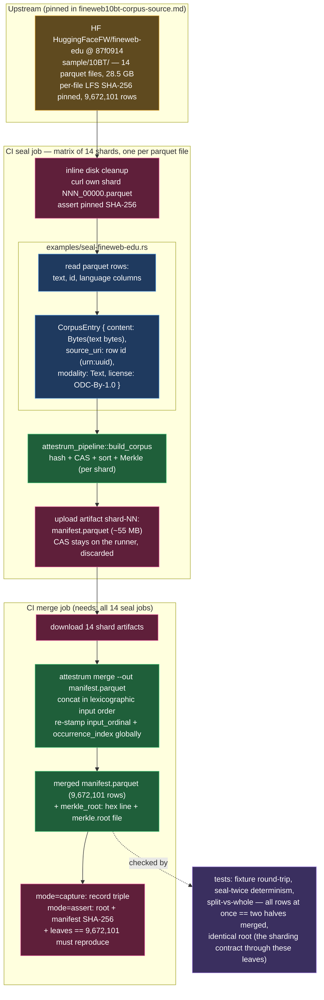

# Lookback — fineweb-edu sample-10BT sharded-matrix seal

**Source of truth: `diagram`** — this is the contract the seal generator
(`crates/attestrum-pipeline/examples/seal-fineweb-edu.rs`) and the CI workflows
must implement; it flips to `code` when the example lands. Fourth reference
bundle after WikiText-103, dolly-15k, and PG-19, and the ladder's first
**sharded** rung: 9,672,101 web pages / 28.5 GB compressed parquet — too big
for one runner's disk, so this rung exists to prove the architecture that
scales to the 286 GB rung above it: **N matrix jobs each seal one slice;
`attestrum merge` combines the shard manifests into one canonical root.** The
corpus never moves between jobs; only manifests (~55 MB/shard) do.

Three decisions shape the pipeline:

1. **Shard = one upstream parquet file, statically pinned.** `sample/10BT/`
   ships as exactly 14 parquet files (13 × ~2.15 GB + one 540 MB tail), each
   with an upstream LFS SHA-256 (pinned in
   `docs/lookback/fineweb10bt-corpus-source.md`). The matrix enumerates the 14
   (filename, sha256) pairs — no dynamic listing, no `attestrum plan`; the
   dataset's own layout is the natural partition. Each shard job's footprint
   (~2.15 GB download + ~3.4 GB CAS) fits a stock runner.
2. **One row = one leaf; sealed bytes = the `text` column bytes exactly.** No
   transform, no added newline — the PG-19 exact-bytes philosophy applied to a
   column. Metadata columns (`url`, `dump`, scores, …) are not sealed.
   `source_uri` is the row's own `id` (a `urn:uuid` — globally unique and
   shard-invariant), so a leaf's identity does not depend on which shard sealed
   it. Per-shard `input_ordinal` restarts are fine: `merge` re-stamps ordinals
   globally over the concatenation.
3. **The merged root is the canonical root.** `attestrum merge` concatenates
   shard manifests in lexicographic input order, re-runs the global passes,
   recomputes the RFC 6962 root over the sorted leaf set, prints
   `merkle_root: <hex>`, and writes `merkle.root` beside the merged manifest —
   byte-identical to what an (infeasible) unsharded build would produce
   (multiset invariance; proven by `crates/attestrum-cli/tests/sharding.rs` and
   re-proven through this example's split-vs-whole test).

**Why `Bytes`, not `Path`:** PG-19's unit was a file on disk, streamed via
`ContentSource::Path`. Here the unit is a parquet row — the text exists only
after column decode, so each row's text bytes are passed as
`ContentSource::Bytes`. Rows are sealed in file order within a shard
(parquet row order is deterministic), and `build_corpus`'s canonical sort makes
the per-shard manifest deterministic regardless. Peak RSS per shard is bounded
by the parquet reader's batch size, not the corpus.

**Why the merge job measures RSS:** `merge` holds all manifest rows in memory
(~4.5 GB est. at 9.67M rows). The capture run records peak RSS via
`/usr/bin/time -v` — the calibration datum that decides whether the ~100M-row
286 GB rung needs a streaming merge (deferred, separate approval). Fallback if
this rung OOMs: staged merge (7+7 then 2) on the same runner — root-identical
by multiset invariance.

The PROTECTED `attestrum-fingerprint` normalization and all other §4 systems
(CLAUDE.md) are untouched, as in all prior rungs.
