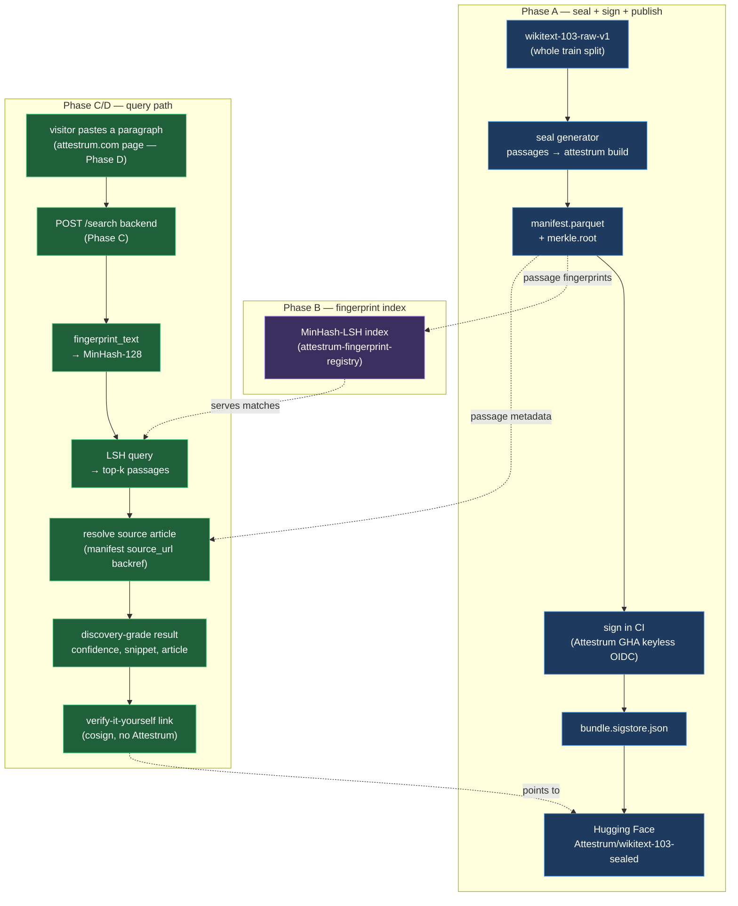

# Lookback — end-to-end architecture (planning)

**Source of truth: `diagram`** — this is a forward-looking design for the Lookback demo (the public corpus fuzzy-search "shop window"). It flips to `source_of_truth: code` per lane as each phase lands. The `models:` files are the crates each lane builds on; the registry crate is still a stub (Phase B is its first real implementation).

A visitor pastes a paragraph on attestrum.com and learns whether it is inside a **real, Attestrum-sealed** public corpus (WikiText‑103), with a "verify it yourself" link to a `cosign`-checkable provenance bundle. Results are **discovery-grade, never proof-grade** (CLAUDE.md §5 / roadmap §21.3) — that wall is structural, not just copy.

The four lanes map to the phase plan:

- **Phase A — seal** the whole corpus → signed, HF-published provenance bundle.
- **Phase B — index** the sealed passages' MinHash signatures into an LSH structure for sub-linear lookup (`attestrum-fingerprint-registry`).
- **Phase C — `/search` backend** that fingerprints the visitor's paste and queries the index.
- **Phase D — website page** (primary completion) that renders results + the verify link.

The matching engine in `attestrum-prove` is deliberately **not** on the query hot path: it does a linear O(N) scan and re-fingerprints every leaf from CAS per fuzzy query — minutes at ~1M leaves. The demo's hot path uses only `attestrum_fingerprint::fingerprint_text` (to fingerprint the paste) plus the Phase‑B LSH index.

**Discovery-grade wall:** the path from a fuzzy LSH hit to a displayed "match" never asserts proof-grade inclusion. A proof-grade claim would require `attestrum prove` emitting a signed inclusion proof against the corpus root — out of scope for the demo, which answers "likely present" with a confidence score and points the visitor at the corpus's own verifiable bundle.
