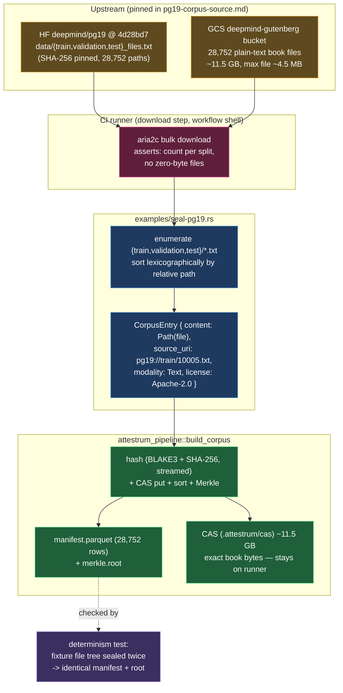

# Lookback Tier-1 — deepmind-pg19 seal generator

**Source of truth: `code`** — the seal generator
`crates/attestrum-pipeline/examples/seal-pg19.rs` (with its file-walking core
`examples/pg19/seal.rs`) has landed; this diagram is now a derived view of it. Third Tier-1 reference bundle after WikiText-103
(`wikitext-seal-pipeline.md`) and dolly-15k (`dolly-seal-pipeline.md`), and the
first **large** rung: 28,752 plain-text books, ~11.5 GB — the corpus is
downloaded and sealed in CI, never on a laptop and never committed.

Three decisions shape the pipeline (deviations from dolly are deliberate):

1. **One book file = one leaf, sealed as its exact bytes.** PG-19 ships as
   28,752 individual UTF-8 `.txt` files (train 28,602 / validation 50 / test
   100), one complete pre-1919 Project Gutenberg book each, max ~4.5 MB. There
   is **no rendering step at all** — the sealed bytes are the file bytes,
   identity-mapped, so every leaf digest is independently checkable against the
   upstream file with `b3sum`. All three splits are sealed: the corpus is the
   whole dataset. `metadata.csv`, the README, and the loader script are an
   index, not corpus content — pinned in `docs/lookback/pg19-corpus-source.md`,
   not sealed.
2. **Entries are `ContentSource::Path`, not `Bytes`.** At 11.5 GB the corpus
   must never sit in RAM. `build_corpus`'s Path branch reads each file once per
   worker, so peak memory is O(workers x largest file) — a few tens of MB —
   inside the free-runner 7 GB envelope.
3. **Determinism is preserved.** Files are enumerated from the input dir's
   `train/`, `validation/`, `test/` subdirs and sorted lexicographically by
   relative path; `build_corpus` stamps `input_ordinal` then sorts canonically,
   so the same file tree seals to a byte-identical `manifest.parquet` + Merkle
   root (the `sprint-3-corpus` determinism contract). The `source_uri` backref
   is `pg19://<relative-path>` (e.g. `pg19://train/10005.txt`).

**Why exact bytes, not a render:** dolly's unit of meaning was a multi-column
row that needed rendering into prose; PG-19's unit is already a single natural
file. Sealing the file bytes untouched is the strongest possible provenance
claim — no transform to disclose, no render contract to drift — and it keeps
the published manifest a direct per-file digest list of the upstream corpus.
The PROTECTED `attestrum-fingerprint` normalization (CLAUDE.md §4) is untouched,
as in both prior rungs.
