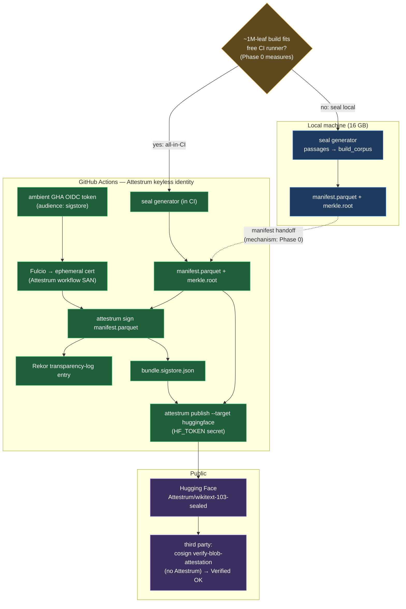

# Lookback Phase A — seal/sign/publish topology (planning)

**Source of truth: `diagram`** — forward-looking design for where each step of sealing the whole WikiText‑103 runs. Flips to `code` once the Phase‑A workflow lands.

Two invariants drive the layout:

1. **The Sigstore signature is always applied by the Attestrum GitHub Actions keyless identity, never a personal one** (CLAUDE‑LOCAL §A9). `attestrum sign` consumes whatever OIDC token is present, so run locally it would sign under the founder's personal identity — forbidden. Signing therefore happens inside GitHub Actions, where the ambient GHA OIDC token resolves to the Attestrum workflow SAN.
2. **The heavy build runs where there's RAM.** Phase 0 measures the ~1M-leaf build's peak memory. If it fits a free GitHub-hosted runner (~7 GB) the whole pipeline runs in CI (cleanest — fully reproducible from the workflow alone). If not, the founder's preference is to seal locally (16 GB box) and hand only the `manifest.parquet` to CI to sign — the manifest is all `sign` needs (it signs the manifest bytes, not the CAS).

The diamond is the Phase‑0 decision; both branches converge on the same in‑CI sign + publish.

**Why the manifest-only handoff is sound:** `attestrum sign` (`crates/attestrum-attest/src/sign.rs`) signs the manifest's bytes/digest, not the content-addressed store. The CAS (~1M objects) never needs to leave the local machine for signing. Publishing to HF likewise uploads `manifest.parquet` + `bundle.sigstore.json` + the emitted Croissant/README/verify.html — not the CAS. The exact local→CI handoff mechanism (push unsigned manifest to the HF repo first, or a transient release asset/object-store hop) is the Phase‑0 deliverable.
