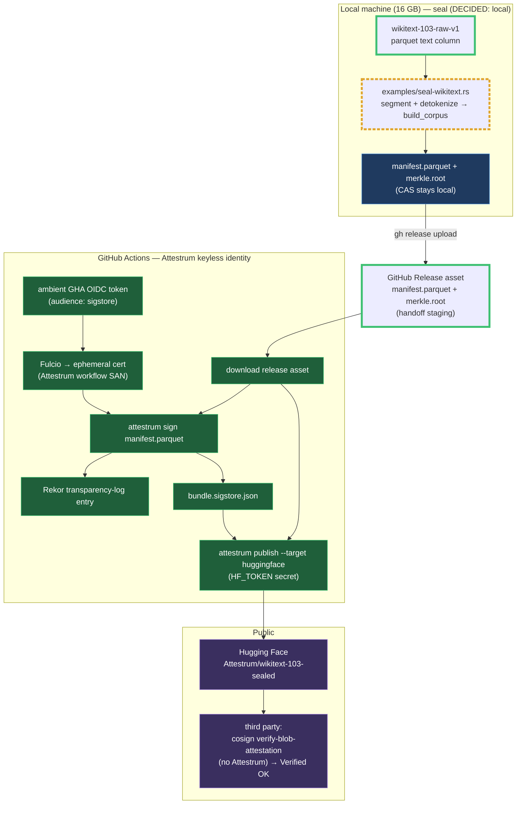

# Lookback Phase A — seal/sign/publish topology (planning)

**Source of truth: `diagram`** — forward-looking design for where each step of sealing
the whole WikiText-103 runs. Flips to `code` once the Phase-A workflow lands.

🟩 new · 🟧 revised this revision

Two invariants drive the layout:

1. **The Sigstore signature is always applied by the Attestrum GitHub Actions keyless
   identity, never a personal one** (CLAUDE-LOCAL §A9). `attestrum sign` consumes
   whatever OIDC token is present, so run locally it would sign under the founder's
   personal identity — forbidden. Signing therefore happens inside GitHub Actions, where
   the ambient GHA OIDC token resolves to the Attestrum workflow SAN.
2. **The heavy build runs where there's RAM. DECIDED: seal local.** The Phase-0 estimate
   (~5 GB peak RSS, ~1.8 h at ~1M leaves) is risky on a free 7 GB GitHub-hosted runner,
   so the ~1M-leaf seal runs on the 16 GB local box (re-measured for real in Phase A).
   Only the small `manifest.parquet` + `merkle.root` cross to CI to be signed — the
   manifest is all `sign` needs (it signs the manifest bytes, not the CAS).

**Manifest handoff = a GitHub Release asset.** The local seal uploads
`manifest.parquet` + `merkle.root` as assets on a (pre)release; the `workflow_dispatch`
sign/publish workflow downloads them, signs under ambient GHA OIDC, and publishes the
full signed set to Hugging Face in one shot. This keeps the public HF dataset repo
pristine until the signed bundle lands (no transient unsigned-manifest state on HF).

**Changed this revision:** removed the Phase-0 decision diamond and the all-in-CI seal
branch (the seal-location question is now decided: local). 🟩 added the corpus input,
the GitHub Release-asset handoff, and the in-CI download step. 🟧 the local generator is
now the concrete `examples/seal-wikitext.rs`.

**Why the manifest-only handoff is sound:** `attestrum sign`
(`crates/attestrum-attest/src/sign.rs`) signs the manifest's bytes/digest, not the
content-addressed store. The CAS (~1M objects) never needs to leave the local machine for
signing. Publishing to HF likewise uploads `manifest.parquet` + `bundle.sigstore.json` +
the emitted Croissant/README/verify.html — not the CAS.
