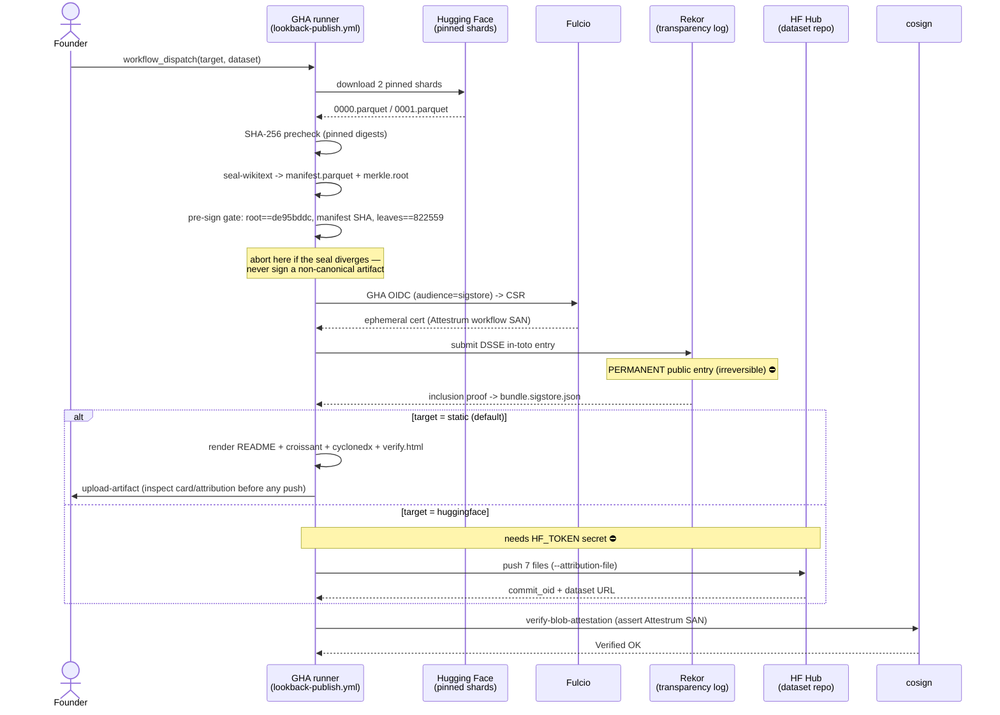

# Lookback Phase A — gated WikiText publish pipeline

The flagship publish flow, realised as `.github/workflows/lookback-publish.yml`
(`workflow_dispatch` only). It seals the **real** WikiText-103 corpus in CI, gates on
the canonical root before signing, signs keyless under Attestrum's GitHub Actions
identity (CLAUDE-LOCAL §A9), and publishes — either `static` (sign + local artifacts
for inspection) or `huggingface` (sign + Hub push). `source_of_truth: code` now that
`lookback-publish.yml` has landed and run — the WikiText-103 corpus is sealed, signed,
and published live; this diagram is the derived view, re-verify when the workflow changes.

**The ⛔ steps are signing (a permanent public Rekor entry) and the HF push (needs the
`HF_TOKEN` secret).** Both run only on an explicit manual dispatch. The pre-sign gate
guarantees only the canonical artifact (`de95bddc…`) is ever signed.

**Pre-sign gate (step before any signing).** The same triple assertion as
`lookback-seal-crosscheck.yml` (root `de95bddc…`, `manifest.parquet` SHA-256
`eafa3dd7…`, leaves `822559`), moved *inside* the publish path so a divergent seal
aborts the run before Fulcio/Rekor are ever contacted.

**Signing identity.** Keyless via the GHA-OIDC→`audience=sigstore` exchange → Fulcio
ephemeral cert bound to the Attestrum workflow SAN, never a personal identity
(CLAUDE-LOCAL §A9). The closing `cosign verify-blob-attestation` step asserts that SAN
+ the GitHub OIDC issuer + the predicate type (`--type`), so a wrong identity or
predicate fails the run (the §21.1 guard, reused from `build-sign-publish.yml`).

**Determinism note.** The seal runs at epoch 0 (the canonical `de95bddc…` input); sign
and publish take a commit-derived `SOURCE_DATE_EPOCH` for reproducible predicate /
dataset-card timestamps. The two epochs are independent and both correct.
