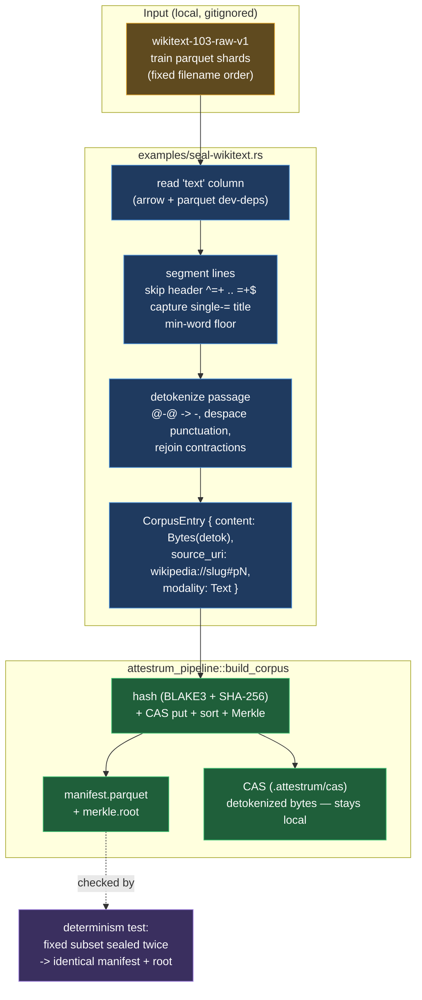

# Lookback Phase A — WikiText-103 seal generator

**Source of truth: `code`** — the programmatic seal generator
`crates/attestrum-pipeline/examples/seal-wikitext.rs` (with its Parquet-reading core
`examples/wikitext/seal.rs`) has landed; this diagram is now a derived view of it.
It follows the deterministic `sprint-3-corpus.rs` pattern but reads the real corpus
from the Hugging Face parquet `text` column instead of synthesising bytes in memory.

Three decisions shape the pipeline:

1. **Detokenization is mandatory and lives here, in segmentation — never in the PROTECTED
   `attestrum-fingerprint` normalization** (CLAUDE.md §4). WikiText-103-raw ships
   moses-tokenized (` @-@ `, spaced punctuation); a pasted natural-English paragraph
   matches a raw passage at ~0.32 Jaccard but ~1.00 after the passage is detokenized.
   The CAS therefore stores detokenized bytes, so Phase B re-fingerprints natural English.
2. **Each passage is one leaf.** A passage is one non-empty, non-header line of the
   `text` column; the single-`=` article-title line becomes the `source_uri` backref
   `wikipedia://<slug>#p<N>`; a min-word floor drops tiny fragments.
3. **Determinism is preserved.** Shards are read in fixed filename order, rows in file
   order; `build_corpus` stamps `input_ordinal` then sorts canonically, so the same
   input yields a byte-identical `manifest.parquet` + Merkle root (the
   `sprint-3-corpus` determinism contract, extended to the real corpus).

**Why detok in segmentation, not fingerprinting:** the `attestrum-fingerprint`
normalization (NFC → lowercase → whitespace-collapse) is a PROTECTED, version-locked
invariant (CLAUDE.md §4) shared by every emitted inclusion proof; changing it would
invalidate prior proofs. Moses detokenization is corpus-preparation, not fingerprint
normalization — it transforms what bytes get sealed, upstream of and independent from the
fingerprint path. Sealing the detokenized text is honest as long as the published dataset
card states the corpus was detokenized to natural English (recorded at publish time).
