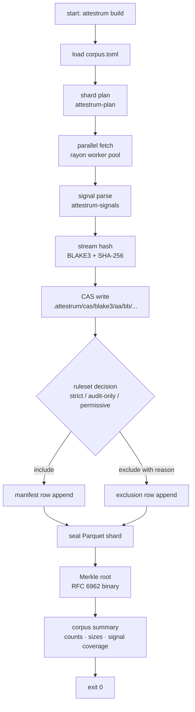

# attestrum build — happy path

Source of truth flips to `code` at end of Sprint 3 when `attestrum-pipeline::run` lands. Integration test `tests/pipeline_happy_path.rs` exercises every edge with a 10-MB fixture corpus checked in under `tests/fixtures/mini-pile/`.

