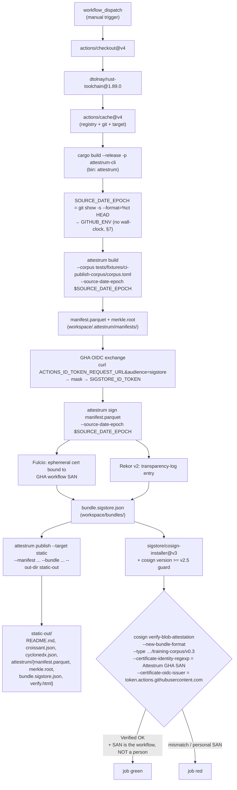

# build → sign → publish — CI dry-run

The `.github/workflows/build-sign-publish.yml` workflow runs the full corpus-to-bundle
pipeline **inside GitHub Actions** and proves a third party can verify the result with
`cosign` alone. It is the first workflow that runs `attestrum publish`; the existing
`cosign-interop.yml` only signs a synthetic empty-corpus manifest.

`source_of_truth: code` — the YAML at `.github/workflows/build-sign-publish.yml` is now
authoritative and this diagram is a derived view (roadmap v0.2a, §2 diagram-first).

**Identity split (the load-bearing point).** The provenance identity is the **ambient GHA
keyless OIDC** identity (`permissions: id-token: write`), exchanged to a `sigstore`-audience
token exactly as `cosign-interop.yml` does, and consumed by `attestrum sign` via
`SIGSTORE_ID_TOKEN`. It is **never** a personal identity (roadmap §21.1). Hugging Face Hub
has no GitHub-OIDC federation, so a real HF push needs a static token — out of scope here:
the dry-run uses `publish --target static` (local write, no network, no secret). The cosign
verify checks the **bundle**, which `sign` produces *before* `publish`, so the static target
fully exercises the §21.1 identity proof.

**Trigger = `workflow_dispatch`** (manual), not `push:main`: every signed run leaves a
permanent public Rekor transparency-log entry, so the cadence is capped to deliberate runs.

**Determinism (§7):** `SOURCE_DATE_EPOCH` is derived from the commit time
(`git show -s --format=%ct HEAD`), never wall-clock, and threaded identically through build,
sign, and publish.

