# CAS layout

Source of truth: `code` (Sprint 2 E6 implementation). Two-level hex sharding (`aa/bb/`) matches git's object layout; tested up to 50M objects without ext4 dirent slowdown. Atomic-rename from `tmp/` is the only legal write path into `cas/`. The layout in PATH-A-BRIEF supersedes BUILD-PLAN.md §0.5.6 (`.attestrum/objects/` is renamed to `.attestrum/cas/`; FastCDC `chunks/` is deferred to v1.1).

This is a protected system per CLAUDE.md §4 — layout change is a corpus-incompatible event requiring a major version bump.

**What E6 actually ships** (the flowchart below shows the FULL `.attestrum/` tree per `PATH-A-BRIEF.md` §1.9 — including subdirectories owned by crates that have NOT yet landed). The Sprint 2 E6 `CasStore` materializes only:

- `<root>/cas/blake3/<aa>/<bb>/<full-hash>.bin` — canonical content-addressed path
- `<root>/tmp/.attestrum-tmp.<pid>-<counter>` — atomic-rename staging

All other subdirectories shown (`manifests/`, `attestations/`, `ledger/`, `bundles/`, `index/`, `cas/sha256/`, `cas/meta/`, `config.toml`) land in their owning sprints:

- `cas/sha256/` + `cas/meta/` — Sprint 3 when the manifest crate wires them
- `manifests/` — Sprint 3 (`attestrum-manifest` Parquet writer)
- `attestations/` + `bundles/` — Sprint 4 (`attestrum-attest` + Sigstore)
- `ledger/` — Sprint 6 (`attestrum-ledger` takedown log)
- `index/` — Sprint 3+ (RocksDB hot-path index)
- `config.toml` — workspace local overrides; lands when the CLI config loader needs it

```mermaid
flowchart TD
  Root[".attestrum/"] --> Cfg["config.toml<br/>(workspace local overrides)"]
  Root --> CAS["cas/"]
  Root --> Mani["manifests/"]
  Root --> Att["attestations/"]
  Root --> Led["ledger/"]
  Root --> Bun["bundles/"]
  Root --> Tmp["tmp/<br/>(atomic-rename staging)"]
  Root --> Idx["index/<br/>(RocksDB)"]

  CAS --> CASb3["blake3/aa/bb/&lt;full-hash&gt;.bin"]
  CAS --> CASs["sha256/aa/bb/&lt;full-hash&gt;.bin"]
  CAS --> CASm["meta/&lt;blake3-prefix&gt;.json<br/>(content-type, fetched_at, source URI)"]

  Mani --> Mfshard["shard-0000.parquet<br/>shard-0001.parquet<br/>..."]
  Mani --> Mfroot["merkle.root"]
  Mani --> Mfsum["summary.json"]

  Att --> AttC["corpus.intoto.json"]
  Att --> AttI["inclusion-&lt;subject&gt;.intoto.json"]
  Att --> AttN["non-inclusion-&lt;subject&gt;.intoto.json"]

  Bun --> BunC["corpus.sigstore.json"]
  Bun --> BunP["proofs/&lt;id&gt;.sigstore.json"]

  Led --> LedJ["takedowns.jsonl<br/>(append-only)"]
  Led --> LedR["ledger.merkle.root"]

  Idx --> IdxF["fingerprints.db<br/>(RocksDB: hash → manifest row)"]
  Idx --> IdxB["bloom.bin<br/>(membership filter)"]
```

