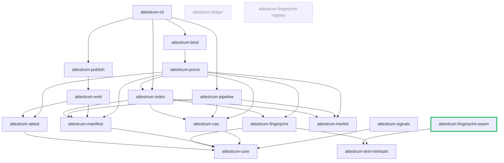

# Crate dependency graph

Source of truth: `code`. The edges are the **transitive reduction** of the **normal** (non-dev) inter-crate `[dependencies]` from `cargo metadata --no-deps`: an edge `A → B` is omitted when `B` is already reachable from `A` through a longer path, which keeps reachability identical while removing visual clutter. For example `attestrum-cli`'s manifest lists `attestrum-core`, `attestrum-cas`, `attestrum-manifest`, `attestrum-merkle`, and `attestrum-prove` directly, but each is reachable via `bind` / `pipeline` / `publish`, so those skip-level edges are not drawn. Test-only `[dev-dependencies]` are likewise not drawn.

**Arrow convention:** `A --> B` means "A depends on B" — the arrow points from the dependent crate to its dependency, matching `cargo-tree` convention.

`attestrum-core` has zero outbound project dependencies (externally it pulls only `serde`, `thiserror`, `schemars`) and is the foundation every wired crate reaches. Three crates are **not yet wired into the runtime graph**: `attestrum-ledger` and `attestrum-fingerprint-registry` have no project edges at all, and `attestrum-signals` depends on `attestrum-core` but nothing depends on it yet — all three are scaffolded ahead of the CLI paths that will consume them. `attestrum-merkle` has no *normal* project dependency (it reaches `attestrum-core` only in tests). `attestrum-index` (v1.1 fuzzy-lookup sidecars) depends on `attestrum-fingerprint` / `attestrum-cas` / `attestrum-manifest` / `attestrum-merkle` (its `attestrum-core` edge is skip-level, omitted). Both the **CLI `index build` subcommand** (`CLI → attestrum-index`) and **`attestrum-prove`'s fuzzy fast-path** (`attestrum-prove → attestrum-index`) depend on it. No cycles exist (`attestrum-index` reaches only leaf crates; nothing it depends on reaches back to it or to `attestrum-prove`).

🟩 new this revision: `attestrum-fingerprint-wasm` — the C2 `cdylib` that compiles the PROTECTED text-MinHash kernel to `wasm32` for the attestrum.com near-match demo (`extern "C"` ABI, no algorithm of its own). Its only **normal** project edge is `→ attestrum-text-minhash`; its `attestrum-fingerprint` edge is test-only (`[dev-dependencies]`, native cross-check) so it is not drawn. `attestrum-text-minhash` (C1, prior revision) remains the shared kernel both `attestrum-fingerprint` and this crate consume.
