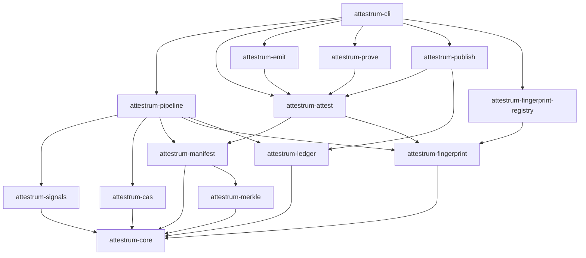

# Crate dependency graph

Source of truth: `code` — verified against `cargo metadata --no-deps` output as of Sprint 2 E5 (workspace `Cargo.toml` adds `blake3 = "1.5"` and `sha2 = "0.10"` to `[workspace.dependencies]`; `attestrum-cas` consumes both). Inter-crate `[dependencies]` edges remain unwired — they land progressively across Sprints 2–6 as each crate's real implementation arrives. The graph itself is unchanged from E2.

**Arrow convention:** `A --> B` means "A depends on B" — the arrow points from the dependent crate to its dependency, matching `cargo-tree` / `cargo-deps` convention. (This is the inverse of PATH-A-BRIEF §1.10's drawn direction, which is corrected here per cross-check; the caption in PATH-A-BRIEF §1.10 is the canonical statement of intent — "`attestrum-core` has zero inbound dependencies and every leaf crate depends transitively on `attestrum-core`.")

`attestrum-core` has zero outbound project dependencies and only depends on `std` plus `serde`, `thiserror`, `blake3`. Every leaf crate depends transitively on `attestrum-core`; no other cycles or skip-level deps are allowed. The diagram-linter forwards this graph to a `cargo-deny` rule (Sprint 2+) that fails the build on any disallowed edge.

