# Croissant `croissant.json` document shape

`source_of_truth: code` — `crates/attestrum-emit/src/croissant.rs` is authoritative; this diagram is
the derived view (decision `croissant-context-conformance`, 2026-05-30).

`attestrum publish` emits `croissant.json` — the dataset's machine-readable descriptor. It must
validate against the public `mlcroissant` reference validator (CLAUDE.md §12 vendor-neutrality: every
emitted artifact verifies with stock tooling, no Attestrum install). The pre-rewrite emitter wrote
`@context` as an array and so failed `mlcroissant`'s `get_context()` (which requires a dict) before
any content check. This diagram is the corrected shape.

**Zero-warnings contract** (verified against `mlcroissant` `make_context` / `assert_has_optional_properties`
/ `cast_version`): the `@context` must inline the full standard **v1.0** dict (36 keys) so no standard
key is reported missing; `@type` + `dct:conformsTo` make the file a recognised Croissant 1.0 Dataset;
and the four *recommended* fields (`license`, `version`, `datePublished`, `citeAs`) each warn when
absent. A default publish supplies `license` (real or the honest token `"unknown"`), `version`
(`"1.0.0"`, overridable via `--version`), and `datePublished` — leaving at most one benign warning
(`citeAs`, publisher-only data). When the publisher passes `--cite-as`, the file validates **zero
errors / zero warnings**. `version` is **never** derived from the Merkle root: `cast_version` enforces
semver `MAJOR.MINOR.PATCH` and warns on any hash, and a content hash is identity, not a release
ordering.

The `attestrum:provenance` block is the only Attestrum-namespaced structure (mapped via the
`attestrum` context key to `https://attestrum.com/croissant/v0.1/`); `mlcroissant` ignores unknown
extension URIs, and extra context keys are not flagged. The `attestrum:predicate` value is a CLAUDE.md
§4 protected URI and is emitted byte-identical.

```mermaid
flowchart TD
  ROOT["croissant.json<br/>(deterministic_json: sorted keys)"]

  ROOT --> CTX["@context · dict (37 keys)<br/>36 standard v1.0 keys + attestrum"]
  ROOT --> TYPE["@type: 'Dataset'<br/>(resolved via @vocab schema.org)"]
  ROOT --> CONF["dct:conformsTo<br/>http://mlcommons.org/croissant/1.0"]
  ROOT --> NAME["name · org/dataset slug"]
  ROOT --> DATES["dateCreated + datePublished<br/>← source_date_epoch (no wall-clock)"]
  ROOT --> LIC["license · real SPDX or 'unknown'"]
  ROOT --> VER["version · '1.0.0' default · --version"]
  ROOT --> CITE["citeAs · only if --cite-as<br/>(else omitted = 1 benign warning)"]
  ROOT --> LIVE["isLiveDataset: false<br/>(unqualified key, not cr:)"]
  ROOT --> RS["recordSet: []<br/>(empty validates clean; distribution omitted)"]
  ROOT --> PROV["attestrum:provenance<br/>(the only attestrum-namespaced block)"]

  PROV --> P1["attestrum:predicate<br/>…/attestation/training-corpus/v0.3 (§4 protected)"]
  PROV --> P2["attestrum:manifest · attestrum/manifest.parquet"]
  PROV --> P3["attestrum:merkleRoot · attestrum/merkle.root"]
  PROV --> P4["attestrum:bundle · attestrum/bundle.sigstore.json"]

  subgraph ZW["validates zero errors / zero warnings when…"]
    direction LR
    Z1["@context full v1.0 dict"]
    Z2["@type + conformsTo present"]
    Z3["license + version + datePublished present"]
    Z4["citeAs present (publisher-supplied)"]
  end

  CTX -.-> Z1
  CONF -.-> Z2
  LIC -.-> Z3
  CITE -.-> Z4

  classDef protected fill:#5a3a8a,stroke:#a98ede,color:#fff
  classDef contract fill:#1f3a5f,stroke:#5b9bd5,color:#fff
  class P1 protected
  class ZW,Z1,Z2,Z3,Z4 contract
```

