# CycloneDX `cyclonedx.json` document shape

`source_of_truth: code` — `crates/attestrum-emit/src/cyclonedx.rs` (`render_cyclonedx`,
`CycloneDxPlan`) is now authoritative; this diagram is the derived view, re-verify when the emitter
changes. Decision: `cyclonedx-mlbom-shape`, 2026-05-30 (multi-agent high-stakes protocol).

`attestrum publish` emits `cyclonedx.json` beside `croissant.json` — the dataset's SBOM/ML-BOM
descriptor for the software-supply-chain ecosystem. It must validate against the public CycloneDX
validator (`sbom-utility`) with **zero errors / zero warnings** (CLAUDE.md §12 vendor-neutrality:
every emitted artifact verifies with stock tooling, no Attestrum install).

**Spec pin:** CycloneDX **1.6** (ECMA-424). `bomFormat:"CycloneDX"` + `specVersion:"1.6"` are the
only root-required fields.

**The honesty contract (the load-bearing decision).** A CycloneDX `hashes` entry means "the digest of
this component's bytes" — a stock tool will recompute it. So `hashes` carries **only the SHA-256** of
`manifest.parquet`, which is exactly the Sigstore-signed in-toto **subject digest** (`verify.rs:44-46`:
sigstore-rs computes the manifest's SHA-256 and asserts it matches the bundle subject). That value is
true, signed, and independently recomputable (`sha256sum manifest.parquet` matches). The BLAKE3
**Merkle root** is a *tree root*, not a flat digest — it is **never** placed in `hashes` (a verifier
recomputing it would get a different value and wrongly contradict the artifact). All BLAKE3 values live
in namespaced `properties`, so the document never shows two BLAKE3 values in two semantic roles.

**Determinism (§7):** no `serialNumber` (omitted — nothing keys on it; avoids a `uuid` dep); a
deterministic `metadata.timestamp` from `--source-date-epoch` (Croissant-consistent, no wall-clock);
content-derived `bom-ref`; sorted-key serialization via `deterministic_json`.

**Vendor-neutrality (§12):** "attestrum" appears only as `metadata.tools` (the generating tool) and in
the §4-protected predicate URI under `externalReferences`. The dataset `supplier` is the corpus
publisher (the Attestrum GitHub Actions workflow identity for demos — never an individual; CLAUDE-LOCAL
§A9 / roadmap §21.1), via `--publisher`, omitted when absent. `authors` is omitted (it carries personal
contact fields). **Honest omission throughout:** `classification`, `governance.owners`, `citeAs`-style
fields are emitted only when their input is supplied — never fabricated (the Croissant `license:"unknown"`
precedent).

```mermaid
flowchart TD
  ROOT["cyclonedx.json<br/>deterministic_json (sorted keys)<br/>bomFormat: CycloneDX · specVersion: 1.6"]

  ROOT --> META["metadata"]
  ROOT --> COMP["metadata.component<br/>type: 'data' · bom-ref: dataset-name-version"]
  ROOT --> NOSER["(no serialNumber — omitted, §7)"]

  META --> TS["timestamp ← source_date_epoch<br/>(deterministic, no wall-clock)"]
  META --> TOOL["tools.components[].name: 'attestrum'<br/>(only structural Attestrum)"]

  COMP --> NAME["name ← --dataset · version ← --version"]
  COMP --> HASH["hashes: [ SHA-256 only ]<br/>= sha256(manifest.parquet)<br/>= signed in-toto subject digest"]
  COMP --> LIC["licenses ← resolved value<br/>SPDX→license.id · 'unknown'→license.name"]
  COMP --> SUP["supplier ← publisher org<br/>(GHA identity / --publisher / omit)"]
  COMP --> XREF["externalReferences"]
  COMP --> PROP["properties (attestrum: namespaced)"]
  COMP --> CDATA["data[]: componentData"]

  XREF --> X1["type: attestation → predicate URI<br/>…/training-corpus/v0.3 (§4 protected) + bundle"]
  XREF --> X2["type: distribution/bom → manifest · bundle paths"]

  PROP --> PR1["attestrum:merkle.root.blake3<br/>(tree root — NEVER in hashes)"]
  PROP --> PR2["attestrum:corpus.leafCount · totalBytes"]

  CDATA --> CD1["type: 'dataset' · name<br/>(the typed-dataset assertion — always)"]
  CDATA --> CD2["governance.owners ← --publisher (else omit)"]
  CDATA --> CD3["classification ← --classification (else omit)"]

  subgraph ZW["validates zero errors / zero warnings when…"]
    direction LR
    Z1["bomFormat + specVersion present"]
    Z2["component.type=data + componentData.type=dataset"]
    Z3["hashes SHA-256 recomputable over manifest.parquet"]
    Z4["sbom-utility validate: no WARN/ERROR"]
  end

  HASH -.-> Z3
  CDATA -.-> Z2
  ROOT -.-> Z1

  classDef protected fill:#5a3a8a,stroke:#a98ede,color:#fff
  classDef contract fill:#1f3a5f,stroke:#5b9bd5,color:#fff
  classDef danger fill:#8a2a2a,stroke:#e06666,color:#fff
  class X1 protected
  class ZW,Z1,Z2,Z3,Z4 contract
  class PR1 danger
```

**Reverse note (`PR1`, red):** the Merkle root in `properties` is flagged as the field that must NEVER
migrate into `hashes` — that migration is the one disqualified option (C1) from the decision.
