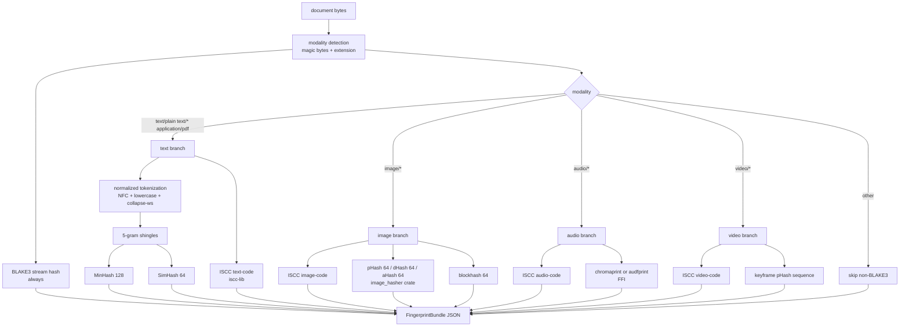

# Fingerprint pipeline

Source of truth flips to `code` when `crates/attestrum-fingerprint/src/lib.rs` lands in Sprint 5. ISO 24138:2024 ISCC is implemented via the official `iscc-lib` Rust crate (the only ISO 24138:2024 conformance-tested polyglot library, with Rust at its core and Python/Java/Go bindings). Image perceptual hashes use the `image_hasher` crate (the maintained fork of `img_hash`, MSRV 1.70). Text MinHash/SimHash are implemented in-tree because public crates are either toy implementations or unmaintained.

