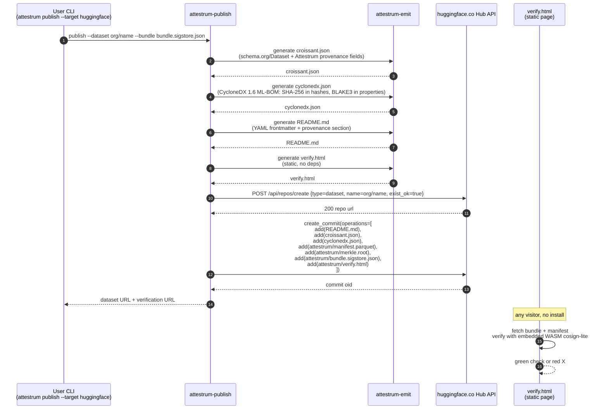

# Hugging Face Hub publish

Source of truth flips to `code` at end of Sprint 6. The HF Hub does not expose a native Sigstore-bundle attestation endpoint for datasets (verified May 2026); the bundle is committed as a regular repo file via the standard `create_commit` API, exactly as the OpenSSF model-signing project and Cohere do today for models. We therefore make `croissant.json` an explicit repo-root file (mirroring established practice such as `huggingface.co/datasets/princeton-nlp/CharXiv/blob/main/croissant.json`), independent of the Hub-generated one.

