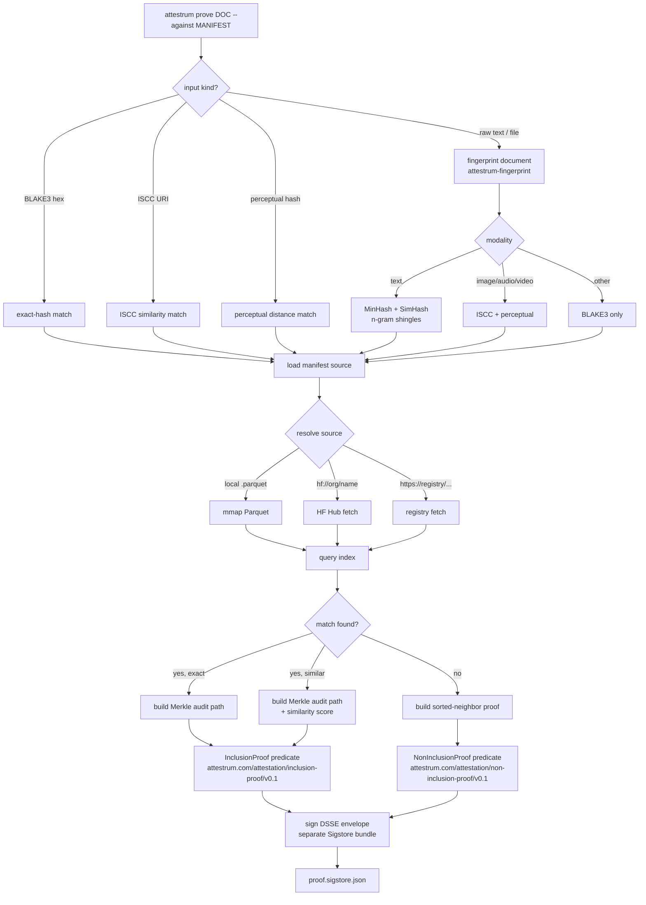

# attestrum prove — pipeline

Source of truth flips to `code` at end of Sprint 5 when `attestrum-prove::prove` lands. The proof bundle is **separately signed** and references the corpus manifest by digest in its `subject[]` array. This separation is intentional: a corpus publisher may delegate proof issuance to a different identity (e.g., a hosted Attestrum service operated by Hugging Face) without compromising corpus authorship.

