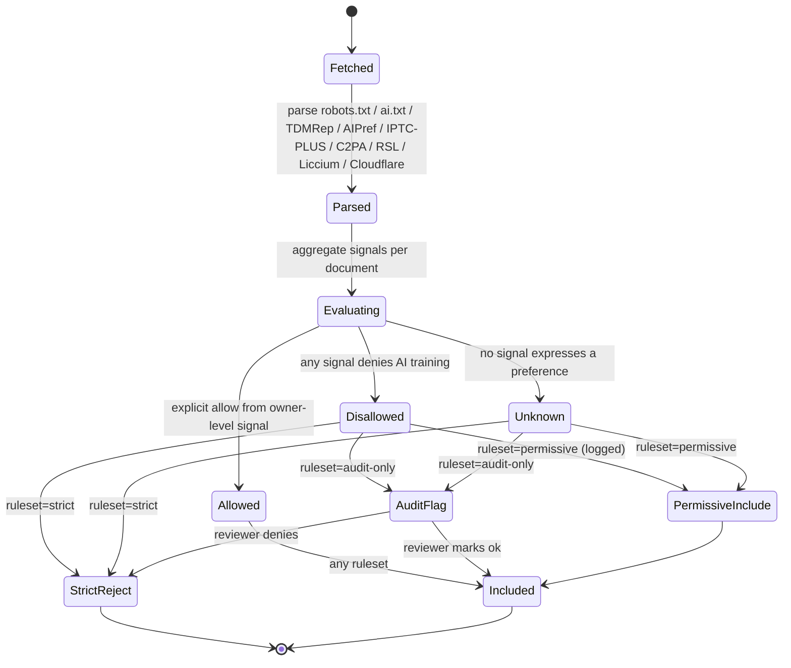

# Signal decision state machine

Source of truth: `code` — verified against `crates/attestrum-signals/src/decision.rs` as of Sprint 1 commit E10 and Sprint 2 commit E2 (property-test verification). Aggregator implements the state machine drawn here: `aggregate(reports, ruleset) -> SignalDecision`. The terminal `SignalDecision::Include | Flag | Exclude` enum maps onto the diagram's `Included | AuditFlag | StrictReject` states (the `AuditFlag → Included | StrictReject` reviewer arrow is a human-in-the-loop step deferred to a future sprint when the audit UI lands).

**Property-test verification:** `crates/attestrum-signals/tests/decision_proptest.rs` (Sprint 2 E2) enumerates every (signal-set × ruleset) pair against this state machine, fulfilling the CLAUDE.md §7.1 / PATH-A-BRIEF §7.1 obligation for `stateDiagram-v2` diagrams. Four properties cover: ANY-Disallowed-wins, Allowed-includes-when-no-Disallow, all-Unknown-follows-ruleset, and reason-string-names-first-Disallow-source. An additional non-proptest test exhaustively walks the trivial 3-verdicts × 3-rulesets matrix end-to-end.

Note: BUILD-PLAN v0.1.1 §0.5.3 spells out per-signal robots.txt edge cases (HTTP error → unknown; 404 → permissive; empty 200 → permissive). PATH-A-BRIEF §1.4 simplifies to the three-bucket Disallowed / Allowed / Unknown model below. Per-parser edge cases (HTTP error → unknown etc.) live in the parser-specific state diagrams (`sprint-1/robots-txt-state.md`, etc.) and aggregate up to this state machine via the `Parsed → Evaluating` step.

