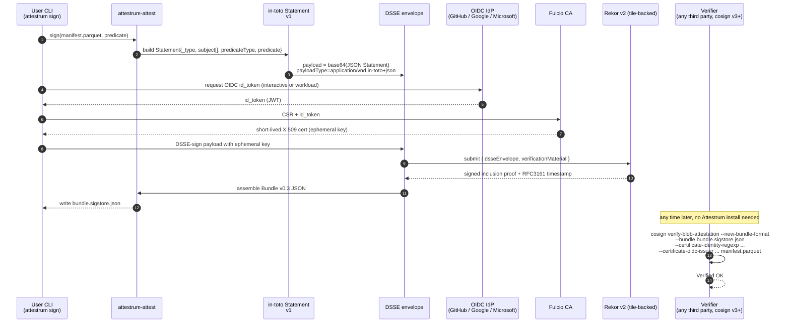

# Sigstore sign + verify

Source of truth is the external Sigstore Bundle v0.3 / in-toto v1 / Fulcio / Rekor v2 specifications. We target `application/vnd.dev.sigstore.bundle.v0.3+json` exclusively (cosign v3's `--new-bundle-format`, which is v3's default). v0.1 / v0.3 bundle formats are not supported. Drift between this diagram and our emitted bundles means our implementation is wrong, not the spec.

