# Static-bundle publish

`attestrum publish --target static --out-dir DIR` materializes the **same seven
artifacts** the Hugging Face target commits, but to a local directory — no network,
no HF auth, no Rekor entry. The output dir is self-contained and uploadable to
Zenodo, GitHub Pages, S3, or any static host; a visitor can verify the bundle with
`cosign` alone, no Attestrum install (CLAUDE.md §12).

`StaticBundleTarget` is the first `PublishTarget` that writes to local disk, so it is
the first to surface filesystem-write failures — these map to
`AttestrumPublishError::Io`. Input-read failures reuse `BundleMissing` (mirroring the
HF target); the four renderer failures reuse `ReadmeRender` / `CroissantInvalid` /
`CycloneDxInvalid` / `VerifyHtmlBuild`.

Legend: 🟩 new this revision (`cyclonedx.json`).

```mermaid
flowchart TD
  start([StaticBundleTarget::publish&#40;plan&#41;]) --> validate{manifest, merkle.root,<br/>bundle all exist?}
  validate -- no --> eBundle[Err: BundleMissing]
  validate -- yes --> mkdir[create out_dir/<br/>and out_dir/attestrum/]
  mkdir -- io error --> eIo[Err: Io]
  mkdir --> render

  subgraph render [render via attestrum-emit]
    rReadme[render_readme&#40;dataset_card_plan&#41;]
    rCroissant[render_croissant&#40;croissant_plan&#41;]
    rCyclonedx[render_cyclonedx&#40;cyclonedx_plan&#41;]
    rVerify[render_verify_html_stub&#40;verify_html_plan&#41;]
  end

  rReadme -- err --> eReadme[Err: ReadmeRender]
  rCroissant -- err --> eCroissant[Err: CroissantInvalid]
  rCyclonedx -- err --> eCyclonedx[Err: CycloneDxInvalid]
  rVerify -- err --> eVerify[Err: VerifyHtmlBuild]
  render --> write

  subgraph write [write artifacts to out_dir]
    direction TB
    w1[README.md &#40;rendered&#41;]
    w2[croissant.json &#40;rendered&#41;]
    w3[cyclonedx.json &#40;rendered&#41;]
    w4[attestrum/manifest.parquet &#40;copy&#41;]
    w5[attestrum/merkle.root &#40;copy&#41;]
    w6[attestrum/bundle.sigstore.json &#40;copy&#41;]
    w7[attestrum/verify.html &#40;rendered&#41;]
    w8[plan.extras &#40;copy each&#41;]
  end

  write -- io error --> eIo
  write --> canon[canonicalize out_dir]
  canon --> receipt([PublishReceipt:<br/>target=static,<br/>dataset_url=file://&lt;abs&gt;,<br/>verify_url=file://&lt;abs&gt;/attestrum/verify.html,<br/>commit_oid=None])

  classDef err fill:#5a1f1f,stroke:#c0392b,color:#fff
  classDef added fill:#1f6f3f,stroke:#3ec072,color:#fff
  classDef addedErr fill:#5a1f1f,stroke:#3ec072,stroke-width:4px,color:#fff
  class eBundle,eIo,eReadme,eCroissant,eVerify err
  class rCyclonedx,w3 added
  class eCyclonedx addedErr
```

The receipt carries an absolute `file://` URL for the human running the CLI to open
immediately. The README's embedded verify link is the **relative** path
`attestrum/verify.html` (resolved by the CLI's `verify_url_for`), so it stays correct
after the publisher re-hosts the directory anywhere.
