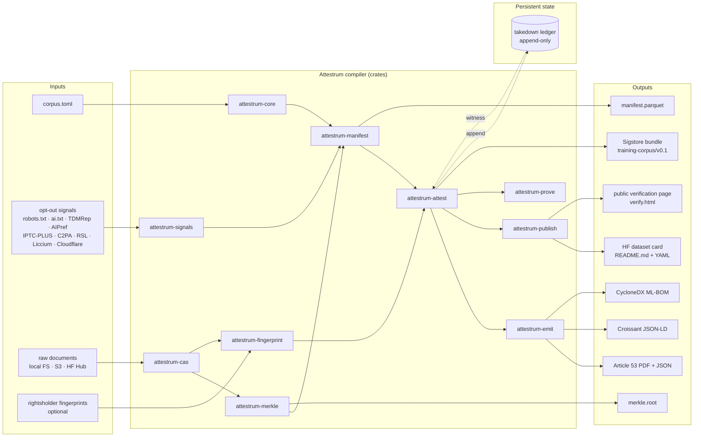

# System overview

Highest-level system map. The Mermaid is the contract; downstream code must implement every edge. Verification strategy: the Sprint 6 end-to-end demo recording must visibly traverse each path from at least one Input to at least one Output, and the demo transcript is checked in alongside this file. `source_of_truth` flips to `code` at the end of Sprint 6.

