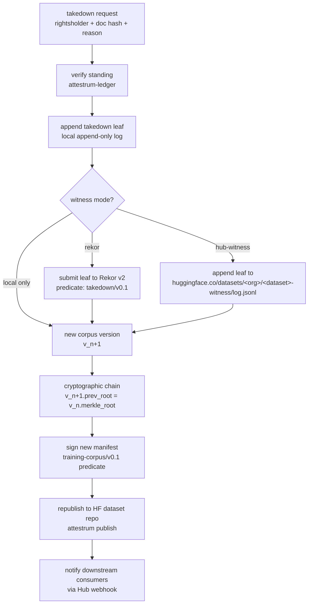

# Takedown + public witness

Source of truth flips to `code` at end of Sprint 6 when `RekorWitness` / `HubWitness` land. The Rekor v2 path uses the public-good instance whose URL is distributed via TUF (the Sigstore docs warn against hardcoding it: "We strongly advise against hardcoding this URL into any pipelines that cannot be easily updated"). The hub-witness path is a fallback we operate ourselves on the Hub when Rekor v2 is unavailable, contractually equivalent to a tiled append-only log.

