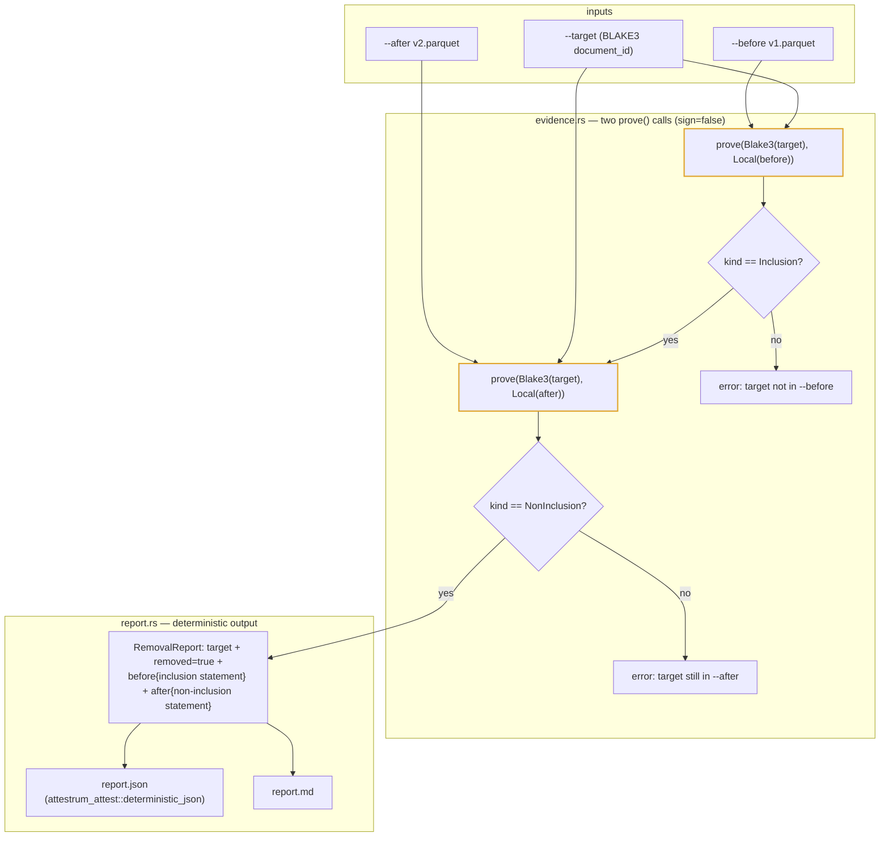

# `attestrum remove` — two-manifest removal evidence

Source of truth: **`code`**. The `attestrum-remove` crate is authoritative; this diagram is the derived
view.

**What it answers.** "Can I prove this document was *removed* between two sealed corpus versions?" — the
takedown / removal question. v1 is a **read-only, unsigned** report:
`attestrum remove --before <v1.parquet> --after <v2.parquet> --target <doc-id>` emits `report.json` +
`report.md` bundling two cryptographic proofs. No signed predicate, no ledger, no manifest mutation.

**Reuses `attestrum_prove::prove()` in both directions — changes no protected system.** The target (a
64-char lowercase BLAKE3 `document_id`) is proved twice, both with `sign = false`:

- **inclusion against `--before`** → an `inclusion-proof/v0.3` in-toto Statement with an RFC-6962 audit path
  (the document *was* there);
- **non-inclusion against `--after`** → a `non-inclusion-proof/v0.3` in-toto Statement via the sorted-Merkle
  adjacent-leaf proof (the document *is gone*).

Both predicate types (`inclusion-proof/v0.3`, `non-inclusion-proof/v0.3`) and the PROTECTED
`attestrum-merkle` audit paths are **consumed, not modified** — `remove` mints no new predicate URI and
touches no §4 schema. That is what keeps it a leaf.

**Honest validation.** A removal is only asserted when the *before* proof is genuinely an inclusion and the
*after* proof is genuinely a non-inclusion. If the target is absent from `--before` (`prove` returns a
non-inclusion there) or still present in `--after` (an inclusion there), `remove` errors instead of emitting
a misleading "removed" report. The two in-toto Statements are embedded verbatim, so anyone can re-verify the
evidence without trusting the summary.

**Deferred (NOT in this leaf — the big one).** A signed `takedown` predicate (a new §4 URI), the append-only
`attestrum-ledger` (a stub today), and a corpus-chain `prev_merkle_root` field (a §4 predicate bump) are all
§4 / §A4 high-stakes work requiring the high-stakes-decision protocol + founder approval. This leaf bundles
two existing read-only proofs into an unsigned report and stops there.

The crate adds **no** new external dependency and modifies **no** §4 protected system: `prove` (highlighted)
and the two v0.3 predicate types are consumed read-only, and the report rides
`attestrum_attest::deterministic_json`. Because the two `prove()` calls embed `file://` manifest URIs, the
report bytes are deterministic *per manifest-path*; the determinism test pins byte-identity across repeated
runs on the same inputs.
