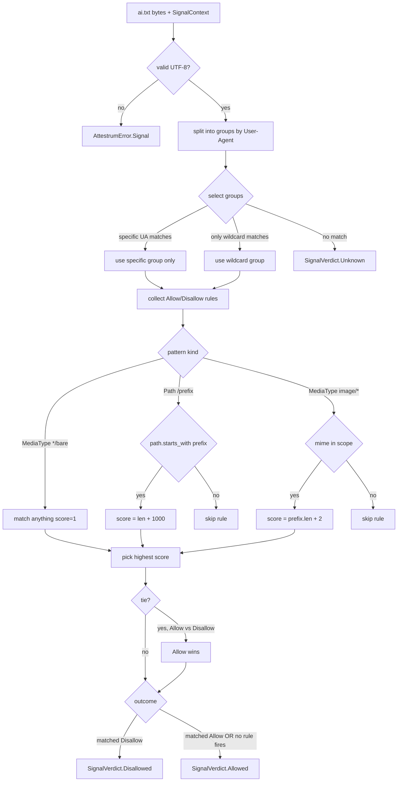

# ai.txt — directive resolution (Spawning convention)

Source of truth: `code` — verified against `crates/attestrum-signals/src/ai_txt.rs` as of commit E9. Format per BUILD-PLAN §2.2 (Spawning AI, 2023; no formal RFC; best-effort standard at `https://site.spawning.ai/spawning-ai-txt`).

Sprint 1 scope: `User-Agent:`, `Disallow-AI-Training:`, `Allow-AI-Training:` directives. Patterns may be path prefixes (start with `/`) or media-type globs (`image/*`, `text/*`, `text/plain`, or bare `*`). Tie-breaking: longest pattern wins; on a length tie, `Allow` beats `Disallow`. Specific UA groups beat the `*` wildcard.

**Differences from robots.txt parser:**

- Single rule directive style: `(Dis)Allow-AI-Training` (not generic `Disallow`/`Allow`).
- Patterns can be media types AND/OR paths in the same group.
- Path scoring includes a +1000 bias over media-type scores so a specific path always beats a generic media-type glob — Spawning's docs suggest path is more specific.
- Out of scope (Sprint 1): per-image-URL ai.txt (where the ai.txt lives next to the media file rather than at the host root); regex glob patterns; ETag-keyed cache hints.

**Sprint 1 context limitation:** `SignalContext` doesn't yet carry MIME, so the parser is invoked with `mime=None`. Media-type-only directives currently evaluate as if no MIME info is available (no match). When fingerprinting lands in Sprint 5, `SignalContext` gains `mime: Option<String>` and this evaluator activates the full media-type path in the same commit per CLAUDE.md §2.

**Public surface (`crates/attestrum-signals/src/ai_txt.rs`):**

- `AiTxt` — parsed root struct
- `Group { agents, rules }`
- `Rule::Disallow(Pattern)` / `Rule::Allow(Pattern)`
- `Pattern::Path(String)` / `Pattern::MediaType(String)`
- `AiTxtParser` — `SignalParser` impl
