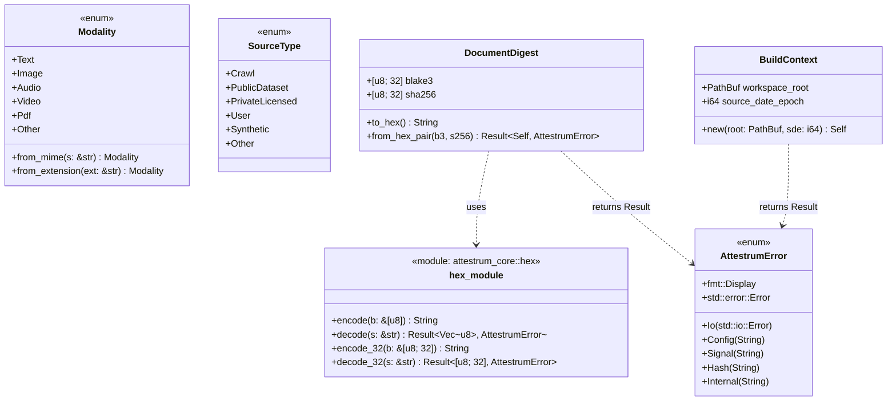

# attestrum-core types — Sprint 1 public surface

Source of truth: `code` — verified against `crates/attestrum-core/src/lib.rs` + `crates/attestrum-core/src/hex.rs` as of commit E7. Implementation lives entirely in `lib.rs` + `hex.rs` (no `error.rs` / `types.rs` files — those were planned but consolidated into `lib.rs` for the minimal Sprint 1 scope).

`attestrum-core` is intentionally minimal in Sprint 1: types, errors, and helpers that every other crate consumes. No I/O, no network, no async runtime. It is the substrate.

**Notes on choices:**

- `AttestrumError` carries the *category* of error; specific message strings live on the variant. `thiserror::Error` derive generates `Display` and `Error`. Includes `Io(#[from] std::io::Error)` for ergonomic `?`-conversion from filesystem operations.
- `Modality` mirrors PATH-A-BRIEF §2.1's enum verbatim — `Text | Image | Audio | Video | Pdf | Other` — so `attestrum-fingerprint` can re-use it in Sprint 5 with zero refactor. `from_mime` strips `; charset=...` suffixes; `from_extension` is case-insensitive.
- `DocumentDigest` carries both BLAKE3 (Attestrum-native) and SHA-256 (Sigstore/in-toto interop) per BUILD-PLAN §3.4. Both mandatory. Streaming-hash implementation lands in Sprint 2 (`attestrum-cas` write path, BUILD-PLAN §4.3).
- `BuildContext` carries `source_date_epoch` from day 1 — determinism is non-negotiable per CLAUDE.md §7. CAS path resolution intentionally NOT here — belongs in `attestrum-cas` per CLAUDE.md §4 protected-system isolation. (Earlier sketch included `cas_root` + `cas_path_for`; both removed at E7 review.)
- `hex` module is in-tree (no `hex` crate dependency) per the cross-check recommendation to keep Sprint 1 dep-free.
- **Sprint 3 E2 addition**: `SourceType` enum mirrors BUILD-PLAN §4.2's `source_type` dictionary column and §7's module-boundary sketch. Six variants: `Crawl | PublicDataset | PrivateLicensed | User | Synthetic | Other`. Lives in `attestrum-core` (not `attestrum-manifest`) because it's a fundamental provenance classification consumed by `attestrum-manifest`, eventually `attestrum-pipeline`, `attestrum-attest`, and the Croissant emitter — same architectural slot as `Modality`. Derives the standard serde + PartialEq + Hash + Copy set. Tests: `source_type_round_trips_via_serde_json`, `source_type_variants_are_distinct_under_serde` (both in `lib.rs::tests`).
