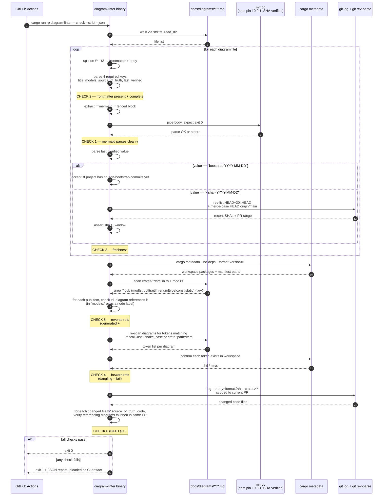

# diagram-linter — CI sequence

Source of truth: `code` — linter is feature-complete as of Sprint 1 E6 and the CI workflow lands at Sprint 1 E11. All six PATH-A-BRIEF §0.3 checks implemented (parse + frontmatter + freshness + reverse-refs + forward-refs + drift); CI invokes `cargo run -p diagram-linter --release --quiet -- check --strict --root docs/diagrams` after pinning Node 20 + `@mermaid-js/mermaid-cli@10.9.1` and Rust 1.89.0 (bumped from 1.84.0 → 1.85.0 at Sprint 2 E2 → 1.88.0 at Sprint 4 E3 → 1.89.0 at the chore(toolchain) precursor to S5-D3 E2).

**Determinism CI** (4-target matrix per BUILD-PLAN §6.5) is a separate workflow at `.github/workflows/determinism.yml` (Sprint 2 E3, extended at Sprint 2 E9 with Merkle-root assertion and Sprint 3 E8 with manifest.parquet byte-identity). This diagram covers `ci.yml` only; determinism CI's flow is described in the corresponding sprint diagrams + workflow comments.

**Sprint 1 dep policy:** linter ships dependency-free using only `std` + workspace-approved `serde_json` + `std::process::Command` for `mmdc`, `cargo metadata`, and `git`. Recursive directory walking uses `std::fs::read_dir`. Frontmatter is `---` delimited and parsed line-by-line (no full YAML parser needed for the four flat string fields).

**Bootstrap exception:** the freshness check (Check 3) accepts `last_verified: bootstrap YYYY-MM-DD` as valid until the first non-bootstrap commit has been merged. After that, only `<short-sha> YYYY-MM-DD` matching the recent commit window is accepted.

**Layered build order (commits E3 → E6):**

- E3: binary scaffold, clap `check --strict --json` recognized, all checks return `Ok` no-op.
- E4: Checks 1 + 2 (mermaid parse + frontmatter). Tests via golden fixtures under `tools/diagram-linter/tests/fixtures/{ok,bad-frontmatter,bad-mermaid}/`.
- E5: Checks 3 + 5 (freshness + reverse refs). Bootstrap token logic. Tests cover both bootstrap and SHA cases.
- E6: Checks 4 + 6 (forward refs + drift). Linter is now feature-complete per PATH-A-BRIEF §0.3.
