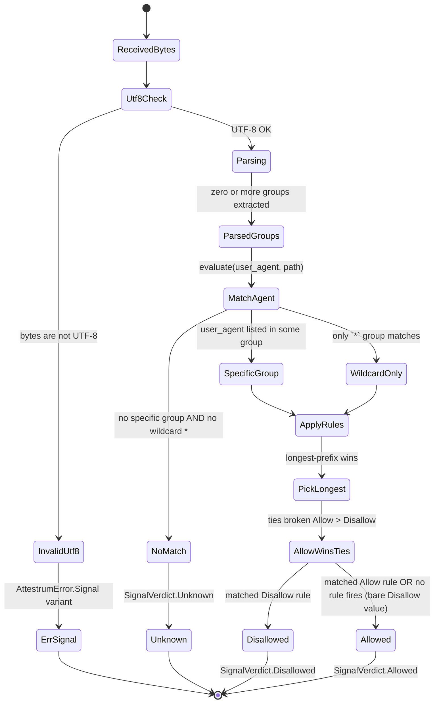

# robots.txt — per-document state machine

Source of truth: `code` — verified against `crates/attestrum-signals/src/robots.rs` as of commit E8. RFC 9309 conformance + AI-bot user-agent matching per BUILD-PLAN §2.1. Lands in the same commit as the `RobotsParser` implementation per CLAUDE.md §2 (diagram + code in same commit).

Sprint 1 scope: prefix-only path matching (no `*` glob, no `$` end-anchor — RFC 9309 §2.2.3 extensions). Comments, blank lines, and combined `User-Agent:` blocks are supported. `Crawl-delay`, `Sitemap`, and `Host` directives are silently ignored.

**Edge cases covered by tests in `crates/attestrum-signals/src/robots.rs`:**

| Input shape | Verdict |
|---|---|
| `User-Agent: GPTBot` + `Disallow: /private`; query `/private/x` | `Disallowed` |
| Same; query `/public/x` | `Allowed` |
| `User-Agent: GPTBot` + `Disallow: /`; query as `ClaudeBot` | `Unknown` (no specific or wildcard group for ClaudeBot) |
| `User-Agent: *` + `Disallow: /admin`; query as `ClaudeBot` `/admin/x` | `Disallowed` (wildcard fallback) |
| Specific UA + wildcard with conflicting rules | Specific wins per RFC 9309 §2.2.1 |
| `Disallow: /` + `Allow: /public` (same group); query `/public/x` | `Allowed` (longest prefix match) |
| Empty `Disallow:` value | `Allowed` (RFC 9309: bare Disallow = allow-all) |
| Non-UTF-8 bytes | `AttestrumError.Signal variant` |

**Per BUILD-PLAN §2.1 edge case (HTTP error → Unknown):** the parser itself only sees bytes — HTTP-error handling is the caller's job (Sprint 3 `attestrum-pipeline`). Convention: on HTTP 4xx/5xx, do NOT call this parser; emit `SignalVerdict.Unknown` directly. On HTTP 404 specifically, `attestrum-pipeline` may emit `SignalVerdict.Allowed` per the legacy convention — that decision lives outside this state machine.

**Out of scope (Sprint 1):** AIPref `Content-Usage` HTTP header semantics (Sprint 4); Cloudflare Content-Signals comment-block parsing (later sprint); `*` glob and `$` anchor extensions (added when a real-world fixture requires them).

**Public surface from `crates/attestrum-signals/src/lib.rs` consumed by this state machine:**

- `SignalParser` trait — `RobotsParser` implements it
- `SignalContext { requested_user_agent, path }` — input to `parse()`
- `SignalVerdict { Disallowed, Allowed, Unknown }` — output
- `ai_user_agents()` — curated bot list embedded from `src/data/ai_user_agents.txt`; callers can enumerate it to drive UI / docs / `signalCoverage` predicate fields
