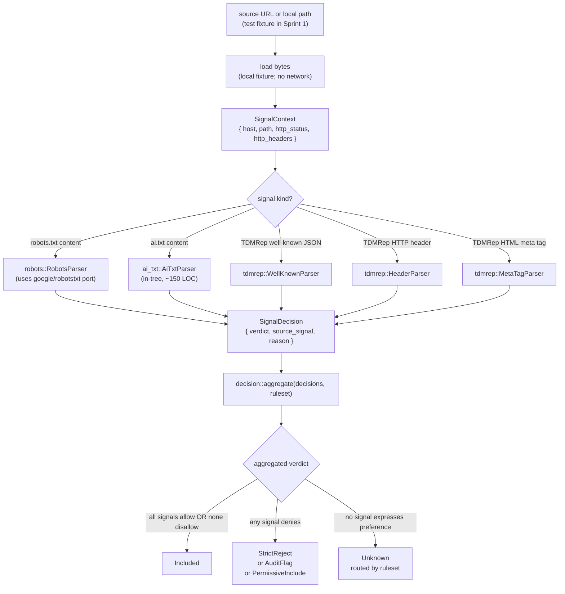

# Signal parser pipeline — Sprint 1

Source of truth flips to `code` in commit E10 when all three parsers + `decision.rs` aggregator land. Sprint 1 ships only the three highest-value parsers: robots.txt (RFC 9309), ai.txt (Spawning), and TDMRep (W3C, May 2024). AIPref, IPTC-PLUS, C2PA, RSL, Liccium, Cloudflare Content Signals are deferred to later sprints per BUILD-PLAN §9 Sprint 1 risk note.

**Sprint 1 fetch policy:** the parsers themselves take `&[u8]` + a `SignalContext`. They DO NOT fetch. Network is out of scope for Sprint 1 — `attestrum-fetch` was dropped from the workspace per PATH-A-BRIEF §1.10, and fetch orchestration is deferred to `attestrum-pipeline` in Sprint 3. Fixtures provide the bytes.

**Per-parser edge cases land in same-commit sub-diagrams:**

- `sprint-1/robots-txt-state.md` (commit E8): HTTP error → unknown; 404 → permissive; 200 empty body → permissive; explicit `Disallow: /` → disallowed.
- `sprint-1/ai-txt-rules.md` (commit E9): modality filters (`image/*`, `text/*`); operator-level vs path-level directives.
- `sprint-1/tdmrep-resolution.md` (commit E10): well-known JSON → HTTP header override → HTML meta override; protocol-error values treated as unset per W3C spec.

These three sub-diagrams are NOT required to exist before Sprint 1 code lands — they ship in the same commit as their parser code per CLAUDE.md §2 "update the diagram in the SAME commit as the code change."
