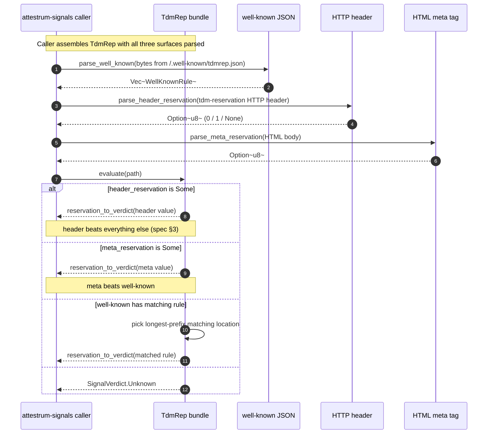

# TDMRep — surface precedence

Source of truth: `code` — verified against `crates/attestrum-signals/src/tdmrep.rs` as of commit E10. W3C Community Final Report, 10 May 2024 (BUILD-PLAN §2.4).

The TDM-Reservation Protocol exposes the same opt-out preference across five surfaces. Sprint 1 implements three (well-known JSON, HTTP header, HTML meta); EPUB and PDF XMP are deferred. Per spec §3, the agent MUST resolve in precedence order: **HTTP header > HTML meta > well-known**. The first surface that returns `Some(reservation)` wins; longest-prefix match wins inside the well-known surface.

Values other than `0` and `1` are protocol errors → treated as unset (Unknown).

**reservation_to_verdict mapping:**

| `tdm-reservation` value | `SignalVerdict` |
|---|---|
| `0` | `Allowed` |
| `1` | `Disallowed` |
| other / missing | `Unknown` |

**Public surface (`crates/attestrum-signals/src/tdmrep.rs`):**

- `TdmRep { well_known, header_reservation, meta_reservation }`
- `WellKnownRule { location, tdm_reservation, tdm_policy }`
- `TdmRep::parse_well_known(bytes) -> Result<Vec<WellKnownRule>>`
- `TdmRep::parse_header_reservation(value) -> Option<u8>`
- `TdmRep::parse_meta_reservation(html) -> Option<u8>`
- `TdmRep::evaluate(path) -> SignalVerdict`
- `TdmRepParser` — `SignalParser` impl (wraps the well-known surface for the trait-based API; header + meta callers go direct)

**Out of scope (Sprint 1):**

- **EPUB 3 package metadata** (`property="tdm:reservation"` in OPF) — needs an EPUB ZIP reader; defer to Sprint 2+ when the corpus pipeline starts ingesting EPUB.
- **PDF XMP metadata** (namespace `http://www.w3.org/ns/tdmrep/`) — needs an XMP parser (`xmp-toolkit-rs` per BUILD-PLAN §6.2); defer until first PDF-heavy corpus partner.
- **`*` glob + `$` anchor** in well-known `location` patterns (spec §3) — Sprint 1 uses prefix matching only, matching our `robots.txt` scope.
- **ODRL-formatted `tdm-policy`** documents — Sprint 1 stores the policy URL as a string; parsing the policy contents is downstream work.
