# Workspace layout — frozen snapshot at Sprint 1 close (E12)

Source of truth: `diagram` — this is a **frozen historical snapshot** of the workspace tree as it existed at Sprint 1 close (commit `62ce4ed`, E12). The content below — including `rust-toolchain.toml` channel `1.84.0`, the per-crate stub labels, and the absence of `tools/cast/` + `determinism.yml` — is correct **for Sprint 1 close**, not for current Sprint 4 state.

**Why frozen-snapshot rather than tracking-current-state**: the title was always "Sprint 1 workspace layout — end-state" (now clarified as "frozen snapshot at Sprint 1 close"). Treating it as `source_of_truth: code` created a maintenance tension because the workspace has legitimately evolved since Sprint 1 close — `rustc` bumped to 1.85.0 at Sprint 2 E2, multiple crates (`attestrum-cas` / `attestrum-merkle` / `attestrum-manifest` / `attestrum-pipeline` / `attestrum-cli`) flipped from stub to real code, `determinism.yml` workflow added at Sprint 2 E3, `tools/cast/` directory added at Sprint 1 E12 + Sprint 2/3, and `.github/workflows/determinism.yml` joined `ci.yml`. None of these are bugs; they're the workspace growing per its sprint plan.

**Evolution since Sprint 1 close** (for orientation, not for diagram updates — see corresponding sprint diagrams for current state of each subsystem):

- Sprint 2 E2 (`7326dbd`): `rust-toolchain.toml` channel bumped from `1.84.0` → `1.85.0`.
- Sprint 2 E1 (`21fe7f8`): `deny.toml` (cargo-deny config) added.
- Sprint 2 E3 (`fdf1820`): `.github/workflows/determinism.yml` added (4-target matrix).
- Sprint 1 E12 + Sprint 2/3: `tools/cast/{sprint-1,sprint-2,sprint-3}.py` asciinema generators added.
- Sprint 1-3 progressive: `crates/attestrum-cas` (Sprint 2 E5-E6), `attestrum-merkle` (Sprint 2 E7-E8, PROTECTED), `attestrum-manifest` (Sprint 3 E2-E3, PROTECTED schema), `attestrum-pipeline` (Sprint 3 E4), `attestrum-cli` (Sprint 3 E5+, lib+bin since E6) all flipped from stub to real code.
- Sprint 4 (in progress): `crates/attestrum-attest` remains stub; will flip to real code at E2.

**A current-state workspace-layout diagram** could be added later (e.g., `docs/diagrams/sprint-4/workspace-layout-current.md`) if the founder finds it useful for orientation. Not currently planned.

**Note on the public-release cleanup** (2026-05-25): the Mermaid block below preserves the Sprint 1 close state of the workspace tree, which at that time included `BUILD-PLAN.md`, `PATH-A-BRIEF.md`, and `SESSION-LOG.md` at the repo root. Those three files were removed from the public tree during the public-release cleanup (retained as local-only notes outside the repo); the rest of the snapshot is unaffected.

```mermaid
flowchart TD
  Root["attestrum/"]
  Root --> Cargo["Cargo.toml<br/>(workspace, resolver=2)"]
  Root --> RustT["rust-toolchain.toml<br/>(channel=1.84.0)"]
  Root --> CargoCfg[".cargo/config.toml"]
  Root --> Fmt["rustfmt.toml"]
  Root --> Cl["clippy.toml"]
  Root --> Gi[".gitignore"]
  Root --> CL["CHANGELOG.md"]
  Root --> SL["SESSION-LOG.md"]
  Root --> LI["docs/license-inventory.md"]
  Root --> BP["BUILD-PLAN.md (read-only)"]
  Root --> PA["PATH-A-BRIEF.md (read-only)"]
  Root --> CM["CLAUDE.md (read-only)"]
  Root --> Cr["crates/"]
  Root --> Tools["tools/"]
  Root --> Docs["docs/"]
  Root --> GH[".github/workflows/ci.yml"]

  Cr --> Core["attestrum-core (lib)"]
  Cr --> Sig["attestrum-signals (lib)"]
  Cr --> Cas["attestrum-cas (lib, stub)"]
  Cr --> Mk["attestrum-merkle (lib, stub)"]
  Cr --> Mf["attestrum-manifest (lib, stub)"]
  Cr --> Fp["attestrum-fingerprint (lib, stub)"]
  Cr --> Ld["attestrum-ledger (lib, stub)"]
  Cr --> Pl["attestrum-pipeline (lib, stub)"]
  Cr --> At["attestrum-attest (lib, stub)"]
  Cr --> Em["attestrum-emit (lib, stub)"]
  Cr --> Pv["attestrum-prove (lib, stub)"]
  Cr --> Pb["attestrum-publish (lib, stub)"]
  Cr --> Fr["attestrum-fingerprint-registry (lib, stub)"]
  Cr --> Cli["attestrum-cli (BIN)"]

  Tools --> DLT["diagram-linter/<br/>(bin)"]

  Docs --> DiagOv["diagrams/overview/<br/>(10 canonical)"]
  Docs --> DiagSp["diagrams/sprint-1/<br/>(workspace-layout, attestrum-core-types,<br/>signal-parser-pipeline, ci-diagram-linter,<br/>robots-txt-state, ai-txt-rules, tdmrep-resolution)"]
  Docs --> DiagAt["diagrams/attestations/<br/>(predicate-relationships)"]
  Docs --> Demos["demos/sprint-1.cast"]
```

**Test layout note:** unit tests live inside each crate's `src/` (per `#[cfg(test)] mod tests` convention) and integration tests live under each crate's `tests/` directory (`crates/<name>/tests/*.rs`). There is no workspace-root `tests/` directory in Sprint 1; cross-crate integration tests live in `crates/attestrum-pipeline/tests/` when that crate gets its real implementation in Sprint 3.
