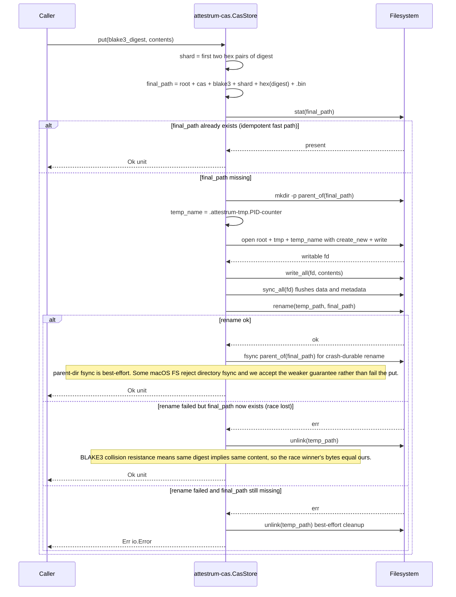

# CAS atomic write path

Source of truth: `code` (Sprint 2 E6 implementation). Goal: a `CasStore::put(digest, contents)` call either fully writes the content-addressed file to its final path OR leaves no trace — never a half-written file at the final path, never a partial file readable by a concurrent reader. This is the property that makes `attestrum build` resumable after a crash.

Final layout (PROTECTED per CLAUDE.md §4, matches `PATH-A-BRIEF.md` §1.9): `<root>/cas/blake3/<ab>/<cd>/<hex-digest>.bin` where `ab` and `cd` are the first two hex character pairs of the BLAKE3 digest. Two-level sharding caps any single leaf directory at ~65 k entries (ext4 / APFS friendly).

**Single std::fs path on all platforms.** A pre-implementation cross-check (gpt-5.5-pro independent review, 2026-05-23) agreed that for v1 the contract is final-path atomicity, not temp-name invisibility. `rename(2)` is POSIX-atomic on the same filesystem and satisfies the contract. Linux `O_TMPFILE` + `linkat` would also work and would gain the property that the temp file is never observable in the parent directory during writing, but it costs ~50 lines of unsafe libc FFI and a cfg-target split — not justified for v1. The syscall pattern is NOT part of the PROTECTED contract (only the on-disk layout is), so a future commit can swap to `O_TMPFILE` on Linux without breaking compatibility.

Temp files stage in `<root>/tmp/` (per `PATH-A-BRIEF.md` §1.9: "atomic-rename from `tmp/` is the only legal write path into `cas/`"), with a per-call unique filename of the form `.attestrum-tmp.<pid>-<counter>`. The `.attestrum-tmp.` prefix makes stale temps from prior crashed processes easy to identify and clean up offline. Sprint 4 E3.6 dropped the `<nanos>` suffix that previously came from `SystemTime::now().subsec_nanos()` — PID + monotonic counter is already collision-free within a single process, and the wall-clock read violated CLAUDE.md §7's "all timestamps come from `--source-date-epoch`" rule (even though temp filenames never enter output bytes, the precedent was wrong).

**Test obligations** (Sprint 2 E6, all in `crates/attestrum-cas/tests/store.rs`):

- `new_creates_cas_and_tmp_subdirs` — `CasStore::new` creates `cas/blake3/` + `tmp/` if missing.
- `put_then_open_roundtrip` — put + open returns the same bytes.
- `put_is_idempotent_for_same_digest` — calling put twice with the same digest is a no-op on the second call.
- `sharding_lands_in_correct_two_level_dir` — a digest with hex `<ab><cd>...` lands at `cas/blake3/<ab>/<cd>/<hex>.bin`, not flat.
- `multiple_digests_coexist_in_same_shard` — two distinct digests sharing the same shard byte pair both succeed and share a parent directory.
- `exists_reflects_presence` — false before put, true after.
- `open_missing_digest_is_not_found` — open returns `io::ErrorKind::NotFound` for a digest never put.
- `concurrent_put_same_digest_races_safely` — 4 threads racing put on the same digest all succeed, no half-written file ever observable.
- `temp_dir_is_empty_after_successful_put` — no stale temps left behind after a clean put.
- `stream_hash_then_put_roundtrip` — end-to-end with the E5 streaming hasher: hash bytes via `stream_hash`, put under the resulting BLAKE3 digest, open, verify content matches.
- `read_only_parent_propagates_io_error` (unix only) — chmod the shard dir to 0o555, expect `io::ErrorKind::PermissionDenied`, not a panic. Temp cleanup still attempted on failure.

**Out of scope for E6** (deferred to later sprints when their owning crates ship):

- `<root>/cas/sha256/<aa>/<bb>/<hex>.bin` — secondary SHA-256-addressed mirror. Sprint 3+ when manifest/pipeline wires it.
- `<root>/cas/meta/<prefix>.json` — per-object metadata (content-type, fetched_at, source URI). Sprint 3+ alongside the manifest crate.
- Cross-filesystem detection (current impl assumes `tmp/` and `cas/blake3/` share a filesystem, which is true when both live under a single `.attestrum/`).
- Garbage-collection / pruning. v1 ships append-only CAS; takedowns go through the ledger (Sprint 6), not by deleting CAS objects.
