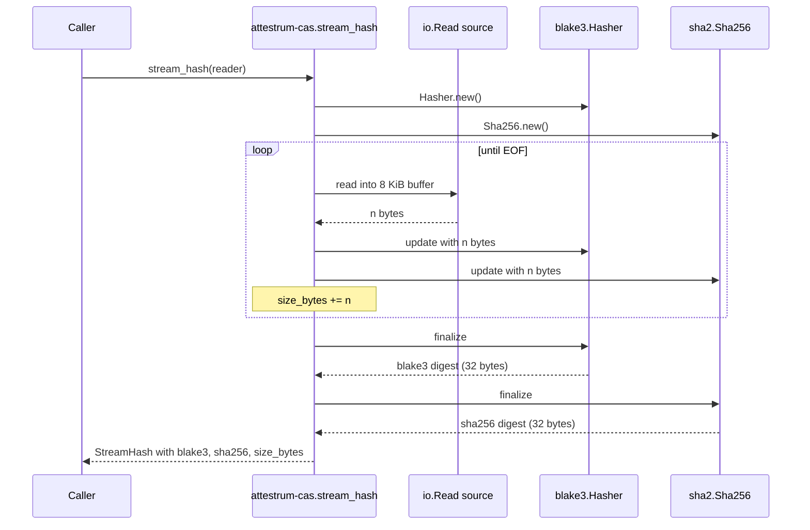

# Streaming hasher

Source of truth: `code` (Sprint 2 E5 implementation). Frozen interface: caller hands `attestrum-cas::stream_hash` an `io::Read` source; the function tees bytes into a BLAKE3 hasher and a SHA-256 hasher concurrently, walking the input in 8 KiB chunks (matches `blake3` doc recommendation), and returns a `StreamHash { blake3, sha256, size_bytes }` struct. **Never holds the full document in RAM** — that property is the entire point of the streaming design and is what makes 100 GB corpora feasible on a 16 GB MacBook. The convenience wrapper `attestrum-cas::stream_hash_path` opens a file at a given path and forwards to `stream_hash`, for the common file-on-disk case.

Per BUILD-PLAN §4.3: BLAKE3 is the primary hash (used for CAS addressing and Merkle leaves); SHA-256 is the secondary hash (kept for Sigstore interop and for the manifest's `sha256` column). Both are computed in a single pass.

**Edge cases the implementation handles** (each covered by a test in `crates/attestrum-cas/src/lib.rs` `#[cfg(test)] mod tests` or in `crates/attestrum-cas/tests/stream_hash_path.rs`):

- **Empty input** — returns BLAKE3 of empty (`af1349b9...`) + SHA-256 of empty (`e3b0c442...`) + size 0.
- **Reader returns `Ok(0)`** — treated as EOF (standard `io::Read` convention).
- **Reader returns an error mid-stream** — propagates as `io::Error`; the partial hash state is discarded.
- **Exactly-one-buffer input** (8 KiB) — single loop iteration plus the EOF read; result matches one-shot `blake3::hash` + `sha2::Sha256::digest`.
- **Multi-buffer input** (~64 KiB pseudorandom, xorshift64-seeded for determinism without a `rand` dep) — eight loop iterations; result matches one-shot.
- **Known vectors** — `b""` and `b"abc"` checked against BLAKE3 reference + FIPS 180-4 SHA-256.
- **`stream_hash_path` parity** — hashing a 100 KiB tempfile via `stream_hash_path` yields the same `StreamHash` as hashing the same bytes in memory via `stream_hash`.
- **Determinism** — calling `stream_hash` twice on the same input yields identical bytes (precondition for the Sprint 2 E9 cross-platform determinism CI assertion).
- **Very large input (≥ 64 MiB)** — Sprint 2 E5 ships the simple single-threaded path. Multi-threaded BLAKE3 via `Hasher::update_rayon` is a Sprint 3+ optimization (deferred per BUILD-PLAN §4.3's chunking-and-parallelism note).
