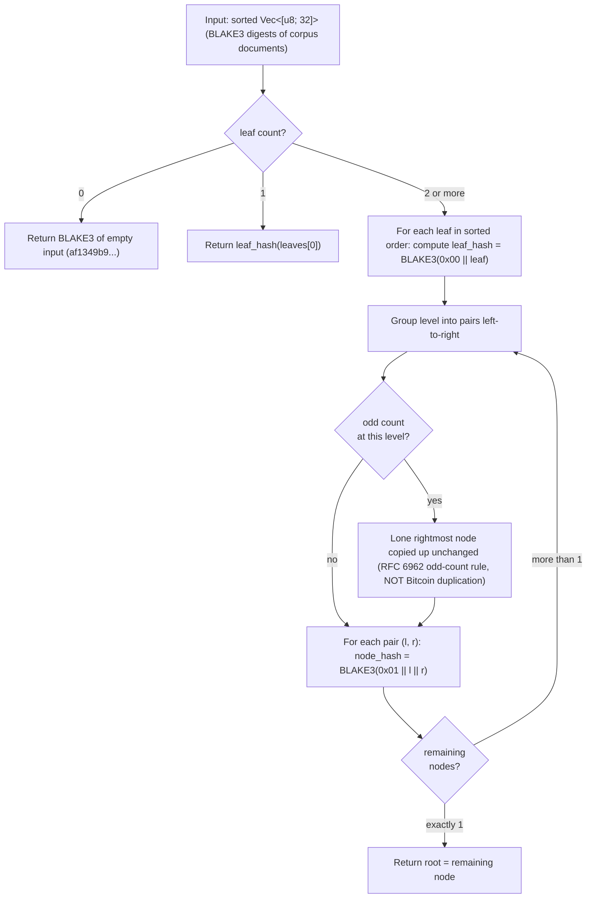

# RFC 6962 Merkle construction

Source of truth: `code` (Sprint 2 E7 + E8 implementation). This crate is a PROTECTED SYSTEM per CLAUDE.md §4 — leaf and internal hash domain separation, the BLAKE3 hash choice, the RFC 6962 odd-count rule, AND the audit-path index convention are all corpus-incompatible contracts. Any future change requires the `Protected-system-change:` commit footer + a versioned migration.

**Hand-rolled implementation choice** (founder-approved post-cross-check 2026-05-23). The pre-implementation cross-check (independent gpt-5.5-pro review, no anchoring) and the agent's own independent read both recommended hand-rolling RFC 6962 directly against the `blake3` crate rather than depending on `ct-merkle` (CT-derived, would have required verifying it accepts BLAKE3 with the right prefixes) or `rs-merkle` (general-purpose, doesn't implement RFC 6962's specific leaf/internal prefix scheme by default). For a ~100-LoC algorithm on a PROTECTED-once-shipped subsystem, owning the implementation beats inheriting library defaults that may quietly use the wrong hash or prefix scheme.

**Duplicate-leaf policy: multiset** (founder-approved 2026-05-23). Identical leaf bytes produce identical leaf hashes and are passed as two adjacent entries to `merkle_root`, not deduplicated. The Merkle root attests to the corpus *as compiled* (a multiset), not to "these unique blobs exist." Real corpora carry repeated files across source datasets, and those repetitions matter for licensing/weighting/provenance/reproducibility. The manifest (Sprint 3) is responsible for binding each corpus entry to its specific leaf occurrence via a `(digest, occurrence_index)` ordering when emitting `leaves`.

**Domain separation** (per RFC 6962):
- `leaf_hash(leaf) = BLAKE3(0x00 || leaf)`
- `node_hash(left, right) = BLAKE3(0x01 || left || right)`

The single-byte prefix prevents second-preimage attacks where an attacker substitutes an internal-node hash sequence as a fake leaf (or vice versa).

**Leaf ordering**: Attestrum sorts leaves by BLAKE3 digest before tree construction (per BUILD-PLAN §4.2's manifest sort-by-`document_id`). This makes the Merkle root invariant under input permutation — adding the same documents in any order yields the same root — which is the property that makes the determinism CI matrix work.

**RFC 6962 odd-count rule**: when a level has an odd number of nodes, the lone rightmost node is **carried up unchanged** (NOT re-hashed against itself). This differs from Bitcoin's Merkle tree (which duplicates the lone node). Trillian's RFC 6962 reference vectors test this edge case explicitly.



**Audit-path generation** (Sprint 2 E8, separate commit, also PROTECTED):

For a tree with `n` sorted leaves and a target `leaf_index`, the audit path is the sequence of sibling hashes along the path from `leaf_hash(leaves[leaf_index])` to the root. Path length = `ceil(log2(n))`. Verification recomputes the root from the leaf hash + audit path + leaf index + tree size, and accepts iff the recomputed root matches the published root.

**Tests** (Sprint 2 E7, all in `crates/attestrum-merkle/src/lib.rs` `#[cfg(test)] mod tests` + `crates/attestrum-merkle/tests/rfc6962.rs`):

- `empty_tree_returns_blake3_of_empty` — `merkle_root(&[])` equals BLAKE3 of empty input (`af1349b9...`), the canonical RFC 6962 §2.1 empty-list root.
- `leaf_hash_prefixes_with_zero_byte` — `leaf_hash(x)` matches a direct `BLAKE3(0x00 || x)` invocation.
- `node_hash_prefixes_with_one_byte` — `node_hash(l, r)` matches a direct `BLAKE3(0x01 || l || r)` invocation.
- `single_leaf_tree_equals_leaf_hash` — `merkle_root(&[x])` equals `leaf_hash(&x)`.
- `two_leaf_tree_equals_node_hash_of_leaf_hashes` — `merkle_root(&[a, b])` equals `node_hash(&leaf_hash(&a), &leaf_hash(&b))`.
- `three_leaf_tree_uses_rfc6962_odd_count_carry_up` — three-leaf tree shape matches RFC 6962's recursive definition: `NH(NH(LH(a), LH(b)), LH(c))` with `LH(c)` carried up unchanged.
- `three_leaf_tree_is_not_bitcoin_duplication` — asserts our root for `[a, b, c]` DIFFERS from the Bitcoin-style root `NH(NH(LH(a), LH(b)), NH(LH(c), LH(c)))`, locking in the RFC 6962 vs Bitcoin distinction.
- `multiset_duplicate_leaves_yield_distinct_root_from_single` — `merkle_root(&[x, x])` differs from `merkle_root(&[x])` and equals `node_hash(&leaf_hash(&x), &leaf_hash(&x))`. Locks the multiset policy in code.
- `multiset_triplicate_leaves_have_their_own_root` — `merkle_root(&[x, x, x])` equals `NH(NH(LH(x), LH(x)), LH(x))` per the odd-count carry-up.
- `root_is_deterministic_across_calls` — same input twice yields byte-identical roots (precondition for the Sprint 2 E9 cross-platform determinism CI assertion).
- `root_depends_on_order_when_caller_does_not_sort` — `merkle_root(&[a, b]) != merkle_root(&[b, a])`. The crate does NOT sort internally; permutation-invariance is the caller's responsibility.
- `merkletree_wrapper_matches_free_function` / `empty_merkletree_root_matches_free_function` — the `MerkleTree` typed wrapper produces the same root as the free `merkle_root` for arbitrary and empty leaf sets.
- `rfc6962_blake3_golden_vectors` (integration) — loads `tests/fixtures/rfc6962/vectors.json` (generated by the checked-in Python script `tests/fixtures/rfc6962/generate.py` using the `blake3` Python package as the independent oracle) and asserts the Rust impl matches every case: empty, single (zero / 0xFF leaves), two / three / four / five / six / seven / eleven distinct leaves, and the three multiset cases (`[x, x]`, `[x, x, x]`, `[x, x, y]`). E8 extended this test to also assert `audit_path(tree, m)` matches the oracle byte-for-byte for every leaf index in every non-empty case, AND that `verify_audit_path` accepts each just-generated path.

## Audit-path API (Sprint 2 E8)

```rust
pub fn audit_path(
    tree: &MerkleTree,
    leaf_index: usize,
) -> Result<Vec<[u8; 32]>, AuditPathError>;

pub fn verify_audit_path(
    root: &[u8; 32],
    leaf: &[u8; 32],
    leaf_index: usize,
    tree_size: usize,
    path: &[[u8; 32]],
) -> bool;

pub enum AuditPathError {
    IndexOutOfBounds { leaf_index: usize, tree_size: usize },
}
```

`MerkleTree::audit_path(&self, leaf_index)` is the method form.

**Index convention** (PROTECTED — matches RFC 6962 §2.1.1):

- `path[0]` is the sibling at the **deepest** level (closest to the leaf).
- `path[path.len() - 1]` is the sibling at the **shallowest** level (closest to the root).
- When a leaf's descendant is the lone rightmost node at some level (odd-count carry-up), **no path element is consumed for that level**. Path length therefore depends on both `tree_size` AND `leaf_index`, not just `tree_size`.

Any future change to this ordering would invalidate every previously-emitted inclusion proof. Locked in code by the inline tests `audit_path_three_leaf_known_paths` (asserts the exact path shape for n=3, m=0/1/2) and `audit_path_length_matches_levels_with_a_sibling` (asserts that for n=5, m=4 the path length is 1 because the leaf carries up unchanged through two levels before getting its first sibling at the root).

**Verification semantics**: `verify_audit_path` returns `false` (never panics) for ALL of these failure modes: `tree_size == 0`, `leaf_index >= tree_size`, modified leaf, modified path element, wrong claimed leaf index, path too short for `(leaf_index, tree_size)`, path too long, wrong root. The `verify_*` family of inline tests covers each rejection path with at least one test.

**Tests added in E8** (in `crates/attestrum-merkle/src/lib.rs` `#[cfg(test)] mod tests`):

- `audit_path_empty_tree_is_out_of_bounds` / `audit_path_out_of_bounds_index` — both correctly return `AuditPathError::IndexOutOfBounds`.
- `audit_path_single_leaf_is_empty` / `audit_path_single_leaf_roundtrip_verifies` — n=1 produces an empty path that `verify_audit_path` accepts.
- `audit_path_three_leaf_known_paths` — locks the path shape for the three leaves of an n=3 tree (the smallest unbalanced case).
- `audit_path_roundtrip_verifies_every_leaf_for_sizes_2_through_15` — for every n in [2,15] and every leaf 0..n, generate a path then verify it; covers 119 (n, m) combinations exhaustively.
- `audit_path_length_matches_levels_with_a_sibling` — asserts path length follows the odd-count rule (n=5/m=4 → len 1; n=5/m=0 → len 3; balanced n=4 → len 2 for every leaf).
- `verify_rejects_modified_leaf` / `verify_rejects_wrong_leaf_index` / `verify_rejects_modified_path_element` / `verify_rejects_too_short_path` / `verify_rejects_too_long_path` / `verify_rejects_out_of_bounds_index` / `verify_rejects_tree_size_zero` / `verify_rejects_wrong_root` — eight independent rejection-path tests.
- `verify_single_leaf_requires_empty_path` — the single-leaf case has its own dedicated semantics (root == leaf_hash, path must be empty); locks them.
