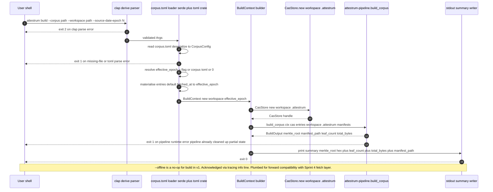

# attestrum build CLI subcommand

Source of truth: `code` (Sprint 3 E5 implementation). This is the user-facing entry point that calls into `attestrum-pipeline::build_corpus` after loading a `corpus.toml` spec (BUILD-PLAN §8.3). The binary is named `attestrum` (configured via `[[bin]] name = "attestrum"` in `crates/attestrum-cli/Cargo.toml`), so the user types `attestrum build --corpus <path> --workspace <path>` rather than `attestrum-cli build ...`.

**Exit-code matrix** (mirrors BUILD-PLAN §8.4): `0` ok; `1` runtime error (TOML parse, missing corpus file, pipeline failure, write failure); `2` clap arg-parse error (clap-native — we let clap exit); `3` `--offline` violation slot (no-op for `build` in v1 since the v1 pipeline does no network fetches; `--offline` is acknowledged via a tracing-info line and otherwise ignored, plumbed for forward compatibility with the Sprint 4 fetch layer); `7` determinism failure slot (reserved for E8 when the determinism extension lands; the `build` subcommand itself does not produce determinism-comparable artifacts in isolation — it's the cross-platform CI matrix that consumes its output).

**Reproducibility**: `--source-date-epoch` (Reproducible Builds convention) takes precedence over `[corpus] source_date_epoch` in the toml; the resulting effective epoch is plumbed into `BuildContext` AND used as the default `fetched_at` for any `[[entry]]` that doesn't specify its own. If absent everywhere, defaults to `0` (Unix epoch) for byte-identical output across machines that don't agree on wall-clock.

**stdout / stderr split**: structured summary goes to **stdout** (so operators can pipe it). Progress / debug logs from `tracing` go to **stderr** (default subscriber config + `RUST_LOG=info` default). Keeps `attestrum build ... | tee build-summary.txt` clean.



**Test obligations** (per CLAUDE.md §7.1 sequenceDiagram → contract test, satisfied at Sprint 3 E5 in `crates/attestrum-cli/tests/cli_build.rs`):

- `build_happy_path_returns_exit_0_with_summary` — 3-entry corpus.toml against a fresh workspace; exit 0; stdout contains `attestrum build: ok`, `merkle_root:` hex line, `leaf_count:   3` line; sealed manifest lands at `<workspace>/.attestrum/manifests/manifest.parquet`.
- `missing_corpus_file_returns_exit_1` — non-existent corpus path; exit code 1 and stderr names the missing file.
- `malformed_corpus_toml_returns_exit_1` — corpus.toml with invalid TOML syntax; exit code 1 and stderr mentions parse failure.
- `clap_arg_parse_failure_returns_exit_2` — invocation missing required `--corpus`; exit code 2 (clap native).
- `source_date_epoch_is_plumbed_into_manifest` — `--source-date-epoch 1700000000` against a corpus.toml whose entries omit `fetched_at`; all rows in the read-back manifest have `fetched_at == Some(1700000000)`. Locks the plumbing from flag → effective_epoch → per-entry default.
- `workspace_directory_is_created_if_missing` — `--workspace` pointing at a nested non-existent path; exit 0; the workspace and all parent dirs are auto-created and the manifest lands at the canonical sub-path.

**`corpus.toml` format** (per BUILD-PLAN §8.3, frozen at E5):

```toml
[corpus]
name = "common-pile-mini-sample"
source_date_epoch = 1700000000

[[entry]]
source_url = "file:///abs/path/to/doc-001.txt"
modality = "text"
mime_type = "text/plain"
source_type = "public_dataset"
license_spdx = "CC0-1.0"

[[entry]]
source_url = "relative/to/corpus-toml/doc-002.txt"
modality = "text"
mime_type = "text/plain"
source_type = "public_dataset"
license_spdx = "CC0-1.0"
fetched_at = 1700000100   # optional; overrides the [corpus] default
```

`source_url` resolution (v1, single machine): `file://<abs-path>` → opens the local file at `<abs-path>`; bare absolute paths → opened as-is; bare relative paths → resolved relative to the `corpus.toml` file's parent directory. `http://` / `https://` are rejected with `UnsupportedScheme` (exit 1) — they land in Sprint 4 with `attestrum-fetch`.

**Public surface** (the CLI's only public Rust API is its binary; the source modules are crate-private):

- `[[bin]] attestrum` — entry point in `crates/attestrum-cli/src/main.rs`. Parses clap, dispatches to subcommand modules under `commands/`.
- `commands::build::run(Args)` — internal, called by `main`.

**Out of scope for E5**:

- HTTP/HTTPS `source_url` resolution — Sprint 4 `attestrum-fetch` ships network fetch with proper signal-aware ruleset evaluation.
- `--ruleset {strict|audit-only|permissive}` flag — Sprint 4 when `attestrum-fetch` lands; v1 corpus entries are pre-resolved (local files) so the ruleset is implicitly permissive.
- Progress reporting / TTY UX — v1 prints summary only; cargo-style live progress bars deferred to v1.1.
- `--format json` for the summary output — diagram lists text format only at E5; deferred until a real consumer needs structured stdout.
- The other subcommands (`attestrum inspect` lands at E6; `attestrum plan` / `attestrum merge` at E7; `attestrum sign` / `attestrum verify` / `attestrum prove` / `attestrum publish` at later sprints). E5 wires only the clap dispatch + `build`.
