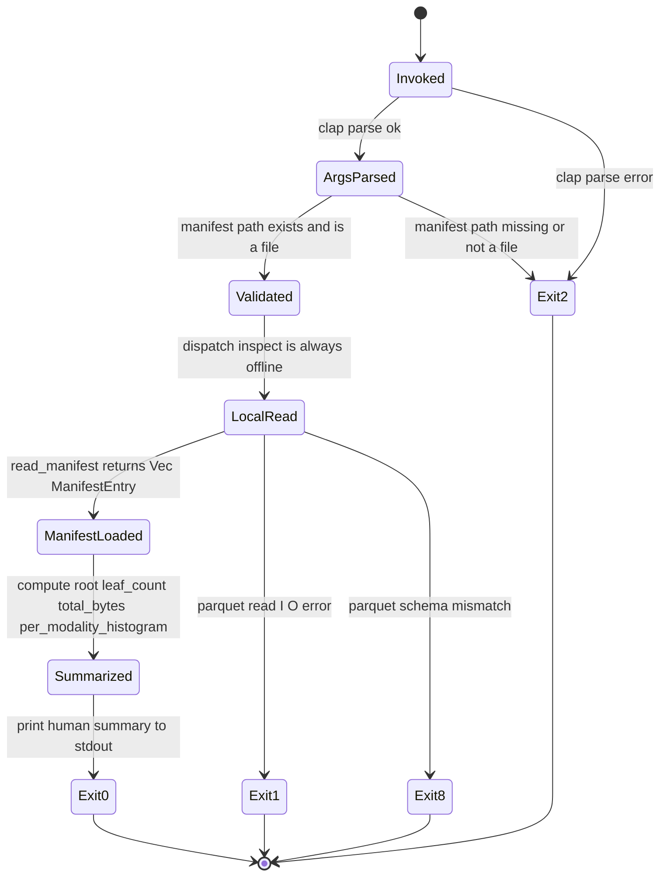

# attestrum inspect CLI subcommand lifecycle

Source of truth: `code` (Sprint 3 E6 implementation). This stateDiagram-v2 is one of two state machines in the project that trigger the per-stateDiagram-v2 proptest obligation per CLAUDE.md §7.1 / PATH-A-BRIEF §7.1; the first was `overview/signal-decision.md` (proptest landed in Sprint 2 E2 at `crates/attestrum-signals/tests/decision_proptest.rs`).

**Second proptest obligation — closed at E6**: `crates/attestrum-cli/tests/inspect_proptest.rs` ships 4 proptests + 2 exhaustive small-case tests that enumerate every (state, event) transition in this diagram and assert terminal-state correctness. Mirrors the Sprint 1 E10 / Sprint 2 E2 pattern.

**Subcommand contract**: `attestrum inspect <manifest>` reads a sealed `manifest.parquet` and prints a human summary: Merkle root hex, leaf count, total bytes, per-modality histogram. Pure offline; no network; no signing; no mutation of any file under any code path. `--offline` is a no-op (the subcommand is always offline) but accepted for CLI-uniformity.

**Exit codes** (subset of BUILD-PLAN §8.4 / `crates/attestrum-cli/src/lifecycle.rs::ExitCode`): `0` ok; `1` runtime error (Parquet KeyValue metadata read failure — file isn't a recognisable Attestrum Parquet at all); `2` argument-style error (clap parse failure OR manifest path missing / not a file); `8` schema validation error (the manifest file is valid Parquet but its `attestrum.manifest.schema_version` KeyValue does not match `attestrum_manifest::SCHEMA_VERSION`, OR metadata reads as version "1" but the row shape doesn't match — versioning slot for future schema migrations).



**Lifecycle implementation** (pure code; no I/O). Lives in `crates/attestrum-cli/src/lifecycle.rs` and is consumed both by `commands::inspect::run` (the real subcommand) and by `tests/inspect_proptest.rs` (the spec checker):

- `pub enum InspectState { Invoked, ArgsParsed, Validated, LocalRead, ManifestLoaded, Summarized, Exit(ExitCode) }`
- `pub enum ExitCode { Ok = 0, RuntimeError = 1, ArgsError = 2, SchemaError = 8 }`
- `pub enum InspectEvent { ClapParseOk, ClapParseError, PathExistsAndIsFile, PathMissingOrNotFile, DispatchInspect, ReadOk, ReadIoError, ReadSchemaMismatch, ComputeSummary, PrintSummary }`
- `pub fn transition(state, event) -> InspectState` — exactly one branch per documented diagram edge; undocumented `(state, event)` pairs hold the input state (no silent forward progress, per the property below).
- `pub fn documented_transitions() -> &'static [(InspectState, InspectEvent, InspectState)]` — the 10 edges above as data, for the exhaustive test.
- `pub fn all_events() -> &'static [InspectEvent]` — sampling pool for the full-set proptest.
- `pub fn all_non_terminal_states() -> &'static [InspectState]` — sampling pool for the undocumented-event hold check.

**Test obligations** (per CLAUDE.md §7.1 stateDiagram-v2 → proptest, satisfied at Sprint 3 E6 in `crates/attestrum-cli/tests/inspect_proptest.rs`):

- `proptest_every_documented_transition_is_reachable` — exhaustive walk of the 10-edge `documented_transitions()` set; asserts each `transition(from, event)` returns the documented `to` state. Locks the spec against the implementation.
- `proptest_no_undocumented_transition_is_taken` — for each (state, event) pair NOT in `documented_transitions()`, asserts `transition(state, event) == state` (holds). The diagram's design choice is "hold" rather than "exit on unknown" so dispatch bugs can't silently advance past a missing edge.
- `proptest_every_path_terminates_in_a_known_exit_code` — bounded random walks from `Invoked` over documented events. Within 32 steps either reaches a terminal Exit (whose code is in `{Ok, RuntimeError, ArgsError, SchemaError}`) OR is still in some documented non-terminal state (closure check, not forced termination).
- `proptest_exit_codes_are_in_the_allowed_set` — random walks from `Invoked` over the FULL event set (including events that hold from the current state). The terminal Exit code, if reached, is always in `{Ok, RuntimeError, ArgsError, SchemaError}` — never `3, 4, 5, 6, 7` (inspect doesn't sign, doesn't network, doesn't verify, doesn't enforce determinism).
- `manifest_with_zero_entries_prints_empty_summary_exits_0` — exhaustive small-case end-to-end. Uses `attestrum_pipeline::build_corpus` to produce a valid zero-row manifest, then runs `attestrum inspect` against it; asserts exit 0 + `leaf_count:  0` + `total_bytes: 0` + `per modality: (none)` in stdout.
- `manifest_with_unknown_schema_version_exits_8` — exhaustive small-case end-to-end. Hand-crafts a Parquet file via `arrow` + `parquet` directly: minimal `Int32` schema, zero rows, KeyValue metadata `attestrum.manifest.schema_version = "999"`. `read_manifest_metadata` reads back `"999"` ≠ `attestrum_manifest::SCHEMA_VERSION = "1"` → Exit8.

**Output format** (human-readable v1, JSON output deferred to v1.1):

```
merkle_root: 47db4aaf7de8c179bdb9662181c76b8b874ce15a49158aad6d8b761e80f96d73
leaf_count:  1000
total_bytes: 12345678
per modality:
  pdf: 34
  image: 92
  text: 874
```

Per-modality output is sorted alphabetically (BTreeMap iteration) so the summary is deterministic across runs. Empty manifests render `per modality: (none)`.

**Out of scope for E6**:

- `--json` output flag — v1.1; v1 ships human-readable only.
- Bundle verification (`attestrum verify`) — Sprint 4 with Sigstore integration.
- Inclusion-proof printing — Sprint 5 with `attestrum prove`.
- Determinism slot Exit7 — never reachable from `inspect` directly; only surfaced by the cross-platform CI matrix (E8) that compares manifests across targets.
